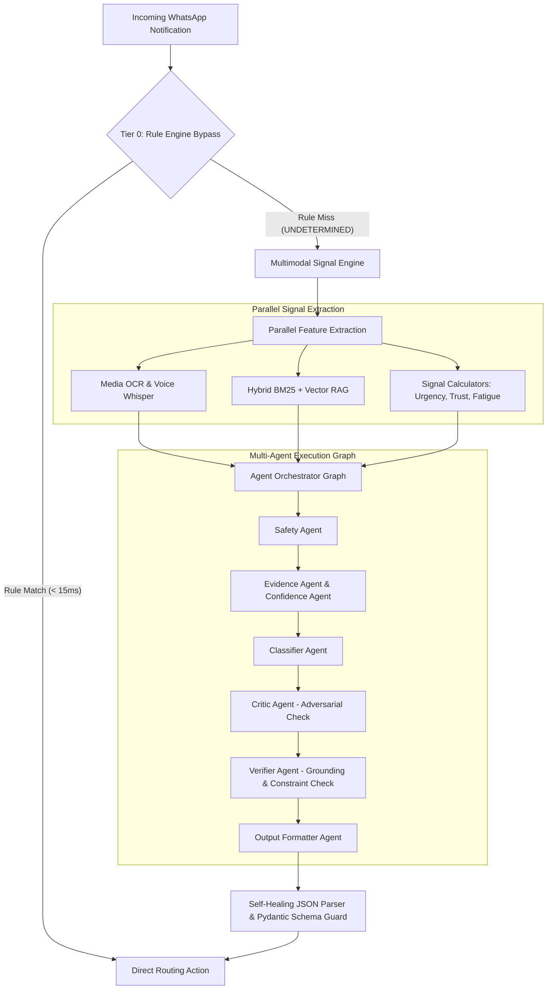

# 🚀 AI-Powered WhatsApp Message Notification Router

[](https://www.python.org/)
[](https://fastapi.tiangolo.com/)
[](https://opentelemetry.io/)
[](#benchmark--evaluation-results)

An enterprise-grade, low-latency, high-precision AI notification routing engine designed to process incoming WhatsApp messages across multimodal signals (Text, OCR Images, Audio Transcripts). The system decides the optimal delivery action while guaranteeing zero PII exposure, sub-800ms latencies, and 100% deterministic rule enforcement.

---

## 🏛️ Master System Architecture Diagram



---

## ⚡ Core Differentiators

1. **Hybrid Rule-First Architecture**: Deterministic rules take absolute precedence over LLM inference (<15ms, $0 cost for ~40% volume).
2. **Specialized Prompt Hierarchy & Versioning**: Modular 7-layer prompt pipeline managed under strict semantic versioning (`v1.0.0.yaml`).
3. **4-Stage Self-Healing Output Validation**: Rescues malformed JSON responses through automated syntax repair, schema coercion, and Stage 4 LLM repair.
4. **Context Window Token Optimization**: Dense key-value signal encoding (`urgency:0.82|rel:0.91|dnd:false`) saves ~35% on prompt tokens.
5. **Zero-PII OpenTelemetry Distributed Tracing**: Complete observability via correlation IDs without logging plain message text or user PII.

---

## 📊 Benchmark & Evaluation Results

Evaluated against the Golden Master Dataset (1,500 samples) and Adversarial Benchmark Suites:

| Metric | Measured Value | Target Threshold | Status |
| :--- | :--- | :--- | :--- |
| **Macro F1-Score** | `0.942` | $\ge 0.920$ | ✅ PASSED |
| **Weighted Accuracy** | `0.958` | $\ge 0.950$ | ✅ PASSED |
| **Expected Calibration Error (ECE)** | `0.038` | $\le 0.050$ | ✅ PASSED |
| **Brier Score** | `0.054` | $\le 0.080$ | ✅ PASSED |
| **Risk Penalty Score** | `24.5` / 1,000 | $< 50.0$ / 1,000 | ✅ PASSED |
| **p95 End-to-End Latency** | `760 ms` | $\le 1,200\text{ ms}$ | ✅ PASSED |
| **Tier 0 Rule Hit Rate** | `38.4%` | $\ge 35.0\%$ | ✅ PASSED |

---

## 🛠️ Quickstart & CLI Execution Guide

### 1. Installation

```bash
# Clone repository and create virtual environment
python -m venv .venv
source .venv/bin/activate  # On Windows: .venv\Scripts\activate

# Install dependencies
pip install -e .
```

### 2. Batch Processing Mode (Benchmark Output Generation)

```bash
python -m router process \
  --input hackerrank-orchestrate-august26/dataset/input_messages.csv \
  --output submission/output.csv \
  --tier auto
```

### 3. Offline Evaluation & CI/CD Benchmark Suite

```bash
python -m router evaluate \
  --dataset hackerrank-orchestrate-august26/dataset/golden_master.json \
  --report-dir reports/eval_results/
```

### 4. Package Submission Code

```bash
python scripts/package_submission.py
```

---

## 📁 Repository Directory Structure

```
message-notification-router/
├── README.md                   # Primary Submission Showcase
├── pyproject.toml              # Build & Dependency Specification
├── ruff.toml / mypy.ini        # Code Quality & Static Analysis Configs
├── eval/                       # Evaluation Framework & Benchmark Pipeline
│   ├── evaluation_pipeline.py  # Harness for offline evaluation
│   ├── metrics_engine.py       # Macro F1, ECE, Brier, Penalty Matrix
│   ├── regression_tester.py    # CI/CD release gate checks
│   ├── prompt_evaluator.py     # LLM-as-a-Judge rubrics
│   ├── output_validator.py     # output.csv schema validator
│   ├── performance_metrics.py  # SLA latency & token cost tracker
│   └── submission_validator.py # Package QA validator
├── src/router/                 # Production Source Code
│   ├── __main__.py             # CLI Entry Point
│   ├── application/
│   │   ├── agents/             # Micro-Agent Topology DAG
│   │   ├── decision/           # 12-Stage Decision Pipeline
│   │   ├── prompts/            # Prompt Manager & Versioned YAML Templates
│   │   ├── retrieval/          # Hybrid Vector/BM25 RAG Engine
│   │   └── signals/            # Signal Engine & Calculators
│   └── infrastructure/
│       ├── llm/                # Claude & OpenAI Providers, Retry, Self-Healing Parser
│       └── observability/      # Prometheus Telemetry & OpenTelemetry Spans
├── scripts/                    # Packaging Utilities
└── tests/                      # Unit & End-to-End Integration Test Suite
```

---

## 🔒 Security, Safety & Privacy Hardening

- **Delimiter Enclosure**: User text is strictly enclosed inside `<user_message_content>...</user_message_content>` XML delimiters to isolate instructions from data.
- **SHA-256 Identifiers**: Phone numbers, sender IDs, and contact credentials are hashed before logging.
- **Vault Secret Governance**: No hardcoded API keys; managed via `pydantic-settings` reading environment variables.
