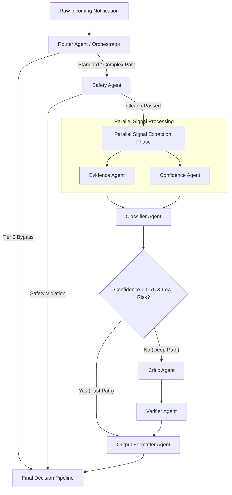

# Master Architecture Specification: Multi-Agent Design

This document details the multi-agent system taxonomy, agent contracts, execution topology, dependency graphs, failure recovery strategies, and conditional skip logic for the AI-powered WhatsApp Message Notification Router.

---

## 1. Executive Summary & Design Philosophy

Rather than relying on a monolithic agent attempt to solve all notification routing steps simultaneously, our system employs a **Micro-Agent Architecture**.

Each agent is a specialized, single-responsibility worker with:
- **Strict I/O Contracts**: Strongly-typed data schemas enforced via Pydantic interfaces.
- **Isolated Failure Domains**: Failure in one non-critical agent does not crash the pipeline.
- **Explicit Skip Triggers**: Agents are dynamically bypassed based on context risk and signal confidence to minimize overall latency and API expenditure.

---

## 2. Multi-Agent System Topology

The agent graph combines parallel feature extraction with sequential reasoning and verification stages.

---

## 3. Specialized Agent Specifications

### 1. Router Agent (Master Orchestrator)
- **Responsibilities**: Evaluates incoming notification signals against Tier 0 deterministic rules, calculates context risk, dynamically constructs the agent execution DAG, and routes traffic to Tier 0 bypass, Tier 1 single-pass, or Tier 2 multi-agent graph.
- **Inputs**: `RawMessageSignal`, `RuleEvaluationResult`, `UserProfile`, `DeviceState`.
- **Outputs**: `ExecutionPlan` (`tier_level`, `agents_to_invoke`, `is_bypass`).
- **Dependencies**: Upstream: Input API Gateway. Downstream: Safety Agent, Classifier Agent.
- **Execution Order**: Node 0 (Root).
- **Failure Handling**: Fallbacks to Tier 1 default single-pass routing if rule engine fails.
- **Skip Logic**: Never skipped.

---

### 2. Safety Agent (Security & Injection Guard)
- **Responsibilities**: Audits input message text, OCR images, and audio transcripts for prompt injection attacks, malicious code, phishing links, or toxic content.
- **Inputs**: `RawMessageText`, `OCRTranscript`, `AudioTranscript`, `SenderMetadata`.
- **Outputs**: `SafetyAssessment` (`is_safe`, `violation_type`, `sanitized_text`).
- **Dependencies**: Upstream: Router Agent. Downstream: Parallel Signal Extraction Phase.
- **Execution Order**: Node 1.
- **Failure Handling**: If safety check times out, message text is sanitized deterministically and flagged with `safety_audit_degraded=True`.
- **Skip Logic**: Skipped for trusted internal system notifications and verified 2FA transactional alerts.

---

### 3. Evidence Agent (Context & Memory Grounding)
- **Responsibilities**: Retrieves and formats key contextual citations, historical chat summaries, relationship scores, and recent user interaction patterns to ground decisions.
- **Inputs**: `SanitizedMessage`, `RetrievedMemorySnippets`, `ContactRelationshipGraph`.
- **Outputs**: `EvidenceBundle` (`key_citations`, `relationship_tier`, `thread_urgency_score`).
- **Dependencies**: Upstream: Safety Agent. Downstream: Classifier Agent.
- **Execution Order**: Node 2A (Parallel execution with Confidence Agent).
- **Failure Handling**: Returns empty evidence array if vector database retrieval fails; pipeline continues with local message context only.
- **Skip Logic**: Skipped if message context contains zero historical thread memory and sender is first-time contact.

---

### 4. Confidence Agent (Uncertainty & Signal Quality Estimator)
- **Responsibilities**: Analyzes signal completeness, noise levels, context relevance, and historical prediction accuracy to generate an initial baseline confidence vector.
- **Inputs**: `SignalQualityMetrics`, `ContextCompletenessScore`, `HistoricalAccuracyScore`.
- **Outputs**: `ConfidenceBaseline` (`completeness_score`, `expected_uncertainty`).
- **Dependencies**: Upstream: Safety Agent. Downstream: Classifier Agent.
- **Execution Order**: Node 2B (Parallel execution with Evidence Agent).
- **Failure Handling**: Defaults to baseline confidence of `0.50` if metric collection fails.
- **Skip Logic**: Skipped during Tier 0 deterministic rule routing.

---

### 5. Classifier Agent (Core Decision Engine)
- **Responsibilities**: Synthesizes safety assessments, evidence bundles, and confidence baselines to infer the optimal routing decision and step-by-step rationale.
- **Inputs**: `SanitizedMessage`, `EvidenceBundle`, `ConfidenceBaseline`, `UserPolicy`.
- **Outputs**: `ProposedRoutingDecision` (`action`, `reasoning_steps`, `raw_confidence`).
- **Dependencies**: Upstream: Evidence Agent, Confidence Agent. Downstream: Verifier Agent / Output Formatter.
- **Execution Order**: Node 3.
- **Failure Handling**: If classification model errors out, triggers immediate fallback to rule-based fallback decision (`DELIVER_SILENTLY`).
- **Skip Logic**: Skipped during Tier 0 deterministic rule bypass.

---

### 6. Critic Agent (Adversarial Evaluator)
- **Responsibilities**: Performs adversarial critique on proposed decisions with low confidence (<0.75) or conflicting signals, identifying potential flaws or missing user context.
- **Inputs**: `ProposedRoutingDecision`, `SanitizedMessage`, `EvidenceBundle`.
- **Outputs**: `CritiqueReport` (`has_flaws`, `flaw_type`, `suggested_refinement`).
- **Dependencies**: Upstream: Classifier Agent. Downstream: Verifier Agent.
- **Execution Order**: Node 4A (Conditional Deep Path).
- **Failure Handling**: If Critic Agent times out (>400ms), Critic output is bypassed and Classifier Agent output is passed directly to Verifier.
- **Skip Logic**: **Skipped when Classifier Agent confidence $\ge 0.75$ and context risk is low.**

---

### 7. Verifier Agent (Factual Grounding & Constraint Enforcer)
- **Responsibilities**: Validates that proposed routing decisions do not contradict extracted evidence or user policy rules, and calibrates final numeric confidence scores.
- **Inputs**: `ProposedRoutingDecision`, `CritiqueReport`, `EvidenceBundle`, `UserPolicy`.
- **Outputs**: `VerifiedDecision` (`is_approved`, `calibrated_confidence`, `final_action`).
- **Dependencies**: Upstream: Critic Agent / Classifier Agent. Downstream: Output Formatter Agent.
- **Execution Order**: Node 4B.
- **Failure Handling**: If verification fails, approves Classifier decision but overrides action to `DELIVER_SILENTLY` for risk mitigation.
- **Skip Logic**: Skipped when Classifier Agent confidence $\ge 0.85$.

---

### 8. Output Formatter Agent (Schema Guard & JSON Serialization)
- **Responsibilities**: Enforces structural JSON compliance, formats exact API responses, generates audit logs, and validates final output schema constraints.
- **Inputs**: `VerifiedDecision`, `AuditMetadata`.
- **Outputs**: `FinalJSONResponse` (`action`, `reason`, `confidence`, `evidence`, `metadata`).
- **Dependencies**: Upstream: Verifier Agent / Classifier Agent. Downstream: Delivery Dispatcher.
- **Execution Order**: Node 5 (Terminal Node).
- **Failure Handling**: Applies deterministic regex and Pydantic auto-repair; if repair fails, returns hardcoded valid JSON fallback response.
- **Skip Logic**: Never skipped.

---

## 4. Agent Dependency Matrix & Skip Logic Summary

| Agent | Predecessor Nodes | Trigger Condition | Skip Condition | Fallback Action on Failure |
| :--- | :--- | :--- | :--- | :--- |
| **Router** | None (Root) | Every message | Never | Fast Rule Fallback |
| **Safety** | Router | Standard / Complex Path | Verified OTP / 2FA | Deterministic Sanitization |
| **Evidence** | Safety | Memory Retrieval Needed | Zero Chat History | Local Context Only |
| **Confidence** | Safety | Standard / Complex Path | Tier 0 Rule Hit | Default `0.50` Baseline |
| **Classifier** | Evidence, Confidence | Tier 1 & Tier 2 Path | Tier 0 Rule Hit | Action: `DELIVER_SILENTLY` |
| **Critic** | Classifier | Confidence `< 0.75` | Confidence $\ge 0.75$ | Bypass Critic Node |
| **Verifier** | Critic / Classifier | Confidence `< 0.85` | Confidence $\ge 0.85$ | Action: `DELIVER_SILENTLY` |
| **Output Formatter** | Verifier / Classifier | All non-rule outputs | Never | Hardcoded Fallback JSON |

---

## 5. Resilience & Degraded Execution Modes

The agent framework features 3 execution modes to ensure uninterrupted operation:

1. **Full Orchestration Mode (Normal)**: All agents execute according to DAG specifications.
2. **Degraded Memory Mode (RAG Offline)**: Evidence Agent returns empty citations; Classifier and Verifier operate strictly on local message signals.
3. **Emergency Circuit-Breaker Mode (LLM Outage)**: Router Agent redirects 100% of volume directly to Tier 0 Rule Engine, ensuring 0% message loss during cloud provider outages.
