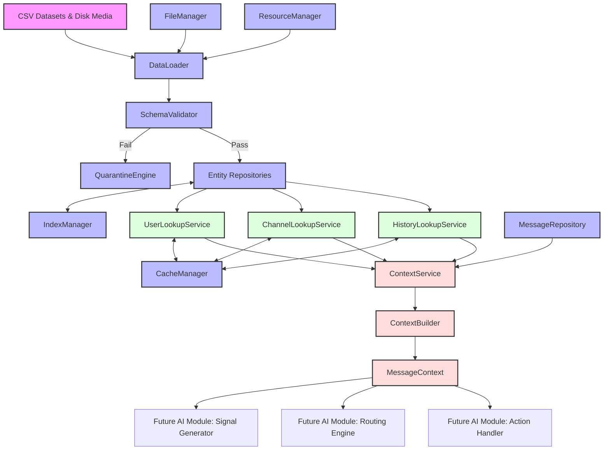

# Data Layer Master Architecture & System Design Blueprint

## 1. Executive System Overview

The **Data Layer** of the AI-powered WhatsApp Message Notification Router serves as the unified, highly performant, memory-resident data substrate for all upstream notification evaluation components. Designed in accordance with **Clean Architecture** principles, it encapsulates raw file storage formats (13 CSV datasets and physical media folders) behind strongly-typed repository contracts and fast-path lookup facades.

Everything in the system obtains data exclusively through this Data Layer. Direct reading of CSV files by future AI, signal, routing, or presentation modules is strictly prohibited.

---

## 2. 15 Core Architectural Components

---

### Component 1: Data Loading Architecture (`DataLoader`)
- **Role**: Coordinates the 7-stage deterministic boot sequence.
- **Key Responsibilities**: Manages staged dataset dependencies, validates schema rules during boot, populates repositories and indexes in topological order.

### Component 2: Repository Pattern (`RepositoryRegistry` & Repositories)
- **Role**: Abstracts entity storage and provides strongly-typed CRUD/Lookup contracts.
- **Key Responsibilities**: Enforces data ownership, immutability, and O(1) primary key access across 8 domain repositories.

### Component 3: Lookup Services (`UserLookupService`, `ChannelLookupService`, `HistoryLookupService`)
- **Role**: Serves as enriched query facades above repositories.
- **Key Responsibilities**: Executes multi-repository joins, computes relationship metrics, resolves channel contexts, evaluates quiet hours windows.

### Component 4: Context Service & Builder (`ContextService`, `ContextBuilder`)
- **Role**: Synthesizes enriched `MessageContext` objects for incoming evaluation messages.
- **Key Responsibilities**: Executes parallel fan-out reads, populates all 40+ context attributes, performs fallback injection, enforces sub-millisecond context assembly.

### Component 5: Data Manager (`DataManager`)
- **Role**: Central facade and lifecycle manager for the Data Layer.
- **Key Responsibilities**: Provides public system management API (`Initialize`, `Reload`, `Shutdown`, `GetStatus`), orchestrates sub-system lifecycle transitions.

### Component 6: Cache Manager (`CacheManager`)
- **Role**: Multi-tier in-memory cache controller.
- **Key Responsibilities**: Manages 4 cache tiers (Static, Lookup, History, Media), enforces LRU/TTL eviction rules, tracks hit/miss ratios.

### Component 7: Index Manager (`IndexManager`)
- **Role**: Constructs and maintains in-memory primary, composite, and inverted indexes.
- **Key Responsibilities**: Pre-computes tuple-key hash codes, maintains fast secondary lookup maps, optimizes index memory layouts.

### Component 8: Data Models (`DataModelFactory` & Entities)
- **Role**: Defines strongly-typed, immutable domain object structures.
- **Key Responsibilities**: Represents core entities (`User`, `Group`, `BusinessAccount`, `MessageContext`, etc.) using compact slot layouts and string interning pointers.

### Component 9: Schema Validation Engine (`SchemaValidator`, `DataConsistencyEngine`)
- **Role**: 4-level integrity and constraint verification engine.
- **Key Responsibilities**: Validates file structure, data types, foreign key referential integrity, and business logic invariants.

### Component 10: File Manager (`FileManager`)
- **Role**: Physical disk file system auditor and path resolver.
- **Key Responsibilities**: Audits media folders (`images/`, `audio/`), verifies path existence, normalizes path string representations.

### Component 11: Resource Manager (`ResourceManager`)
- **Role**: System memory footprint controller and concurrency guard.
- **Key Responsibilities**: Enforces <5 MB RAM allocation ceiling, provides lock-free read semantics and thread-safe reload locks.

### Component 12: Memory Management Subsystem
- **Role**: Memory optimization engine.
- **Key Responsibilities**: Implements string interning pools, zero-copy entity reference sharing, fixed slot layouts.

### Component 13: Lazy Loading Subsystem
- **Role**: On-demand deferred loading engine.
- **Key Responsibilities**: Virtualizes media asset verification, defers deep historical text trajectory loading until required.

### Component 14: Error Recovery Subsystem
- **Role**: Fault isolation and degraded state controller.
- **Key Responsibilities**: Manages quarantine logging, synthetic default profile injection, prevents system boot halts on non-critical data flaws.

### Component 15: Telemetry & Logging Subsystem
- **Role**: Structured logging and operational observability manager.
- **Key Responsibilities**: Emits JSON telemetry, logs boot audits, schema violations, and cache performance metrics.

---

## 3. Comprehensive Class Specifications Matrix

The following matrix documents every single architectural class in the Data Layer:

| Class Name | Primary Purpose & Responsibilities | Public Methods | Inputs | Outputs | Core Dependencies | Lifecycle | Interaction with Other Classes |
|---|---|---|---|---|---|---|---|
| **`DataManager`** | Central Data Layer facade & orchestrator. | `Initialize()`, `Reload()`, `Shutdown()`, `GetStatus()` | Config options | System state / Health metrics | `DataLoader`, `CacheManager`, `ResourceManager` | Singleton / Boot-to-Shutdown | Invokes `DataLoader.ExecutePipeline()`, controls `CacheManager.PurgeAll()`. |
| **`DataLoader`** | Executes 7-stage deterministic boot pipeline. | `ExecutePipeline()` | Data directory path | Ingestion summary report | `SchemaValidator`, `FileManager`, Repositories | Short-lived during boot | Reads CSV streams, validates via `SchemaValidator`, populates Repositories. |
| **`FileManager`** | Audits disk media assets & path pointers. | `AuditMediaDirectories()`, `VerifyFileExists(path)` | Media dir paths | `HashSet<String>` valid paths | Operating System I/O | Singleton | Invoked by `DataLoader` (Stage 1) and `MediaRepository`. |
| **`ResourceManager`** | Monitors RAM budget & manages read/write locks. | `AcquireReadLock()`, `ReleaseReadLock()`, `GetMemoryUsage()` | None | Lock token / Memory metrics | OS Process APIs | Singleton | Used by all Repositories during read/write operations. |
| **`SchemaValidator`** | Executes 4-level integrity & FK checks. | `ValidateRow(row, stage)`, `ValidateFK(fkValue, targetRepo)` | Raw CSV row, Stage ID | Validation Result (Pass/Fail/Quarantine) | Entity Repositories | Boot-time & Load-time | Invoked by `DataLoader`; queries target repositories for FK existence checks. |
| **`QuarantineEngine`** | Isolates bad rows & writes violation logs. | `QuarantineRow(row, reason)`, `FlushLog()` | Raw row, Error details | None | File System / Logger | Boot-time & Load-time | Invoked by `SchemaValidator` upon validation failure. |
| **`StringInternPool`** | Pools repeated strings to save RAM. | `Intern(rawString) -> String` | Raw string | Shared string pointer | None | Singleton | Used by `DataModelFactory` during entity instantiation. |
| **`DataModelFactory`**| Instantiates immutable domain entities. | `CreateUser()`, `CreateGroup()`, `CreateBusiness()` | Validated field dictionary | Typed Domain Entity | `StringInternPool` | Stateless Helper | Used by `DataLoader` to convert validated rows to entities. |
| **`UserRepository`** | Stores & indexes recipient user profiles. | `GetById(id)`, `GetAll()`, `Exists(id)`, `Add(user)` | User ID / User Object | User Entity / Status | `ResourceManager` | Singleton | Reads/Writes user map; queried by `UserLookupService` and `SchemaValidator`. |
| **`GroupRepository`** | Stores & indexes group profiles & membership. | `GetById(id)`, `GetMember(groupId, userId)`, `IsAdmin(groupId, userId)` | Group ID, User ID | Group Entity / Member Record | `ResourceManager` | Singleton | Stores group & member maps; queried by `ChannelLookupService`. |
| **`BusinessRepository`**| Stores business profiles & interaction history.| `GetById(id)`, `GetHistory(userId, businessId)` | Business ID, User ID | Business Entity / History Record | `ResourceManager` | Singleton | Stores business maps; queried by `ChannelLookupService`. |
| **`MediaRepository`** | Stores image & voice note manifest pointers. | `GetImage(id)`, `GetVoiceNote(id)` | Media ID | Media Manifest Record | `FileManager` | Singleton | Maps media IDs to disk paths; queried by `ContextBuilder`. |
| **`HistoryRepository`**| Stores historical message trajectory logs. | `GetTrajectory(userId, senderId)`, `GetHistoryById(msgId)` | User ID, Sender ID | List<HistoricalMessage> | `ResourceManager` | Singleton | Stores pre-sorted trajectory lists; queried by `HistoryLookupService`. |
| **`EventRepository`** | Stores message event delivery/read status logs.| `GetEvent(userId, msgId)` | User ID, Message ID | MessageEvent Record | `ResourceManager` | Singleton | Stores event map; queried by `HistoryLookupService`. |
| **`NotificationSummaryRepository`** | Stores daily user notification metric summaries.| `GetSummary(userId, date)` | User ID, Date | DailySummary Record | `ResourceManager` | Singleton | Stores daily metric map; queried by `HistoryLookupService`. |
| **`MessageRepository`**| Stores incoming primary evaluation messages. | `GetById(id)`, `GetNextMessage()`, `GetAll()` | Message ID / Stream Cursor | Message Entity | `ResourceManager` | Singleton | Stores incoming stream; read by `ContextService`. |
| **`IndexManager`** | Computes composite tuple keys & index maps. | `BuildTupleKey(k1, k2)`, `RebuildIndexes()` | Identifier strings | Composite key hash | None | Singleton / Boot-time | Invoked by Repositories during stage population. |
| **`CacheManager`** | Multi-tier cache controller & eviction engine. | `Get(tier, key)`, `Put(tier, key, val)`, `Invalidate(tier, key)` | Tier ID, Key, Object | Cached Object / Null | `ResourceManager` | Singleton | Used by Lookup Services to store/retrieve pre-computed contexts. |
| **`UserLookupService`**| Resolves user metrics & DND quiet hours. | `GetUserProfile(id)`, `EvaluateDNDStatus(id, ts)` | User ID, Timestamp | Enriched User Profile / DND Result | `UserRepository`, `CacheManager` | Singleton | Queries `UserRepository`; consumed by `ContextBuilder`. |
| **`ChannelLookupService`**| Resolves Personal, Group, and Business context.| `ResolvePersonalChannel()`, `ResolveGroupChannel()`, `ResolveBusinessChannel()` | User ID, Channel ID | Enriched Channel Context | `GroupRepo`, `BusinessRepo`, `CacheManager` | Singleton | Queries Group/Business repos; consumed by `ContextBuilder`. |
| **`HistoryLookupService`**| Resolves interaction trajectories & baselines. | `GetInteractionTrajectory()`, `GetDailyBaseline()` | User ID, Sender ID, Date | Trajectory Summary / Baseline Metrics | `HistoryRepo`, `EventRepo`, `NotificationSummaryRepo` | Singleton | Queries History/Event/Summary repos; consumed by `ContextBuilder`. |
| **`ContextService`**| Orchestrates context creation fan-out reads. | `CreateContext(rawMessage) -> MessageContext` | Raw Message Entity | Enriched MessageContext | Lookup Services, `ContextBuilder` | Singleton | Primary interface called by downstream evaluation modules. |
| **`ContextBuilder`**| Assembles & binds immutable `MessageContext`. | `Build(msg, userCtx, channelCtx, historyCtx) -> MessageContext` | Intermediate contexts | Immutable MessageContext | Data Entities | Stateless Builder | Called by `ContextService` to synthesize final object. |

---

## 4. End-to-End Data Flow Execution Sequence

```
[ CSV Datasets & Physical Media ]
               |
               v (Stage 1-6 Boot Ingestion)
       +---------------+
       |  DataLoader   |
       +-------+-------+
               |
               v (Level 1-4 Validation)
       +---------------+
       | SchemaValid.  | ---- (Validation Failure) ----> [ Quarantine Log ]
       +-------+-------+
               | (Validation Pass)
               v
       +---------------+
       | Repositories  | <====> [ IndexManager ] (Primary & Composite Hash Maps)
       +-------+-------+
               |
               | (Stage 7 Runtime Message Evaluation)
               v
       +---------------+
       |MessageRepository|
       +-------+-------+
               |
               v (Raw Message Stream)
       +---------------+
       |ContextService |
       +-------+-------+
               |
       +-------+-----------------------+-----------------------+
       |                               |                       |
       v                               v                       v
+--------------+               +---------------+       +---------------+
|UserLookupSvc |               |ChannelLookup  |       |HistoryLookup  |
+------+-------+               +-------+-------+       +-------+-------+
       |                               |                       |
       +-------+-----------------------+-----------------------+
               | (Enriched Attributes)
               v
       +---------------+
       |CacheManager   | <---> (Check LRU / TTL Cache Tiers)
       +-------+-------+
               | (Cache Miss -> Assemble)
               v
       +---------------+
       |ContextBuilder |
       +-------+-------+
               |
               v (Immutable Enriched Object)
       +---------------+
       |MessageContext |
       +-------+-------+
               |
               +-----------------------+-----------------------+
               |                       |                       |
               v                       v                       v
       [ Future Module: ]      [ Future Module: ]      [ Future Module: ]
       [ Signal Generator ]    [ Routing Engine ]      [ Action Handler ]
```

---

## 5. Module Interaction & Dependency Diagram (Strict DAG)



> **Zero Circular Dependency Assurance**:
> The interaction structure is strictly directed and acyclic (DAG). Dependencies flow unidirectionally from Storage → Loader → Repositories → Lookup Services → Context Builder → Downstream Consumer Modules.

---

## 6. Software Engineering & Architectural Best Practices

### 6.1 SOLID Principles Compliance
1. **Single Responsibility Principle (SRP)**: Repositories store entities, `SchemaValidator` enforces integrity, `CacheManager` accelerates queries, `ContextBuilder` synthesizes context objects.
2. **Open/Closed Principle (OCP)**: Lookup services and repositories expose extensible interfaces (`IRepository`, `ILookupService`), allowing new storage backends or caching algorithms to be introduced without altering business logic.
3. **Liskov Substitution Principle (LSP)**: All repositories implement strict contract abstractions guaranteeing drop-in compliance for testing mocks.
4. **Interface Segregation Principle (ISP)**: Consuming modules receive narrow, targeted lookup contracts (e.g., `UserLookupService` only exposes user methods) rather than monolithic data access surfaces.
5. **Dependency Inversion Principle (DIP)**: `ContextService` depends on abstract repository and lookup interfaces, not concrete implementations.

### 6.2 Dependency Injection & Clean Architecture
- **Inversion of Control (IoC)**: Component dependencies (Repositories, Lookup Services, Cache Managers) are wired at system boot via Dependency Injection containers.
- **Clean Architecture Boundaries**: Data Layer entities and context specifications contain zero external framework dependencies, ensuring high testability and architectural independence.

### 6.3 Comprehensive Testing Strategy
1. **Unit Testing**: 100% test coverage for `SchemaValidator` rules, regex matchers, DND window calculators, and string interning logic.
2. **Contract Testing**: Verifies that repository interfaces adhere strictly to primary key O(1) retrieval contracts.
3. **Integration Testing**: Executes the 7-stage deterministic boot sequence against full test CSV datasets to verify total referential integrity.
4. **Benchmark Testing**: Asserts sub-millisecond (< 1.0 ms) context assembly latency under multi-threaded load.
