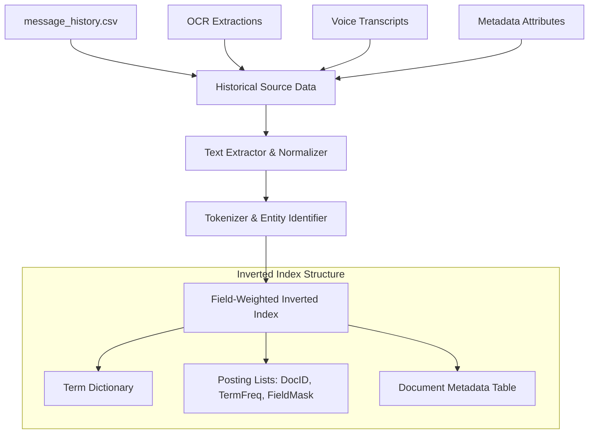

# Sparse BM25 Keyword Retrieval Specification

## Overview

The `BM25Service` provides fast, accurate sparse keyword retrieval over historical messages and context metadata. BM25 (Best Matching 25) excels at exact string matching, entity lookup (order numbers, OTPs, transactional codes, domain names), and keyword-based similarity search across `message_history.csv`.

---

## Mathematical Formulation & Tuning Parameters

The BM25 relevance score of a historical document \(D\) for a query \(Q = \{q_1, q_2, \dots, q_n\}\) is defined as:

$$\text{Score}(D, Q) = \sum_{i=1}^{n} \text{IDF}(q_i) \cdot \frac{f(q_i, D) \cdot (k_1 + 1)}{f(q_i, D) + k_1 \cdot \left(1 - b + b \cdot \frac{|D|}{\text{avgdl}}\right)}$$

Where:
- \(f(q_i, D)\): Term frequency of query term \(q_i\) in historical document \(D\).
- \(|D|\): Document length (total word count of historical message and enriched metadata).
- \(\text{avgdl}\): Average document length across the entire historical corpus (`message_history.csv`).
- \(\text{IDF}(q_i)\): Inverse Document Frequency of term \(q_i\):

$$\text{IDF}(q_i) = \ln \left( \frac{N - n(q_i) + 0.5}{n(q_i) + 0.5} + 1 \right)$$

- \(N\): Total number of historical messages in the index.
- \(n(q_i)\): Number of historical messages containing term \(q_i\).

### Calibrated Hyperparameters

| Hyperparameter | Value | Description & Rationale |
|---|---|---|
| \(k_1\) | **1.2** | Controls term frequency saturation. A lower value (1.2) prevents multiple repetitions of promotional keywords from artificially inflating document score. |
| \(b\) | **0.75** | Controls document length normalization. Scales down long group messages while giving appropriate weight to short, concise SMS-style transactional alerts. |
| \(\epsilon\) | **0.25** | Floor value for negative IDF scores to prevent extremely common stop-words from penalizing candidates. |

---

## Inverted Index Architecture

The BM25 inverted index indexes historical messages alongside their multimodal extractions and relational metadata:

### Indexed Fields & Boosting Weights

To ensure key structural and entity matches take precedence over generic text match, the inverted index supports multi-field weighted scoring:

$$\text{Score}_{\text{Total}}(D, Q) = \sum_{\text{field} \in \text{Fields}} w_{\text{field}} \cdot \text{Score}_{\text{BM25}}(D_{\text{field}}, Q)$$

| Index Field | Content Description | Field Boost Factor (\(w_{\text{field}}\)) |
|---|---|---|
| `sender_user_id` | Exact sender identifier | **3.0** |
| `business_id` | Business account identifier | **3.0** |
| `official_domain` | Verified domain name | **2.5** |
| `ocr_text` | Text extracted from images | **1.5** |
| `voice_transcript` | Transcribed audio content | **1.2** |
| `message_text` | Primary body message text | **1.0** |
| `image_caption` | Vision description caption | **0.8** |
| `group_type` | Group context taxonomy term | **0.5** |

---

## Tokenization & Preprocessing Pipeline

Raw incoming text and historical documents undergo a strict preprocessing pipeline before indexing and searching:

1. **Unicode Normalization**: NFKC normalization to standardize emojis, special symbols, and diacritics.
2. **Lowercasing**: Conversion of all characters to lower-case.
3. **Entity-Preserving Tokenization**:
   - OTP codes (`[0-9]{4,8}`), currency values (`Rs. 500`, `$50`), tracking codes, and URLs are preserved as atomic tokens without hyphenation splitting.
4. **Language-Aware Stop-Word Removal**: Removes high-frequency grammatical tokens (e.g., *"is"*, *"the"*, *"at"*, *"in"*) while strictly preserving negation tokens (*"not"*, *"no"*, *"don't"*) and urgency indicators (*"now"*, *"urgent"*, *"immediately"*).
5. **Stemming & Lemmatization**: Uses Snowball Stemmer for English text while maintaining un-stemmed original tokens in an exact-match index layer.

---

## Edge Case Handling

1. **Pure Media Messages**:
   - For messages with NULL `message_text` but valid `media_id`, BM25 queries fall back directly onto `ocr_text`, `voice_transcript`, or `image_caption` fields.
2. **Numeric-Heavy Messages (OTPs / Transactions)**:
   - Numerical sequences (e.g., OTP digits `"482910"`) receive dedicated exact token matching. If a numeric code matches an existing candidate's code exactly, field weight is multiplied by 4.0.
3. **Empty / Noise Messages**:
   - Messages consisting solely of punctuation, single emojis, or whitespace are bypassed by BM25 retrieval and delegated to relational metadata matching.
