# Context Assembly Engine Architectural Blueprint

## 1. System Overview & Core Philosophy

The **Context Assembly Engine** is the central orchestration layer of the AI-powered WhatsApp Message Notification Router. It operates as the single authoritative provider of context for the system.

```
┌────────────────────────────────────────────────────────────────────────────────────────┐
│                                   INCOMING MESSAGE                                     │
└────────────────────────────────────────────────────────┬───────────────────────────────┘
                                                         │
                                                         ▼
┌────────────────────────────────────────────────────────────────────────────────────────┐
│                               CONTEXT ASSEMBLY ENGINE                                  │
│                                                                                        │
│  ┌────────────────────────┐  ┌────────────────────────┐  ┌──────────────────────────┐  │
│  │   Repository Lookups   │  │   Multimodal Cache     │  │  Context Normalization   │  │
│  └───────────┬────────────┘  └───────────┬────────────┘  └────────────┬─────────────┘  │
│              └─────────────────────┐     │     ┌──────────────────────┘                │
│                                    ▼     ▼     ▼                                       │
│                              ┌──────────────────────────┐                              │
│                              │ Parallel Builder Pipeline│                              │
│                              └───────────┬──────────────┘                              │
│                                          │                                             │
│                                          ▼                                             │
│                              ┌──────────────────────────┐                              │
│                              │   Context Validator &    │                              │
│                              │ Quality Scoring Engine   │                              │
│                              └───────────┬──────────────┘                              │
└──────────────────────────────────────────┼─────────────────────────────────────────────┘
                                           │
                                           ▼
┌────────────────────────────────────────────────────────────────────────────────────────┐
│                              STANDARDIZED MessageContext                               │
│                (Immutable, Fully Enriched, Validated Master Context Object)            │
└────────────────────────────────────────────────────────────────────────────────────────┘
```

### Key Architectural Constraints
1. **Zero Direct Data Source Access**: No downstream module may query raw CSV files, database repositories, or multimodal caches directly. All data access must pass through the `MessageContext`.
2. **Strict Immutability**: Once assembled, validated, and returned by the engine, the `MessageContext` instance and all nested sub-contexts are completely immutable.
3. **No Downstream Decision Logic**: The engine solely gathers, normalizes, links, and validates data. It makes zero routing, notification mode, or prompt decisions.
4. **Deterministic Assembly**: Given identical underlying repository states and multimodal inputs, the assembly engine must produce identical `MessageContext` states.

---

## 2. High-Level Class & Component Hierarchy

The engine is structured around clean object-oriented principles, splitting responsibility between orchestration, sub-context assembly, repository access, and validation.

```mermaid
classDiagram
    class ContextAssemblyEngine {
        +assemble(raw_message: RawMessagePayload) MessageContext
        +assemble_batch(raw_messages: List[RawMessagePayload]) List[MessageContext]
    }

    class ContextRepositoryRegistry {
        +messages_repo: IMessageRepository
        +users_repo: IUserRepository
        +groups_repo: IGroupRepository
        +group_members_repo: IGroupMemberRepository
        +business_accounts_repo: IBusinessAccountRepository
        +user_business_history_repo: IUserBusinessHistoryRepository
        +message_history_repo: IMessageHistoryRepository
        +message_events_repo: IMessageEventRepository
        +daily_notification_summary_repo: IDailyNotificationSummaryRepository
        +multimodal_cache: IMultimodalCache
    }

    class ParallelContextBuilderPipeline {
        -user_builder: UserContextBuilder
        -group_builder: GroupContextBuilder
        -business_builder: BusinessContextBuilder
        -media_builder: MediaContextBuilder
        -history_builder: HistoryContextBuilder
        -notification_builder: NotificationContextBuilder
        -relationship_builder: RelationshipContextBuilder
        -conversation_builder: ConversationContextBuilder
        -behaviour_builder: BehaviourContextBuilder
        +execute_parallel(payload: RawMessagePayload, registry: ContextRepositoryRegistry) UnvalidatedContextBag
    }

    class ContextValidationService {
        +validate(bag: UnvalidatedContextBag) ValidationResult
        +compute_quality_score(bag: UnvalidatedContextBag) ContextQualityMetrics
    }

    class MessageContextFactory {
        +create(bag: UnvalidatedContextBag, metrics: ContextQualityMetrics) MessageContext
    }

    ContextAssemblyEngine --> ContextRepositoryRegistry : Uses
    ContextAssemblyEngine --> ParallelContextBuilderPipeline : Orchestrates
    ContextAssemblyEngine --> ContextValidationService : Validates with
    ContextAssemblyEngine --> MessageContextFactory : Constructs with
```



### Core Components & Service Responsibilities

#### `ContextAssemblyEngine`
The primary entrypoint service called by the message ingestion gateway. Coordinates the pipeline execution flow, manages async execution threads, handles engine-level exceptions, and returns the final `MessageContext`.

#### `ContextRepositoryRegistry`
A unified registry providing dependency-injected interfaces for accessing every system data source:
- `messages.csv` (IMessageRepository)
- `users.csv` (IUserRepository)
- `groups.csv` (IGroupRepository)
- `group_members.csv` (IGroupMemberRepository)
- `business_accounts.csv` (IBusinessAccountRepository)
- `user_business_history.csv` (IUserBusinessHistoryRepository)
- `message_history.csv` (IMessageHistoryRepository)
- `message_events.csv` (IMessageEventRepository)
- `daily_notification_summary.csv` (IDailyNotificationSummaryRepository)
- Multimodal Artifact Cache (`ImageContext`, `VoiceContext`, `MediaContext`)

#### `ParallelContextBuilderPipeline`
Orchestrates independent worker units (`SubContextBuilders`) to construct sub-contexts concurrently using async task pools.

#### `ContextValidationService`
Applies structural integrity checks, referential link checks, and null-safety assertions across all populated sub-contexts. Calculates a global completeness score before object freezing.

#### `MessageContextFactory`
Instantiates the final `MessageContext` container, wrapping all sub-contexts alongside assembly metadata and quality scores, sealing the object into a read-only state.

---

## 3. Dependency Flow & Object Ownership

### Assembly Sequence & Object Lifecycle

```
[Raw Message Payload]
       │
       ▼
1. ContextAssemblyEngine.assemble()
       │
       ├──► 2. Repository Hydration (Fetches matching primary keys across CSV repositories)
       │
       ├──► 3. Async Parallel Dispatch
       │        ├──► UserContextBuilder.build()
       │        ├──► GroupContextBuilder.build()
       │        ├──► BusinessContextBuilder.build()
       │        ├──► MediaContextBuilder.build()
       │        ├──► HistoryContextBuilder.build()
       │        ├──► NotificationContextBuilder.build()
       │        ├──► RelationshipContextBuilder.build()
       │        ├──► ConversationContextBuilder.build()
       │        └──► BehaviourContextBuilder.build()
       │
       ├──► 4. UnvalidatedContextBag Aggregation
       │
       ├──► 5. ContextValidationService.validate() & compute_quality_score()
       │
       └──► 6. MessageContextFactory.create() ──► [Immutable MessageContext]
```

### Object Ownership Principles
- **Repositories**: Owned by the `ContextRepositoryRegistry`. Read-only; repositories never mutate incoming payloads or stored CSV models.
- **UnvalidatedContextBag**: Transient mutable collection object owned solely during execution by `ContextAssemblyEngine`. Trash-collected immediately after assembly completes.
- **Sub-Context Objects**: Produced by their respective sub-builder classes. Immutable once produced.
- **MessageContext**: Maintained in memory as a singleton per message processing cycle. Passed downstream to consumer modules.

---

## 4. Production Architecture & Scalability Patterns

### 1. High-Throughput Parallel Building
Sub-contexts with independent database dependencies (e.g., `UserContext`, `BusinessContext`, `MediaContext`) are dispatched to an asynchronous threadpool (`ThreadPoolExecutor` or async loop). Dependencies that rely on prior context resolutions (e.g., `RelationshipContext` relying on `UserContext` and `BusinessContext`) execute in a secondary dependent stage.

### 2. Multi-Level In-Memory Caching
To maintain sub-10ms assembly latencies:
- **L1 Entity Cache**: Hot key-value store for static entity lookups (`users.csv`, `business_accounts.csv`, `groups.csv`).
- **L2 Relationship Cache**: Pre-indexed lookup maps for complex dynamic joins (`group_members.csv`, `user_business_history.csv`).
- **L3 Multimodal Cache**: Shared memory cache storing pre-computed `ImageContext` and `VoiceContext` objects indexed by media content hash (`SHA-256`).

### 3. Object Pooling & Memory Optimisation
To minimize Garbage Collection overhead during high-volume message bursts:
- Standardized sub-context defaults (e.g., `EMPTY_GROUP_CONTEXT`, `EMPTY_BUSINESS_CONTEXT`, `UNKNOWN_USER_CONTEXT`) are initialized as global static singletons and reused across requests when entities are absent.
- Avoids allocating redundant heap objects for null or non-applicable fields.

---

## 5. Testing Strategy & Maintainability

### Unit & Integration Testing Blueprint
- **Isolated Sub-Builder Tests**: Mocking `ContextRepositoryRegistry` to test each builder against edge-case entity states (e.g., user missing from `users.csv`, corrupt media hash, group without members).
- **Referential Consistency Tests**: Injecting intentional foreign key mismatches between `messages.csv` and `groups.csv` to ensure `ContextValidationService` properly downgrades context quality scores without crashing.
- **Determinism Verification**: Assembling contexts for 10,000 synthetic message payloads twice and asserting 100% byte-for-byte equality across generated `MessageContext` output structures.
- **Latency Benchmarking**: Verifying end-to-end assembly time remains under 15ms under simulated peak load (1,000 messages/sec).

---

## 6. Common Anti-Patterns to Avoid

| Anti-Pattern | Description | Architecture Remedy |
| :--- | :--- | :--- |
| **Leaky Data Repositories** | Downstream consumers directly calling repositories or reading CSVs. | Enforce direct data access blocks; only pass `MessageContext` objects to downstream interfaces. |
| **Inline Routing Logic** | Adding conditional branching (e.g., `if user.is_muted: ...`) inside context builders. | Strip all routing and action logic from context builders; restrict engine strictly to data enrichment. |
| **Deep Defensive Null Checks** | Downstream modules repeatedly checking `if ctx.user is not None and ctx.user.profile is not None...` | Enforce complete sub-context contracts with non-null null-object defaults for missing data. |
| **Heavy Sequential DB Queries** | Executing 9 sequential database lookups per incoming message. | Group lookup keys into a single pre-hydration pass and execute sub-builders concurrently. |

---

## 7. How Top AI Systems Build Context Objects

Modern production AI platforms (e.g., Google DeepMind Agent Architectures, Anthropic Claude Context Managers, Meta AI Messenger Pipelines) follow key context assembly paradigms:

1. **Unified Context Contract**: Decoupling context collection from feature usage. Context is built as a complete, self-contained record of truth.
2. **Context Completeness Metrics**: Explicit numerical quality scores attached to context instances, allowing downstream AI components to adjust their confidence based on context richness.
3. **Immutability & Auditability**: Freezing context snapshots at ingestion time so AI reasoning steps can be reproduced identically in offline evaluations.
4. **Normalized Multimodal Merging**: Unifying text, voice, visual OCR, and metadata into a clean, typed schema before downstream consumption.
