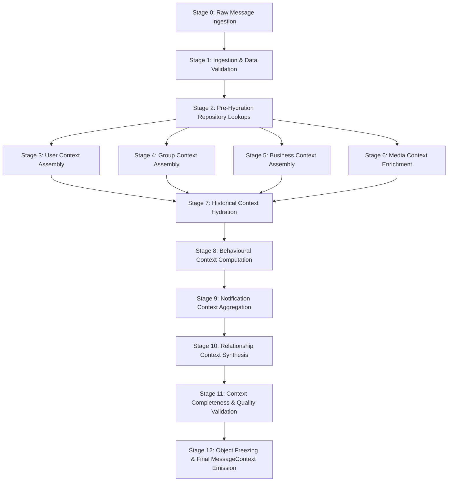

# Context Assembly Flow & Enrichment Engine Blueprint

## 1. Complete Assembly Pipeline Flow Architecture

The Context Assembly Engine executes a strict, 13-stage deterministic assembly flow to transform incoming raw message payloads into fully populated `MessageContext` master objects.



---

## 2. Stage-by-Stage Detailed Assembly Explanation

### Stage 0: Raw Message Ingestion
- **Input**: Inbound JSON event payload from WhatsApp Webhook or API Gateway containing `message_id`, `sender_phone`, `receiver_phone`, `group_id`, `content`, `timestamp`, and `media_hash`.
- **Action**: Wraps raw payload in a thread-safe `RawMessagePayload` instance.

### Stage 1: Ingestion & Data Validation
- **Action**: Performs syntax and boundary checks on input payload.
- **Validation Rules**:
  - `message_id` must be present and non-empty.
  - `timestamp` must be a valid positive integer.
  - Text encoding must be valid UTF-8.
- **Error Behavior**: Corrupted payloads immediately halt assembly and trigger an `InvalidPayloadException`.

### Stage 2: Pre-Hydration Repository Lookups
- **Action**: Queries `ContextRepositoryRegistry` in a single batch pass to fetch primary key records across CSV tables (`users.csv`, `groups.csv`, `business_accounts.csv`).
- **Optimization**: Resolves entity keys simultaneously using pre-indexed primary keys to prevent $N+1$ query overhead.

### Stage 3: User Context Assembly
- **Action**: Constructs `UserContext` instances for both **Sender** and **Receiver**.
- **Data Enrichment**: Resolves `user_id`, `preferred_language`, `timezone`, and calculates `account_age_days` from `registration_date`.
- **Fallback**: If user ID is missing from `users.csv`, populates an `UNKNOWN_USER_CONTEXT` default structure.

### Stage 4: Group Context Assembly
- **Action**: If `group_id` is present, queries `groups.csv` and `group_members.csv`.
- **Data Enrichment**: Hydrates group taxonomy, `total_member_count`, announcement settings, and sender-specific membership role (`ADMIN` vs `MEMBER`).
- **Fallback**: If message is a 1-on-1 Direct Message, returns `EMPTY_GROUP_CONTEXT`.

### Stage 5: Business Context Assembly
- **Action**: Evaluates whether sender or receiver is a registered commercial entity in `business_accounts.csv`.
- **Data Enrichment**: Injects verification level (`VERIFIED_OFFICIAL`), business vertical, support SLA, and catalog support flags.
- **Fallback**: If neither party is a business, returns `EMPTY_BUSINESS_CONTEXT`.

### Stage 6: Media Context Enrichment
- **Action**: Inspects `media_hash` or `message_type`. If media exists, retrieves pre-computed multimodal artifacts from `IMultimodalCache`.
- **Data Enrichment**: Attaches visual OCR text, image risk scores, speech-to-text transcripts, voice acoustic tone (`URGENT`/`CALM`), and voice duration.
- **Fallback**: For text-only messages, injects `TEXT_ONLY_MEDIA_CONTEXT`.

### Stage 7: Historical Context Hydration
- **Action**: Queries `message_history.csv` and `message_events.csv` for past thread interactions between sender and receiver pair.
- **Data Enrichment**: Calculates total historical exchange count, `days_since_last_interaction`, and aggregates recent delivery/read events over the past 24 hours.

### Stage 8: Behavioural Context Computation
- **Action**: Runs in-memory statistical aggregations over sender's historical message stream.
- **Data Enrichment**: Computes `sender_avg_daily_messages`, `sender_forward_ratio`, and evaluates if message transmission time falls into receiver's typical `quiet_hours`.

### Stage 9: Notification Context Aggregation
- **Action**: Fetches target user's records from `daily_notification_summary.csv`.
- **Data Enrichment**: Attaches cumulative daily notification count, historical open percentage, and average response latency in seconds.

### Stage 10: Relationship Context Synthesis
- **Action**: Combines output from Stage 3, Stage 5, and Stage 7 to synthesize relational attributes.
- **Data Enrichment**: Resolves `relationship_type` (`PEER_TO_PEER`, `CUSTOMER_BUSINESS`, `GROUP_MEMBER`), user commercial spend history (`customer_total_spend`), and customer tier (`VIP`, `REGULAR`).

### Stage 11: Context Completeness & Quality Validation
- **Action**: Passes assembled sub-contexts to `ContextValidationService`.
- **Calculations**: Verifies foreign-key integrity, executes null-safety assertions, and computes the global `completeness_score` ($0.0 \le Q \le 1.0$).

### Stage 12: Object Freezing & Final MessageContext Emission
- **Action**: Invokes `MessageContextFactory.create()`.
- **Output**: Returns the sealed, read-only, fully enriched master `MessageContext` object to downstream consumers.

---

## 3. Detailed Context Enrichment Mechanics

The enrichment engine transforms lean raw payloads into deep contextual models through systematic metadata expansion without making any routing decisions.

```
RAW INPUT:
{ "sender": "+15550199", "content": "Payment screenshot", "media_id": "img_99" }
                                │
                                ▼
                       CONTEXT ENRICHMENT
                                │
┌───────────────────────────────┴───────────────────────────────┐
│ • Sender Phone ──► Matched to user_102 (Language: English)    │
│ • img_99 ───────► OCR extracted: "Paid $45.00 to Nike Store"  │
│ • Business ─────► Nike Store (Verified Official, Tier: VIP)  │
│ • History ──────► 14 past orders, Last interacted 2 days ago  │
└───────────────────────────────┬───────────────────────────────┘
                                ▼
FINAL RESULT:
Fully Enriched MessageContext (Zero downstream actions executed)
```

### Specific Enrichment Strategies

#### 1. Raw Message Enrichment
- Converts raw epoch timestamps into local human-readable time structures (`day_of_week`, `hour_of_day`, `is_weekend`, `is_working_hours`).
- Analyzes text structure for URL presence, phone numbers, character count, and word count.

#### 2. Visual & Image Enrichment
- Enriches images by combining OCR markdown text, detected visual objects, and structural table extractions into `image_summary` and `image_risk_score`.

#### 3. Voice Note Enrichment
- Merges raw acoustic features (pitch, speech rate, energy) with transcript content to provide acoustic tone classification (`URGENT`, `CALM`) and voice urgency scores.

#### 4. User & Group Taxonomy Enrichment
- Expands user IDs into complete profile models including preferred language, account age, and registration verification.
- Enriches group IDs with workspace type, role hierarchy (`ADMIN`/`MEMBER`), and permission rules (`is_announcement_only`).

#### 5. Business & Commercial Relationship Enrichment
- Cross-references user ID and business ID in `user_business_history.csv` to calculate cumulative spend, order volume, and assign commercial relationship tiers (`VIP`/`REGULAR`).

#### 6. History & Notification Behavioral Enrichment
- Computes time elapsed since previous interaction (`days_since_last_interaction`) and attaches 30-day historical open rates and response latency averages.
