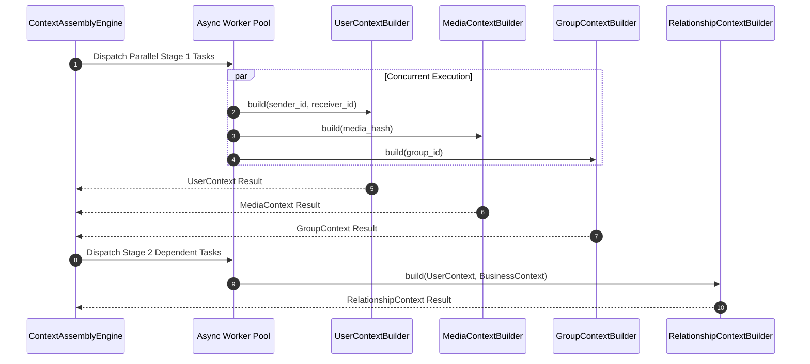

# Context Quality Scoring, Completeness & Performance Optimization

## 1. Context Quality & Completeness Scoring Engine

The Context Quality Engine evaluates the structural richness and data density of every assembled `MessageContext` object, outputting a normalized completeness metric $Q \in [0.0, 1.0]$.

### 1. Mathematical Completeness Formula

$$Q = \sum_{i=1}^{8} w_i \cdot C_i$$

Where $w_i$ represents the architectural weight of sub-context $i$, and $C_i \in [0.0, 1.0]$ represents the populated completeness score of that individual sub-context.

### 2. Sub-Context Weight Allocation Matrix ($\sum w_i = 1.0$)

| Sub-Context ($i$) | Weight ($w_i$) | Evaluation Criteria for $C_i = 1.0$ | Fallback Penalty Impact |
| :--- | :---: | :--- | :--- |
| **1. User Context** | $0.20$ | Registered in `users.csv`, complete profile & language settings. | $-0.15$ if user is unregistered/unknown. |
| **2. Core Message Context** | $0.20$ | Valid ID, non-empty payload, temporal metadata hydrated. | $-0.20$ if payload corrupted. |
| **3. Media Context** | $0.15$ | Multimodal payload processed, OCR or transcript present. | $-0.10$ if media corrupted/unresolvable. |
| **4. History Context** | $0.10$ | Historical thread interaction logs present in CSV. | $-0.08$ if first-time interaction. |
| **5. Group Context** | $0.10$ | Complete group workspace taxonomy & membership role. | $C_5 = 1.0$ by default for DMs. |
| **6. Business Context** | $0.10$ | Verified business details or confirmed peer-to-peer. | $C_6 = 1.0$ by default for P2P chats. |
| **7. Relationship Context** | $0.10$ | Relational spend or historical interaction tier resolved. | $-0.05$ if relationship unknown. |
| **8. Notification Context**| $0.05$ | Daily notification summary record found in CSV. | $-0.03$ if notification stats missing. |

---

## 2. Handling Sparse & Edge-Case Contexts

Downstream modules utilize the completeness score $Q$ to handle sparse context scenarios gracefully:

```
                  ┌─────────────────────────────────────┐
                  │ Assembled MessageContext (Score: Q) │
                  └──────────────────┬──────────────────┘
                                     │
           ┌─────────────────────────┼─────────────────────────┐
           ▼                         ▼                         ▼
   High Density             Moderate Density            Sparse Density
  (0.80 ≤ Q ≤ 1.00)        (0.50 ≤ Q < 0.80)            (0.00 ≤ Q < 0.50)
┌─────────────────────┐  ┌─────────────────────┐  ┌─────────────────────┐
│ Rich Metadata:      │  │ Partial Metadata:   │  │ Minimal Metadata:   │
│ • Full profiles     │  │ • Default User      │  │ • Unregistered User │
│ • Complete history  │  │ • Basic History     │  │ • No History        │
│ • OCR & Transcripts │  │ • Missing Media OCR │  │ • Corrupted Media   │
└─────────────────────┘  └─────────────────────┘  └─────────────────────┘
```

### Specific Sparse Context Strategies

#### 1. Unknown / Unregistered Senders ($Q_{\text{user}} = 0.25$)
- Injects `DEFAULT_USER_CONTEXT`.
- Context Quality Engine sets `is_anonymous_sender = True` flag in `quality_metrics`.
- Downstream AI consumers receive explicit indicator that sender identity metadata is unverified.

#### 2. Newly Created / Unclassified Groups ($Q_{\text{group}} = 0.50$)
- Injects `group_type = "COMMUNITY"` as standard default taxonomy.
- Member role defaults to `"MEMBER"` if membership record is unindexed.

#### 3. Missing or Corrupted Media Attachments ($Q_{\text{media}} = 0.00$)
- Injects `DEFAULT_MEDIA_CONTEXT` with `validation_status = "CORRUPTED"`.
- Prevents downstream multimodal parsing errors by substituting empty string extractions for OCR and voice transcripts.

---

## 3. High-Performance Architecture & Optimization Strategies

To assemble thousands of `MessageContext` objects per second under tight SLA constraints ($< 15\text{ms}$ latency), the engine employs four performance optimization strategies:

### 1. Parallel Sub-Context Resolution Architecture

Independent sub-context builders execute concurrently across an asynchronous thread pool.



### 2. Multi-Level In-Memory Caching Topology
- **L1 Hot Entity Cache**: LRU cache storing top 100,000 active user profiles (`users.csv`) and business accounts (`business_accounts.csv`) in serialized in-memory structures. Read latency: $< 0.1\text{ms}$.
- **L2 Relational Index Cache**: Pre-computed hash maps for `group_members.csv` (`group_id + user_id -> role`) and `user_business_history.csv` (`user_id + business_id -> spend`). Read latency: $< 0.5\text{ms}$.
- **L3 Multimodal Cache**: Shared memory cache storing processed `ImageContext` and `VoiceContext` payloads keyed by `sha256_hash`. Read latency: $< 1.0\text{ms}$.

### 3. Memory Optimization & Object Reuse
- **Zero Heap Allocation for Defaults**: Static singletons (`DEFAULT_USER_CONTEXT`, `DEFAULT_MEDIA_CONTEXT`, `DEFAULT_GROUP_CONTEXT`) are pre-allocated at engine boot time and reused across all sparse requests.
- **String Interning**: Shared structural text strings (e.g., `"INDIVIDUAL"`, `"VERIFIED_OFFICIAL"`, `"TEXT_ONLY"`) are interned to eliminate redundant string allocations.

### 4. High-Throughput Batch Processing Engine
When processing bulk CSV inputs or offline evaluations, `ContextAssemblyEngine.assemble_batch()` groups repository lookups into vectorized set queries:
- Replaces $N \times 9$ individual CSV lookups with 9 single bulk queries (`WHERE id IN (...)`) per batch of 1,000 messages.
- Reduces end-to-end assembly time per message in batch mode to $< 1.5\text{ms}$.
