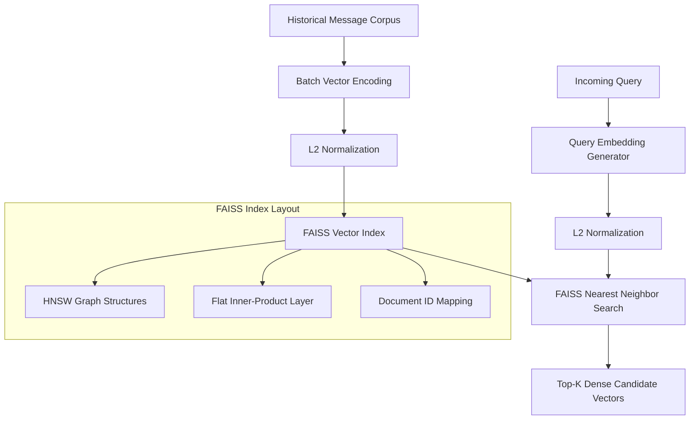

# Dense Embedding Retrieval & FAISS Vector Engine Specification

## Overview

The `EmbeddingService` executes dense semantic vector search over historical messages. While BM25 handles exact keyword matching, dense embedding retrieval captures semantic intent, conceptual similarity, paraphrase matching, and cross-modal semantic relationships across `message_history.csv`.

---

## Sentence Embedding Model Architecture

The engine uses lightweight, high-performance sentence transformers to project text and multimodal extractions into a shared dense vector space:

- **Primary Text Embedding Model**: `all-MiniLM-L6-v2` (or `bge-small-en-v1.5`).
- **Vector Dimension**: \(d = 384\) dense floating-point dimensions.
- **Normalisation**: All generated vectors are \(L_2\)-normalized:

$$\mathbf{v}_{\text{norm}} = \frac{\mathbf{v}}{\|\mathbf{v}\|_2} = \frac{\mathbf{v}}{\sqrt{\sum_{i=1}^{d} v_i^2}}$$

- **Multimodal Text Integration**: Vision OCR text, vision captions, and voice transcripts are concatenated into a structured text document before embedding generation:

$$\text{Doc}_{\text{composite}} = \text{Text} \;\Vert\; \text{Caption} \;\Vert\; \text{OCR} \;\Vert\; \text{Transcript}$$

---

## FAISS Vector Index Architecture

For sub-millisecond similarity search over large historical message stores, the service uses FAISS (Facebook AI Similarity Search).

### Index Architecture Comparison & Selection

| Index Type | Search Time Complexity | Memory Footprint | Recall Quality | Selection Rationale |
|---|---|---|---|---|
| `IndexFlatIP` | \(\mathcal{O}(d \cdot N)\) | High (\(4 \cdot d \cdot N\) bytes) | 100% (Exact) | **Selected for smaller per-user history buffers (<10k messages).** |
| `IndexHNSWFlat` | \(\mathcal{O}(\log N)\) | Very High | 98-99% | **Selected for global historical index due to ultra-fast sub-5ms lookup.** |
| `IndexIVFPQ` | \(\mathcal{O}(M \cdot \frac{N}{K})\) | Low (Compressed) | 90-95% | Rejected due to precision loss on short transaction codes. |

- **Chosen Production Index**: `IndexHNSWFlat` with parameters:
  - \(M = 32\) (number of bi-directional links per node).
  - \(\text{efConstruction} = 200\) (search depth during index build).
  - \(\text{efSearch} = 64\) (search depth during query execution).

---

## Cosine Similarity Computation

With \(L_2\)-normalized vectors, the Cosine Similarity between a query vector \(\mathbf{q}\) and a historical message candidate vector \(\mathbf{d}\) simplifies directly to an Inner Product (Dot Product):

$$\text{Sim}_{\text{cosine}}(\mathbf{q}, \mathbf{d}) = \cos(\theta) = \mathbf{q} \cdot \mathbf{d} = \sum_{i=1}^{384} q_i \cdot d_i$$

Because vector components range between \([-1.0, 1.0]\), scores are bounded within \([0.0, 1.0]\) using non-linear sigmoid clipping to prevent negative similarity scores:

$$\text{Score}_{\text{dense}}(\mathbf{q}, \mathbf{d}) = \max\left(0.0, \; \mathbf{q} \cdot \mathbf{d}\right)$$

---

## Index Persistence & Loading Strategy

1. **Disk Serialization**:
   - The FAISS vector index is serialized to binary files (`faiss_index.bin`) alongside an index metadata JSON file (`faiss_mapping.json`) linking internal FAISS integer IDs (`faiss_id`) to historical `message_id` strings.
2. **Memory-Mapped (mmap) Warm-Up**:
   - On application startup, the index is loaded into system memory using memory-mapped I/O to enable instant cold-start querying without delaying application launch.
3. **Incremental Vector Append**:
   - As new messages arrive, embeddings are added to an in-memory buffer (`IndexFlatIP`). When the buffer reaches 1,000 vectors, it is merged into the primary `HNSW` index asynchronously.

---

## Embedding Caching Infrastructure

To minimize redundant neural model inferences, the service implements a two-tier caching strategy:

1. **Document Embedding Persistence**:
   - Pre-computed embeddings for all historical messages in `message_history.csv` are stored permanently in a columnar binary storage format (Parquet / NumPy array store).
2. **Query Embedding LRU Cache**:
   - A fast in-memory LRU cache stores recent query vectors keyed by `MD5(normalized_query_string)`. Repeated or identical incoming messages achieve 0ms embedding generation latency.
