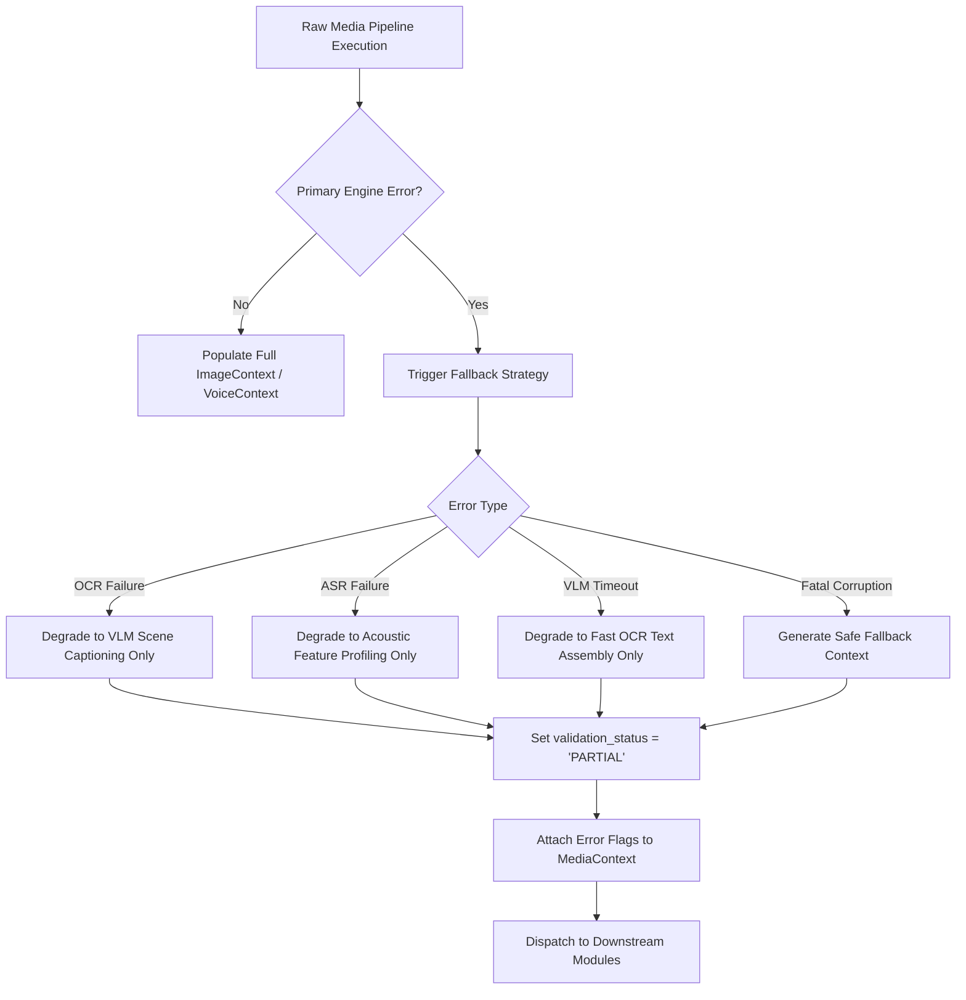
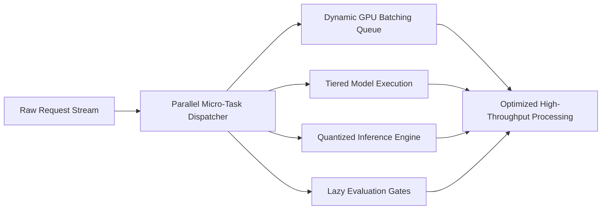

# Error Handling, Degradation & Performance Optimization Architecture

## 1. Comprehensive Failure Mode Matrix & Mitigation Strategies

The Multimodal Intelligence Layer must operate with maximum fault tolerance. Hardware GPU crashes, unreadable files, corrupt audio streams, or model timeouts must **NEVER** crash the pipeline or interrupt message handling.

| Failure Scenario | Root Cause | Detection Mechanism | Recovery & Degradation Strategy |
| :--- | :--- | :--- | :--- |
| **Missing File** | Disk I/O error or broken media storage path. | `FileNotFoundError` or zero-byte file check during Stage 1 validation. | Mark `validation_status = "FAILED"`. Return safe default `MediaContext` with error flag `MISSING_MEDIA_FILE`. |
| **Corrupted Binary File** | Truncated network transfer or invalid header bytes. | Magic byte inspection failure or decoder error. | Return `MediaContext` with error flag `CORRUPTED_BINARY`. Fallback to raw message text processing. |
| **Unreadable / Blurred Image** | Severe motion blur, zero contrast, or dark lighting. | Mean Laplacian variance $< 10.0$ (blur threshold) or Otsu contrast failure. | Skip OCR line extraction; invoke low-resolution VLM scene captioning to describe high-level shapes. |
| **Silent / Distorted Audio** | Microphone muted, low SNR, or extreme background clipping. | Silero VAD returns $0.0$ active speech seconds or SNR $< 3$ dB. | Set `transcript = ""` and `acoustic_tone = "SILENT"`. Flag `AUDIO_LOW_QUALITY`. |
| **Unsupported Media Format** | Unknown file codec or unsupported extension (e.g., `.heic`, `.amr`). | MIME type check failure. | Attempt FFmpeg universal transcoding fallback. If unsuccessful, flag `UNSUPPORTED_FORMAT`. |
| **OCR Engine Failure / Timeout** | Memory allocation fault or OCR timeout ($> 3.0$s). | Execution timer interrupt or process exception. | Fall back from primary PaddleOCR engine to secondary TrOCR/Tesseract engine; if both fail, degrade to raw VLM captioning. |
| **ASR Model Execution Failure** | GPU OOM or CUDA kernel driver error during Whisper decoding. | CTranslate2 exception catch. | Switch execution to CPU fallback queue using quantized `distil-whisper-small` model. |
| **Subsystem Timeout** | Deep VLM inference exceeds hard deadline ($> 5.0$s). | Async task deadline cancellation. | Abort deep VLM path; assemble `ImageContext` using fast OCR text and heuristic visual features. |
| **External API Rate Limit** | External vision model HTTP 429 rate-limiting. | HTTP status code intercept. | Trigger local open-source VLM fallback (e.g., local SigLIP / Moondream container). |

---

## 2. Graceful Degradation Architecture & Fallback Pipelines

### Safe Fallback Context Principles
1. **Never Raise Unhandled Exceptions**: Pipeline entries wrap all internal executions in a high-level circuit breaker. If an unrecoverable exception occurs, a valid `MediaContext` object is guaranteed to be returned.
2. **Explicit Error Tagging**: Downstream modules are informed of degradation through the `error_flags` list (`["OCR_ENGINE_TIMEOUT", "VLM_FALLBACK_APPLIED"]`) and `validation_status` enum (`"PARTIAL"` or `"FAILED"`).
3. **Partial Feature Preservation**: If OCR succeeds but visual category classification fails, the extracted OCR text and QR payloads are preserved in the returned `ImageContext`.

---

## 3. Performance & Throughput Optimization Architecture

To maintain low latency and scalable GPU memory utilization under peak WhatsApp traffic, the pipeline employs 6 core optimization techniques:

### 1. Parallel Task Execution
- Within the Image Pipeline, OCR text extraction, QR matrix scanning, and VLM visual embedding computation run asynchronously in parallel using non-blocking worker pools (`asyncio.gather`), cutting processing latency by up to $60\%$.
- Within the Voice Pipeline, Silero VAD, pitch contour extraction, and Whisper ASR execution operate concurrently on isolated worker threads.

### 2. Dynamic Batching & GPU Queuing
- Requests targeting heavy neural models (Faster-Whisper, VLM encoders) are coalesced into dynamic micro-batches (batch size $N = 8$ or $N = 16$) with a maximum queue delay of $15$ms.
- Micro-batching maximizes GPU Tensor Core utilization ($> 85\%$) compared to single-sample sequential inference.

### 3. Tiered Processing Architecture
- **Tier 1 (Ultra-Fast Heuristics)**: Execute lightweight QR decoding and fast text detection ($< 10$ms). If an image is 100% recognized as a standard payment QR code, deep VLM evaluation is skipped entirely.
- **Tier 2 (Local Edge Neural Models)**: Execute fast local ONNX models (PaddleOCR, Silero VAD, Distil-Whisper).
- **Tier 3 (Deep Multimodal Models)**: Execute full VLM scene decomposition only when Tiers 1 and 2 indicate high visual complexity.

### 4. Precision Quantization (Float16 & INT8)
- All local neural models are deployed with quantization:
  - **Faster-Whisper**: INT8 quantization via CTranslate2, reducing VRAM footprint by $70\%$ with $< 1\%$ drop in word error rate (WER).
  - **Vision Encoders**: Float16 (FP16) Mixed Precision execution on CUDA Tensor Cores.

### 5. Memory Optimization & Streaming Audio
- Large audio files are streamed in chunks rather than buffering uncompressed 32-bit float audio matrices in RAM.
- Downscaled image tensors are freed immediately from VRAM as soon as encoder embeddings are generated.

### 6. Lazy Evaluation Strategy
- Fields requiring expensive computation (such as deep structural table reconstruction or fine-grained OCR spell checking) are evaluated lazily only when initial bounding box heuristics indicate multi-column tabular data.
