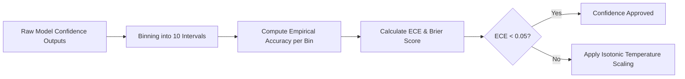
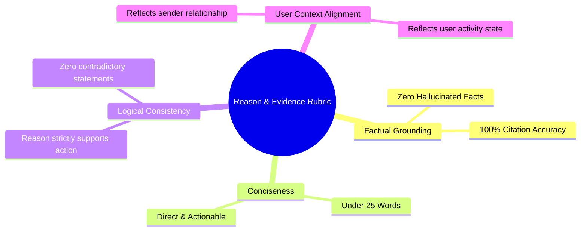
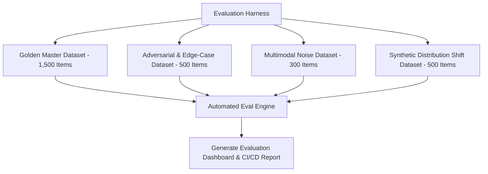
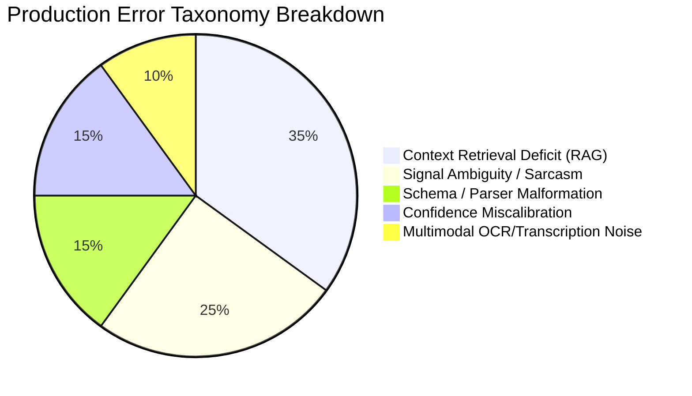

# Master Architecture Specification: Evaluation Framework

This document defines the offline evaluation methodology, LLM-as-a-Judge evaluation rubrics, confidence calibration standards, benchmark datasets, stress testing procedures, and continuous improvement metrics for the AI-powered WhatsApp Message Notification Router.

---

## 1. Executive Summary & Design Principles

Evaluating a production AI notification system requires moving beyond generic accuracy. A system that misclassifies a routine promotional message as low priority suffers a minor UX issue, whereas misclassifying an emergency medical message as `DO_NOT_DISTURB` represents a critical failure.

Our evaluation framework is built on four pillars:
1. **Asymmetric Risk-Weighted Metrics**: Severe penalties for critical false negatives.
2. **Calibrated Confidence Alignment**: Ensuring model confidence correlates perfectly with empirical accuracy.
3. **Factual Grounding & Reason Quality**: Automated LLM-as-a-Judge audit suites for rationale validity.
4. **Automated CI/CD Regression Testing**: Zero deployment without passing benchmark thresholds.

---

## 2. Core Quantitative Evaluation Metrics

### 1. Multi-Class Classification Performance
Evaluated across all 4 routing actions: `NOTIFY_IMMEDIATELY`, `DELIVER_SILENTLY`, `SUMMARIZE_IN_BATCH`, `DO_NOT_DISTURB`.

- **Primary Benchmark Metrics**:
  - Macro F1-Score (Target: $\ge 0.92$)
  - Action-Specific Precision & Recall
  - Weighted Accuracy (Target: $\ge 0.95$)

### 2. Risk-Weighted Error Matrix
To reflect production impact, errors are penalized according to an explicit Severity Cost Matrix.

| True Class \ Predicted Class | NOTIFY_IMMEDIATELY | DELIVER_SILENTLY | SUMMARIZE_IN_BATCH | DO_NOT_DISTURB |
| :--- | :--- | :--- | :--- | :--- |
| **NOTIFY_IMMEDIATELY** | `0` (Correct) | `10` (CRITICAL FAIL) | `8` (HIGH FAIL) | `15` (FATAL FAIL) |
| **DELIVER_SILENTLY** | `2` (Minor Annoyance)| `0` (Correct) | `1` (Negligible) | `3` (Moderate) |
| **SUMMARIZE_IN_BATCH**| `3` (Moderate) | `1` (Negligible) | `0` (Correct) | `2` (Minor) |
| **DO_NOT_DISTURB** | `5` (High Annoyance) | `2` (Minor) | `1` (Negligible) | `0` (Correct) |

*System evaluation score calculates total penalty points per test run, requiring total penalty score $< 50$ per 1,000 benchmark evaluations.*

---

## 3. Confidence Calibration Framework

Model confidence ($C \in [0.0, 1.0]$) must accurately reflect empirical accuracy ($A \in [0.0, 1.0]$). Overconfident predictions with incorrect actions are explicitly penalized.

### Calibration Metrics
1. **Expected Calibration Error (ECE)**:
   $$\text{ECE} = \sum_{m=1}^{M} \frac{|B_m|}{N} \Big| \text{acc}(B_m) - \text{conf}(B_m) \Big|$$
   - *Target*: $\text{ECE} \le 0.05$ (5% max variance across confidence bins).
2. **Brier Score**: Measures mean squared difference between predicted probability and actual binary correctness outcome ($y \in \{0, 1\}$).
   - *Target*: $\text{Brier Score} \le 0.08$.

---

## 4. Reason & Evidence Quality Evaluation (LLM-as-a-Judge)

Every generated rationale (`reason`) and extracted evidence list (`evidence`) is evaluated asynchronously using a Judge Model against standardized rubrics.

### Evaluation Rubric Matrix

- **Grounding Ratio**: $\frac{\text{Validated Evidence Citations}}{\text{Total Extracted Claims}} = 1.00$ (Zero tolerance for ungrounded claims).
- **Reason Judge Alignment**: Agreement rate between Judge LLM score and manual human annotator ratings (Target: Kendall's $\tau \ge 0.88$).

---

## 5. Benchmark Datasets & Testing Harness

Evaluation is conducted against 4 distinct test dataset suites.

### Test Suite Descriptions
1. **Golden Master Dataset (1,500 samples)**: Hand-curated, balanced real-world WhatsApp notification records across diverse sender relationship types, time windows, and user preferences.
2. **Adversarial Edge-Case Suite (500 samples)**: Contains prompt injection attempts, sarcastic text, ambiguous urgency ("Call me when you're dead... tired"), and conflicting user preferences.
3. **Multimodal Noise Suite (300 samples)**: Contains degraded OCR text (blurry images, low contrast screenshots) and noisy audio transcripts (background static, heavy accents, truncated audio).
4. **Synthetic Distribution Shift (500 samples)**: Simulates seasonal notification spikes (holidays, flash sales, group chat storms) to test system robustness against temporal shifts.

---

## 6. Failure Analysis & Error Taxonomy

System errors are categorized into an immutable 5-class error taxonomy for targeted engineering remediations.

### Error Action Plan Matrix
- **Context Retrieval Deficit**: Expand RAG search window ($K=3 \to K=5$) or re-index conversation summary memory.
- **Signal Ambiguity / Sarcasm**: Shift message execution from Tier 1 Fast LLM to Tier 2 Deep Reasoner with Critic Agent.
- **Schema / Parser Malformation**: Trigger Stage 4 LLM Repair Prompt and update Pydantic regex guards.

---

## 7. Continuous Improvement Tracking

To prove that system changes yield real improvements, every PR triggers automated regression evaluation.

### Release Gate Requirements (CI/CD Quality Bar)
- [x] Zero regression on Golden Master Dataset Macro F1 ($\ge 0.92$).
- [x] Risk-Weighted Penalty Score strictly lower than baseline version.
- [x] ECE score $\le 0.05$.
- [x] 100% passing rate on Adversarial Safety & Prompt Injection test suites.
- [x] Latency p95 strictly $\le 1,500\text{ ms}$.
