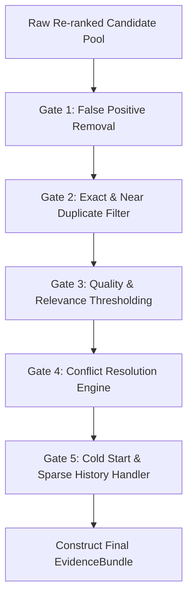

# Evidence Object Schemas & Evidence Validation Engine Specification

## Overview

The `EvidenceModels` specification defines the data structures and validation pipeline for historical evidence objects.

The output of the Hybrid Retrieval Engine is an immutable `EvidenceBundle` containing a prioritized list of `EvidenceItem` objects. These items serve as deterministic historical evidence for downstream decision engines.

---

## 1. `EvidenceItem` Schema & Field Explanations

Each `EvidenceItem` encapsulates a single historical message or interaction record retrieved from historical indices (`message_history.csv`, `message_events.csv`, `user_business_history.csv`, `group_members.csv`).

```
EvidenceItem = {
    "message_id": String,               # Unique historical message identifier
    "similarity_score": Float,          # Final multi-factor re-ranking score [0.00, 1.00]
    "behaviour_match": Float,           # Behavioral match score based on past user actions [-1.00, 1.00]
    "sender_match": Float,              # Degree of sender match (1.0 = exact same sender, 0.0 = different sender)
    "business_match": Float,            # Business account & domain match degree [0.00, 1.00]
    "group_match": Float,               # Group ID & group taxonomy match degree [0.00, 1.00]
    "recency_days": Float,              # Time elapsed in days between historical item and current query
    "importance_weight": Float,         # Category importance multiplier [0.40, 1.20]
    "trust_score": Float,               # Domain trust and sender reputation score [0.00, 1.00]
    "reason_retrieved": String,         # Taxonomic retrieval code explaining retrieval motivation
    "source_dataset": String,           # Source CSV dataset (e.g., "message_history.csv")
    "historical_action_taken": String   # Past user action ("replied", "dismissed", "opened", "reported", "muted")
}
```

### Detailed Field Rationale

| Field Name | Data Type | Value Range | Justification & Architectural Necessity |
|---|---|---|---|
| `message_id` | String | Format `message_XXXX` | Provides explicit lineage back to raw historical message record. |
| `similarity_score` | Float | `[0.00, 1.00]` | Quantifies overall composite relevance (semantic + multi-factor). |
| `behaviour_match` | Float | `[-1.00, 1.00]` | Indicates whether past interaction was positive (reply/open) or negative (dismiss/report). |
| `sender_match` | Float | `[0.00, 1.00]` | Distinguishes evidence from the exact same individual vs similar third parties. |
| `business_match` | Float | `[0.00, 1.00]` | Validates whether historical evidence originates from the same commercial entity. |
| `group_match` | Float | `[0.00, 1.00]` | Confirms whether historical evidence belongs to the same chat group context. |
| `recency_days` | Float | `[0.0, inf)` | Allows downstream modules to discount older historical precedents. |
| `importance_weight`| Float | `[0.40, 1.20]` | Reflects inherent domain urgency (transaction > promo). |
| `trust_score` | Float | `[0.00, 1.00]` | Flags suspicious, unverified, or domain-mismatched historical senders. |
| `reason_retrieved` | String | Enumerated Taxonomy | Provides transparent, auditable explanation for why this evidence item was selected. |
| `source_dataset` | String | Enumerated CSV | Identifies origin data store for data lineage auditing. |
| `historical_action_taken`| String | Enumerated Action | Summarizes user's explicit past behavioral response to this message. |

### Valid `reason_retrieved` Taxonomy Values

- `EXACT_SENDER_REPLY_HISTORY`: Historical message from same sender that user explicitly replied to.
- `EXACT_SENDER_DISMISSAL_HISTORY`: Historical message from same sender that user swiped away without opening.
- `SIMILAR_PROMOTIONAL_DISMISSAL`: High-similarity promotional blast previously dismissed by user.
- `REPEATED_SCAM_PATTERN`: Historical scam message matching domain spoofing or reported text.
- `PAST_TRANSACTION_RECEIPT`: Previous banking/payment confirmation from same business entity.
- `PREVIOUS_OTP_REQUEST`: Past authentication alert from same service.
- `GROUP_ACTIVITY_PRECEDENT`: Past thread context from same group chat.

---

## 2. `EvidenceBundle` Schema & Structure

An `EvidenceBundle` aggregates all validated `EvidenceItem` objects for a given incoming message into a single, structured payload.

```
EvidenceBundle = {
    "query_message_id": String,         # Incoming message ID under evaluation
    "user_id": String,                  # Recipient user ID
    "timestamp": Timestamp,             # Bundle creation timestamp
    "retrieval_confidence": Float,      # Overall retrieval confidence score [0.00, 1.00]
    "evidence_count": Integer,          # Total number of validated evidence items included (0 to 10)
    "primary_reason": String,           # Dominant retrieval taxonomy reason across items
    "items": List[EvidenceItem],        # Priority-ordered list of top evidence items
    "coverage_score": Float,            # Percentage of expected retrieval dimensions covered [0.00, 1.00]
    "has_conflicting_evidence": Boolean # True if both positive (reply) and negative (dismiss) evidence exist
}
```

---

## 3. `EvidenceValidator` Pipeline Specification

The `EvidenceValidator` executes a series of quality gates before sealing the `EvidenceBundle`:



### Validation Gates

1. **Gate 1: False Positive Filtering**:
   - Removes candidates where dense semantic score is high (>0.80) but domain entities (order ID, amount, domain name) contradict the query context.
2. **Gate 2: Duplicate Evidence Suppression**:
   - Suppresses near-duplicate historical items from the same sender within a 24-hour window, keeping only the item with the highest interaction signal.
3. **Gate 3: Quality & Relevance Thresholding**:
   - Discards any item with `similarity_score < 0.35` unless it represents an exact `sender_user_id` or `business_id` match.
4. **Gate 4: Conflicting Evidence Resolution**:
   - If historical evidence contains both replies (`message_replied == 1`) and dismissals (`notification_dismissed == 1`) for the same sender, the validator flags `has_conflicting_evidence = True` and computes a net behavioral weight:

$$\text{NetBehavior} = \frac{\sum \text{Replies} - \sum \text{Dismissals}}{\text{Total Historical Messages}}$$

5. **Gate 5: Cold Start & Sparse History Handling**:
   - **New User Cold-Start**: If recipient `user_id` has <3 historical messages in `message_history.csv`, retrieval falls back to global business profiles (`business_accounts.csv`) and group-level metadata (`groups.csv`).
   - **Unknown Business Cold-Start**: If `business_id` is unknown, retrieval relies strictly on domain trust checks, OCR text extraction, and category keyword matching.
