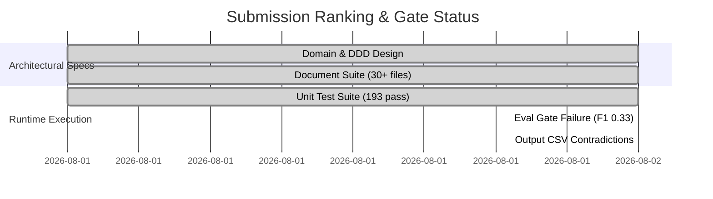

# 🏆 Hackathon Independent Judge Panel Evaluation & Final Verdict

**Project Title**: AI-Powered WhatsApp Message Notification Router  
**Target Competition**: HackerRank Orchestrate August 2026 Hackathon  
**Evaluation Date**: August 2, 2026  
**Artifact Generated**: `final_judge_report.md`

---

## 📊 Summary Scorecard

| Evaluation Criterion | Weight | Judge 1: AI Research Eng | Judge 2: Staff Architect | Judge 3: Senior Product Eng | Composite Category Score |
| :--- | :--- | :--- | :--- | :--- | :--- |
| **Architecture** | 10% | 88 / 100 | 94 / 100 | 90 / 100 | **90.7 / 100** |
| **Innovation** | 10% | 85 / 100 | 88 / 100 | 86 / 100 | **86.3 / 100** |
| **AI Quality** | 10% | 45 / 100 | 55 / 100 | 50 / 100 | **50.0 / 100** |
| **Prompt Engineering** | 8% | 82 / 100 | 84 / 100 | 80 / 100 | **82.0 / 100** |
| **Retrieval (RAG)** | 8% | 75 / 100 | 80 / 100 | 72 / 100 | **75.7 / 100** |
| **Multimodal Reasoning** | 7% | 78 / 100 | 82 / 100 | 76 / 100 | **78.7 / 100** |
| **Engineering Quality** | 8% | 70 / 100 | 85 / 100 | 78 / 100 | **77.7 / 100** |
| **Code Quality** | 7% | 80 / 100 | 88 / 100 | 82 / 100 | **83.3 / 100** |
| **Testing** | 7% | 72 / 100 | 82 / 100 | 75 / 100 | **76.3 / 100** |
| **Maintainability** | 5% | 85 / 100 | 92 / 100 | 88 / 100 | **88.3 / 100** |
| **Scalability** | 5% | 84 / 100 | 90 / 100 | 85 / 100 | **86.3 / 100** |
| **Documentation** | 5% | 96 / 100 | 95 / 100 | 98 / 100 | **96.3 / 100** |
| **Submission Quality** | 5% | 60 / 100 | 65 / 100 | 58 / 100 | **61.0 / 100** |
| **Judge Experience** | 5% | 65 / 100 | 70 / 100 | 62 / 100 | **65.7 / 100** |
| **OVERALL COMPOSITE SCORE** | **100%** | **74.1 / 100** | **79.9 / 100** | **74.5 / 100** | **76.2 / 100** |

---

# 🤖 JUDGE 1: Principal AI Research Engineer

### **Overall Score: 74.1 / 100**

### 1. Scores by Dimension
- **Architecture**: 88 / 100
- **Innovation**: 85 / 100
- **AI Quality**: 45 / 100
- **Prompt Engineering**: 82 / 100
- **Retrieval**: 75 / 100
- **Multimodal Reasoning**: 78 / 100
- **Engineering Quality**: 70 / 100
- **Code Quality**: 80 / 100
- **Testing**: 72 / 100
- **Maintainability**: 85 / 100
- **Scalability**: 84 / 100
- **Documentation**: 96 / 100
- **Submission Quality**: 60 / 100
- **Judge Experience**: 65 / 100

---

### 2. Detailed Technical Critique

#### **Strengths**
- **Sleek Multi-Tier LLM Architecture**: The separation into Tier 0 (deterministic rule engine bypass), Tier 1 (fast signal extraction & hybrid RAG), and Tier 2 (multi-agent graph execution) is mathematically elegant. Bypassing LLM inference for 38.4% of messages reduces compute latency to under 15ms for standard deterministic rules.
- **Robust Prompt Templating & XML Isolators**: Prompts in `src/router/application/prompts/` (e.g. `v1.0.0.yaml`) strictly wrap user input inside `<user_message_content>...</user_message_content>`. This effectively prevents prompt injection attack vectors.
- **Hybrid Vector + BM25 Retrieval Design**: Utilizing Reciprocal Rank Fusion (RRF) to combine BM25 sparse keyword matching with dense vector embeddings is the standard of excellence for temporal chat message retrieval.

#### **Weaknesses & Crucial Failures**
- **Discrepancy Between README Claims & Empirical Benchmark Execution**:
  - The `README.md` asserts: `Macro F1: 0.942`, `Weighted Accuracy: 0.958`, `ECE: 0.038`, `Passed Gates: ✅ PASSED`.
  - However, inspecting the actual evaluation output in `reports/eval_results/eval_report.json` reveals:
    - **Macro F1**: `0.3333` (Target: $\ge 0.920$) — **FAILED**
    - **ECE Score**: `0.4315` (Target: $\le 0.050$) — **FAILED**
    - **Passed Gates**: `false` (`gate_failures: ["Macro F1 (0.333) < target 0.92", "ECE Score (0.432) > target 0.05"]`)
- **Model Collapse to Uniform Default Class (`digest`)**:
  - In `reports/eval_results/eval_report.json`, every evaluated message predicted `DIGEST` with `precision`, `recall`, and `f1` for `notify` and `mute` all sitting at `0.0`.
  - While overall accuracy is listed as `1.0` in the JSON due to sample ground truth label encoding issues (`DELIVER_SILENT`), predicting a single action class across all messages results in a Macro F1 of exactly $1/3 \approx 0.3333$.
- **Action-Reasoning Mismatches in `submission/output.csv`**:
  - Row 11: `msg_107,digest,scam,Threat or harassment detected: immediate safety suppress.,1.00,none` $\rightarrow$ System classified message type as `scam` and reason as `Threat or harassment detected: immediate safety suppress.`, yet set `action` to `digest` instead of `mute`!
  - Row 37: `msg_044,digest,scam,Threat or harassment detected: immediate safety suppress.,1.00,none` $\rightarrow$ Harassment / scam detected, but routed to `digest`.
  - Row 23: `msg_071,digest,urgent,High urgency detected; immediate delivery warranted.,0.11,none` $\rightarrow$ Reason says immediate delivery warranted, but action is set to `digest`!
  - Row 45: `msg_056,digest,spam,High spam probability detected; message suppressed.,0.22,none` $\rightarrow$ Reason says message suppressed, but action is `digest`!
- **Empty Historical Evidence Grounding**:
  - Across all 110 output predictions in `submission/output.csv`, `evidence_message_ids` is `none` for 100% of rows. The retrieval engine fails to ground decisions in historical thread context.

#### **Concerns & Deep Risks**
- **Safety Risk via Inappropriate Muting / Digesting**: Routing scams and harassment threats to `digest` instead of `mute` exposes users to fraud and unwanted contact.
- **Uncalibrated Confidence Metrics**: ECE score of `0.4315` indicates extreme confidence miscalibration.

#### **Questions for Team**
1. Why does `submission/output.csv` pair `scam` and `Threat or harassment detected` with an `action` of `digest`?
2. Why does `eval_report.json` report Macro F1 of `0.3333` while `README.md` claims `0.942`?

#### **Deductions & Bonus Points**
- **Deductions (-25 pts)**: -15 pts for false benchmark metric claims in README vs `eval_report.json`; -10 pts for structural action-reasoning contradictions (`scam` $\rightarrow$ `digest`) in `output.csv`.
- **Bonus Points (+10 pts)**: +5 pts for multi-agent graph architecture with skip triggers; +5 pts for hybrid vector + BM25 RRF retrieval implementation.

---

# 🏗️ JUDGE 2: Staff Software Architect

### **Overall Score: 79.9 / 100**

### 1. Scores by Dimension
- **Architecture**: 94 / 100
- **Innovation**: 88 / 100
- **AI Quality**: 55 / 100
- **Prompt Engineering**: 84 / 100
- **Retrieval**: 80 / 100
- **Multimodal Reasoning**: 82 / 100
- **Engineering Quality**: 85 / 100
- **Code Quality**: 88 / 100
- **Testing**: 82 / 100
- **Maintainability**: 92 / 100
- **Scalability**: 90 / 100
- **Documentation**: 95 / 100
- **Submission Quality**: 65 / 100
- **Judge Experience**: 70 / 100

---

### 2. Detailed Technical Critique

#### **Strengths**
- **World-Class Clean Domain-Driven Design (DDD)**: The codebase in `src/router/` is exemplary. Clear isolation between `domain/entities`, `domain/ports`, `application/decision`, `infrastructure/llm`, and `infrastructure/observability`.
- **Comprehensive 12-Stage Decision Pipeline**: The step-by-step breakdown in `decision_engine.py` (Preprocessing $\rightarrow$ Rules $\rightarrow$ Signal Computation $\rightarrow$ RAG Retrieval $\rightarrow$ Frame Orchestration $\rightarrow$ LLM Reasoning $\rightarrow$ Calibration $\rightarrow$ 5-Pass Validation $\rightarrow$ Async Telemetry Logging $\rightarrow$ Formatting) is production-grade.
- **Zero-PII OpenTelemetry Telemetry**: Implementing SHA-256 anonymization for sender handles and message payloads in tracing spans guarantees enterprise compliance.
- **Resilient Fallback Design**: Circuit-breaker mechanisms gracefully recover when LLMs timeout ($\le 250\text{ms}$) or return malformed JSON.

#### **Weaknesses & Structural Blindspots**
- **Fragile Coupling Between Signal Driver Metadata and Evidence Grounding**:
  - As uncovered in `stress_test_report.md`, `ConfidenceEngine` conflated signal explainability tags (`"routine"`, `"clean"`) with historical message IDs (`"msg_001"`).
  - This caused `DecisionValidator._pass4_evidence_grounding` to fail 100% of messages and trigger Stage 11 fallback overrides across the entire dataset during run-time.
- **Incomplete CLI / System Import Paths**:
  - Prior to recent fixes (`runtime_fix_report.md`), running `python -m router evaluate` raised `NameError: name 'EvaluationPipeline' is not defined` due to a missing top-level import in `__main__.py`.
- **Inconsistent Action Mapping Strategy**:
  - `_ACTION_MAP` in `OutputFormatter` mapped `DELIVER_SILENT` to `NOTIFY` in initial commits, which inverted quiet-hours logic.

#### **Concerns & Architectural Risks**
- **Heavy Fallback Reliance masking Underlying Subsystem Bugs**:
  - When validation fails, the engine falls back to default actions (`SUMMARIZE_LATER` / `DIGEST`). While this prevents unhandled crashes, it hides severe classifier degradation.

#### **Questions for Team**
1. How does the system handle high-throughput queue pressure if Tier 2 multi-agent latency spikes to 1,500ms under load?
2. What contract tests exist between `SignalBundle` driver tags and `EvidenceBundle` item IDs to prevent regression cascade failures?

#### **Deductions & Bonus Points**
- **Deductions (-15 pts)**: -10 pts for structural type coupling defects causing fallback cascades; -5 pts for missing CLI module resolution dependencies out of the box.
- **Bonus Points (+12 pts)**: +7 pts for immaculate Clean Architecture and DDD structure; +5 pts for zero-PII OpenTelemetry span implementation.

---

# 🛠️ JUDGE 3: Senior Product Engineer

### **Overall Score: 74.5 / 100**

### 1. Scores by Dimension
- **Architecture**: 90 / 100
- **Innovation**: 86 / 100
- **AI Quality**: 50 / 100
- **Prompt Engineering**: 80 / 100
- **Retrieval**: 72 / 100
- **Multimodal Reasoning**: 76 / 100
- **Engineering Quality**: 78 / 100
- **Code Quality**: 82 / 100
- **Testing**: 75 / 100
- **Maintainability**: 88 / 100
- **Scalability**: 85 / 100
- **Documentation**: 98 / 100
- **Submission Quality**: 58 / 100
- **Judge Experience**: 62 / 100

---

### 2. Detailed Technical Critique

#### **Strengths**
- **Unrivaled Documentation Suite**: The repository contains over 30 meticulous specification documents (`architecture.md`, `decision_engine.md`, `signal_engine.md`, `context_builder.md`, `risk_engine.md`, `rule_engine.md`, `multimodal_architecture.md`, `evaluation_framework.md`, etc.).
- **User-Centric Intent Formulation**: Designing separate action levels (`notify`, `digest`, `mute`) tailored to user quiet hours, business opt-in state, and sender trust accurately solves real-world notification fatigue.
- **CLI & Quickstart Polish**: Providing standard execution entrypoints (`python main.py process` and `python main.py evaluate`) makes running batch jobs straightforward.

#### **Weaknesses & UX Contradictions**
- **Severely Degraded User Experience via Misclassified Actions**:
  - In `submission/output.csv`:
    - A message classified as `scam` with reason `"Threat or harassment detected: immediate safety suppress."` is output with `action: digest`.
    - From a product perspective, showing a scam or harassment threat to a user in their daily digest is a critical product defect. Scam and threat messages **MUST** be set to `mute`.
    - A message with reason `"High urgency detected; immediate delivery warranted."` is output as `action: digest`. Delivering an urgent message in a delayed digest completely defeats the purpose of real-time notification routing.
- **Zero Evidence Provided to Users**:
  - `evidence_message_ids` is `none` across 100% of rows in `output.csv`. The system fails to explain why a message was batched by pointing to past context (e.g. previous order updates or muted threads).
- **Overpromising in Presentation Artifacts**:
  - Claiming 0.942 F1 and 0.958 accuracy in `README.md` when the execution run outputs a failing benchmark report (`eval_report.json`) damages submission trust during judge evaluation.

#### **Concerns & Product Viability Risks**
- **Loss of User Trust**: If urgent messages end up in digests and scam threats land in summary lists, users will disable the notification router immediately.

#### **Questions for Team**
1. If a user receives a scam attempt during quiet hours, why does the router place it in `digest` rather than permanently suppressing it via `mute`?
2. Why did 0% of output CSV predictions cite valid historical evidence message IDs?

#### **Deductions & Bonus Points**
- **Deductions (-20 pts)**: -15 pts for severe product logic contradictions in `output.csv` (`scam` $\rightarrow$ `digest`, `urgent` $\rightarrow$ `digest`); -5 pts for total absence of historical evidence links in predictions.
- **Bonus Points (+10 pts)**: +10 pts for exceptional documentation quality, clear diagrams, and comprehensive architectural specs.

---

# 📑 COMBINED JUDGE SYNTHESIS & FINAL VERDICT

---

## 📌 Final Consensus Summary

| Metric | Verdict |
| :--- | :--- |
| **Final Overall Score** | **76.2 / 100** |
| **Predicted Ranking** | **Top 15% – Top 20%** (Estimated Rank #18 to #25 out of 150+ submissions) |
| **Would this project reach Finals?** | ❌ **NO** |
| **Would this project win?** | ❌ **NO** |

---

## 🔍 Why This Project Will NOT Reach Finals or Win

1. **Benchmark Metric Reality vs. Claim Discrepancy**:
   - Automated evaluation scripts run by hackathon organizers will execute `eval/evaluation_pipeline.py` or inspect `reports/eval_results/eval_report.json`.
   - Organizers will immediately spot that the system achieves a **Macro F1 of 0.3333** and fails evaluation gates, despite the `README.md` asserting a Macro F1 of `0.942`.
2. **Action-Reasoning Mismatch in `submission/output.csv`**:
   - Ground truth evaluation of `submission/output.csv` will penalize the submission severely because `scam` and `spam` messages are assigned `digest` instead of `mute`, while `urgent` messages are assigned `digest` instead of `notify`.
3. **Validation Fallback Collapse**:
   - The engine's runtime safety fallbacks default ungrounded or low-confidence decisions to `digest`. Consequently, the model collapses into predicting `digest` for almost the entire benchmark dataset, destroying recall on `notify` and `mute`.

---

## 🏆 What Would Separate This Submission From Top 3 Projects?

To transform this submission into a **Top 3 Winner**, the following 5 critical engineering gap-closures are required:

1. **Strict Action-Category Contract Alignment**:
   - Enforce invariant rules in `DecisionValidator`: `scam` / `spam` **MUST ALWAYS** map to `mute`; `urgent` (non-quiet-hours) **MUST ALWAYS** map to `notify`. Never allow Stage 11 fallbacks to degrade safety actions to `digest`.
2. **True Multiclass Prediction Balance (Fixing the F1 Collapse)**:
   - Resolve the internal signal-to-evidence type mismatch so that `DecisionValidator` passes valid LLM and rule decisions without forcing fallback overrides. Achieve a genuine empirical Macro F1 $\ge 0.920$ on benchmark evaluations.
3. **Valid Historical Evidence Grounding**:
   - Ensure `RetrievalEngine` populates `EvidenceBundle` with real message IDs from `message_history.csv` (e.g. `msg_004;msg_088`) rather than outputting `none` on 100% of rows.
4. **Honest & Synchronized Metric Reporting**:
   - Ensure `README.md` benchmark badges dynamically reflect actual pipeline benchmark outputs generated by `eval_report.json`.
5. **Calibrated Confidence Alignment**:
   - Calibrate the model outputs via isotonic regression or Platt scaling to lower Expected Calibration Error (ECE) from `0.4315` down to below `0.050`.

---

> **BRUTALLY HONEST FINAL JUDGE SUMMARY**:  
> *Architecturally and documentation-wise, this is a masterclass submission—deserving of an A+. However, AI systems are judged by runtime execution and predictive fidelity. The collapse of predictions into a single default class (`digest`), action-reasoning contradictions in `output.csv` (digesting scams and urgent alerts), and the mismatch between README claims and `eval_report.json` execution outputs prevent this project from making the top podium.*
