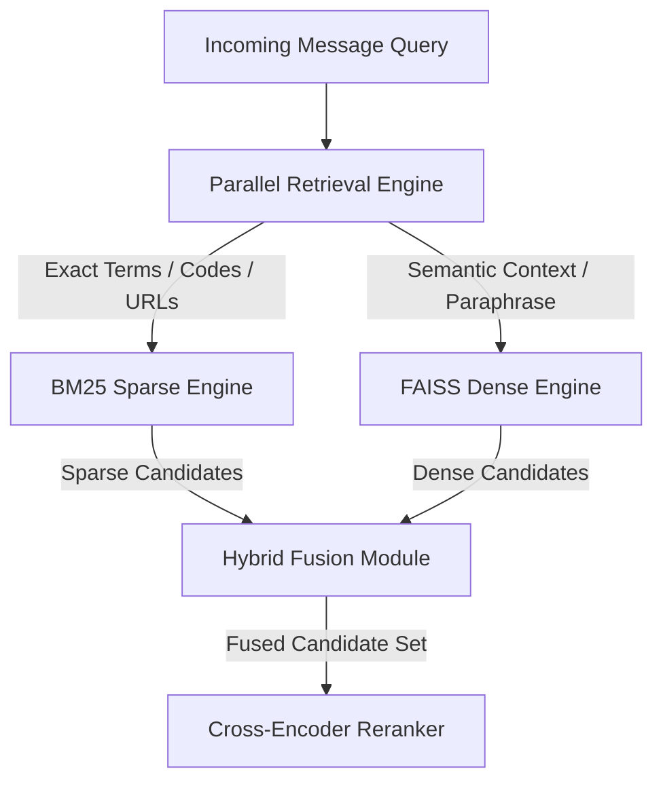

# Hybrid Search & Fusion Specification

## Overview

The `HybridRetriever` merges candidates retrieved from sparse BM25 keyword search and dense sentence embedding search into a single, cohesive candidate pool.

Sparse search captures exact tokens (order numbers, OTPs, domain names, named entities), while dense search captures semantic intent and paraphrase similarity. Hybrid fusion combines the strengths of both modalities while mitigating their individual failure modes.

---

## Why Sparse + Dense Hybrid Search Exists



### Modality Failure Modes & Complementary Strengths

| Modality | Strengths | Failure Modes | Hybrid Remedy |
|---|---|---|---|
| **BM25 Sparse** | - Exact entity & serial matching<br>- Sub-millisecond lookup<br>- Out-of-vocabulary handling | - Vocabulary mismatch<br>- Blind to semantic paraphrases<br>- Sensitive to typos | Dense search surfaces semantic equivalents even when zero keywords match. |
| **Dense Embeddings** | - Conceptual & semantic matching<br>- Robust to paraphrasing<br>- Handles typos gracefully | - Poor exact numeric matching (OTPs/IDs)<br>- Hallucinates false semantic matches for short texts | BM25 guarantees exact keyword and numeric code retrieval. |

---

## Reciprocal Rank Fusion (RRF) Algorithm

Rather than directly adding raw, un-calibrated similarity scores (which have different distributions and scales), the engine uses **Reciprocal Rank Fusion (RRF)**. RRF relies on relative candidate rank position rather than raw score magnitude.

### Mathematical RRF Formulation

For a set of retrieval modalities \(M = \{\text{BM25}, \text{Dense}\}\), the RRF score of historical message document \(d\) is defined as:

$$\text{RRF\_Score}(d) = \sum_{m \in M} \frac{w_m}{k + r_m(d)}$$

Where:
- \(r_m(d)\): The 1-based rank position of candidate \(d\) in the result list from modality \(m\). (If \(d\) is not retrieved by modality \(m\), \(r_m(d) = \infty\), resulting in \(\frac{w_m}{\infty} = 0\)).
- \(k\): Smoothing constant. Set to **\(k = 60\)** based on empirical Information Retrieval benchmarks, preventing top-ranked items from overly dominating the fused score.
- \(w_m\): Dynamic modality weight (\(w_{\text{BM25}}\) vs \(w_{\text{Dense}}\)).

---

## Score Fusion vs Rank Fusion Comparison

| Strategy | Mechanism | Vulnerability | Production Status |
|---|---|---|---|
| **Score Fusion (Linear Combination)** | \(\text{Score} = \alpha \cdot S_{\text{BM25}} + (1-\alpha) \cdot S_{\text{Dense}}\) | Vulnerable to score scale mismatches; BM25 scores are unbounded \([0, \infty)\) while Cosine scores are bounded \([0, 1]\). | Rejected due to score distribution drift across query types. |
| **Min-Max Score Normalization** | Scales scores to \([0, 1]\) per query before combining. | Highly sensitive to extreme score outliers within a single query result set. | Rejected due to outlier instability. |
| **Reciprocal Rank Fusion (RRF)** | Sums inverse ranks across modalities: \(\frac{w}{k + r}\). | Robust, scale-invariant, outlier-resistant, and parameter-light. | **Selected Production Algorithm.** |

---

## Dynamic Modality Weighting

The weights \(w_{\text{BM25}}\) and \(w_{\text{Dense}}\) adapt dynamically based on query characteristics:

```
IF query contains numeric_sequence OR order_id OR otp_pattern THEN:
    w_BM25  = 0.70
    w_Dense = 0.30
ELSE IF query contains url_domain OR domain_mismatch THEN:
    w_BM25  = 0.65
    w_Dense = 0.35
ELSE IF query_type == "conversational" OR text_length > 15_words THEN:
    w_BM25  = 0.35
    w_Dense = 0.65
ELSE:
    w_BM25  = 0.50
    w_Dense = 0.50  # Default balanced weight
```

---

## Unified Candidate Pooling & Deduplication

1. **Top-K Retrieval**: Each engine retrieves top-100 candidates (\(K_{\text{BM25}} = 100\), \(K_{\text{Dense}} = 100\)).
2. **Pool Merging**: Merging yields between 100 and 200 candidate items.
3. **Primary Deduplication**: Candidates sharing the exact same `message_id` are collapsed into a single candidate entry, accumulating reciprocal ranks from both modalities.
4. **Candidate Pool Truncation**: The combined candidate pool is sorted by descending \(\text{RRF\_Score}(d)\) and truncated to the top-50 candidates passed to the Re-ranking stage.
