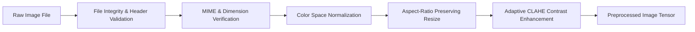

# Image Processing Pipeline Architecture

## 1. Image Validation & Preprocessing Pipeline

The Image Processing Pipeline ingests incoming raw image assets, performs multi-stage physical and visual validation, applies contrast and format normalization, and dispatches preprocessed tensors to downstream OCR and Vision-Language models.



### 1.1 Integrity & MIME Verification
- **Magic Byte Validation**: Verify header signatures (`\xFF\xD8\xFF` for JPEG, `\x89PNG\r\n\x1a\n` for PNG, `RIFF...WEBP` for WebP).
- **Dimension Check**: Assert dimensions fall within safe limits ($64 \times 64 \le \text{width, height} \le 8192 \times 8192$ pixels). Images exceeding 8192 pixels are downscaled to prevent memory exhaustion.
- **Corrupt Frame Detection**: Validate image payload by testing matrix decompression without allocating full uncompressed buffers.

### 1.2 Preprocessing Transformations
- **Color Space Normalization**: Convert all color formats (CMYK, Grayscale, RGBA, BGR) into standard 3-channel 8-bit RGB color space.
- **Aspect-Ratio Preserving Resizing**:
  - High-Res Branch (VLM Layout & OCR): Max edge bound to 2048px; padding applied if necessary to match model block sizes.
  - Low-Res Branch (Scene & Object Classification): Downscaled to $512 \times 512$px using Lanczos resampling.
- **Contrast & Lighting Enhancement**:
  - Apply **Contrast Limited Adaptive Histogram Equalization (CLAHE)** on the Luminance channel ($L^*$ in $L^*a^*b^*$ color space) for document, receipt, and text-dense images to recover low-light text without over-amplifying background noise.

---

## 2. Image Category Detection & Semantic Representation (14 Categories)

Every image processed by the pipeline is evaluated across 14 explicit categories. Each category has distinct visual cues, text pattern indicators, structural layouts, and semantic representations.

### Category Specifications

#### 1. Posters (Event / Marketing Posters)
- **Detection Method**: High text-to-image area ratio, prominent header typography, decorative background graphics, presence of logos, date/time text strings, and venue references.
- **Semantic Representation**:
  - `poster_title`: String
  - `organizer_name`: Optional[String]
  - `event_schedule`: Optional[String]
  - `visual_theme`: String (e.g., "Tech Conference", "Music Concert", "Festive Sale")

#### 2. Screenshots (Chat / UI Screenshots)
- **Detection Method**: High density of linear interface elements (status bars, navigation bars, message bubbles, system fonts, battery/time icons at top boundary).
- **Semantic Representation**:
  - `ui_platform`: String (e.g., "WhatsApp UI", "Instagram DM", "iOS Settings", "Web Browser")
  - `chat_participants`: List[String]
  - `visible_message_count`: Integer
  - `screenshot_timestamp`: Optional[String]

#### 3. Business Advertisements
- **Detection Method**: Promotional banners, product photography with embedded price tags, discount callouts ("50% OFF", "Limited Offer"), call-to-action buttons, business logo placement.
- **Semantic Representation**:
  - `brand_name`: String
  - `promoted_product_service`: String
  - `discount_offer`: Optional[String]
  - `call_to_action`: Optional[String]
  - `contact_details`: List[String]

#### 4. Payment Screenshots (Bank Transfers / UPI Receipts)
- **Detection Method**: Structured financial transaction layout, bank logos, transaction ID strings, currency symbols (₹, $, €), status indicators ("Successful", "Completed", "Pending"), sender/receiver bank account masks.
- **Semantic Representation**:
  - `transaction_id`: Optional[String]
  - `amount`: Optional[Float]
  - `currency`: String
  - `payer_name`: Optional[String]
  - `payee_name`: Optional[String]
  - `payment_status`: String ("SUCCESSFUL", "FAILED", "PENDING")
  - `timestamp`: Optional[String]

#### 5. Scam Images (Phishing / Urgent Lottery / Fraud Alerts)
- **Detection Method**: Poor typography quality combined with high-urgency keywords ("YOU WON", "Account Blocked Immediately", "Claim $10,000", suspicious unverified phone numbers, unofficial domain URLs, low-res fake official logos).
- **Semantic Representation**:
  - `scam_type`: String ("LOTTERY_FRAUD", "BANK_PHISHING", "JOB_SCAM", "CRYPTO_FRAUD")
  - `suspicious_urls`: List[String]
  - `suspicious_phone_numbers`: List[String]
  - `urgency_tactic`: String ("IMMEDIATE_ACCOUNT_CLOSURE", "FINANCIAL_REWARD_EXPIRATION")

#### 6. Event Posters
- **Detection Method**: Specific sub-class of posters containing explicit calendar event markers: date grids, time ranges, location tags, registration links, QR codes for RSVP.
- **Semantic Representation**:
  - `event_name`: String
  - `date_time`: String
  - `venue_location`: String
  - `rsvp_link_or_qr`: Optional[String]
  - `target_audience`: Optional[String]

#### 7. Meeting Invitations (Calendar / Video Call Screenshots)
- **Detection Method**: Grid schedules, video conferencing provider branding (Zoom, Google Meet, Microsoft Teams), calendar invite UI cards, meeting ID / passcode text blocks.
- **Semantic Representation**:
  - `meeting_topic`: String
  - `platform`: String ("ZOOM", "TEAMS", "MEET", "CALENDAR")
  - `start_time`: Optional[String]
  - `meeting_link_or_id`: Optional[String]
  - `host_name`: Optional[String]

#### 8. Government Notices / Official Advisories
- **Detection Method**: Formal document headers, official crests/emblems, legal font styling, reference/file numbers, official seal/stamp visual regions, authoritative language structures.
- **Semantic Representation**:
  - `issuing_authority`: String (e.g., "Municipal Corporation", "Tax Department", "Traffic Police")
  - `notice_reference_number`: Optional[String]
  - `subject`: String
  - `compliance_deadline`: Optional[String]
  - `official_seal_present`: Boolean

#### 9. Personal Photographs
- **Detection Method**: High organic photographic detail (natural lighting, faces, outdoor landscapes, indoor family scenes, pets, food), low text density (< 5% screen area), absence of structured UI/document layouts.
- **Semantic Representation**:
  - `primary_subjects`: List[String] (e.g., ["people", "dog", "beach"])
  - `setting_environment`: String ("INDOOR", "OUTDOOR", "NATURE", "URBAN")
  - `facial_count`: Integer
  - `aesthetic_type`: String ("SELFIE", "PORTRAIT", "LANDSCAPE", "CASUAL_SNAP")

#### 10. Documents (PDF Renders / Formal Letters / Contracts)
- **Detection Method**: High text density (> 60% white canvas with black text), paragraph blocks, formal margin boundaries, page numbers, signature lines, header/footer lines.
- **Semantic Representation**:
  - `document_type`: String ("LETTER", "CONTRACT", "POLICY", "ARTICLE", "CERTIFICATE")
  - `title_header`: Optional[String]
  - `page_number_info`: Optional[String]
  - `has_signature`: Boolean

#### 11. Charts & Infographics
- **Detection Method**: Graphical visual elements (bars, pie slices, line plots, scatter axes), data labels, legend boxes, title banners, axis labels.
- **Semantic Representation**:
  - `chart_type`: String ("BAR_CHART", "PIE_CHART", "LINE_GRAPH", "INFOGRAPHIC", "FLOWCHART")
  - `chart_title`: Optional[String]
  - `key_metrics_highlighted`: List[String]
  - `axes_labels`: Optional[Dict[String, String]]

#### 12. Forms (Fillable Applications / Surveys)
- **Detection Method**: Checkboxes, empty underlined fillable fields, form field labels ("Name:", "Address:", "DOB:"), radio buttons, structured multi-row input boxes.
- **Semantic Representation**:
  - `form_name`: String
  - `field_labels_extracted`: List[String]
  - `is_filled`: Boolean
  - `submission_instructions`: Optional[String]

#### 13. Receipts & Invoices
- **Detection Method**: Narrow receipt paper aspect ratio or formal invoice grid, merchant header, itemized list of goods/services with quantities and prices, subtotal/tax/grand total calculations.
- **Semantic Representation**:
  - `merchant_name`: String
  - `invoice_receipt_number`: Optional[String]
  - `line_items`: List[Dict[String, Any]] (description, qty, price)
  - `tax_amount`: Optional[Float]
  - `total_amount`: Float
  - `payment_method`: Optional[String]

#### 14. QR Codes
- **Detection Method**: High-contrast square finder patterns (nested black/white concentric squares at three corners) and dense 2D matrix data pattern.
- **Semantic Representation**:
  - `qr_count`: Integer
  - `raw_payloads`: List[String]
  - `payload_types`: List[String] ("URL", "UPI_PAYMENT", "WIFI_CREDENTIALS", "PLAIN_TEXT")

---

## 3. Vision-Language Model (VLM) Architecture

### 3.1 Model Selection & Tile Processing
- **Architecture**: Dual-branch vision model strategy combining a fast local Vision Transformer encoder (e.g., SigLIP / ViT-H) for zero-shot image embeddings and classification, paired with a multimodal Vision-Language Model (VLM) for deep scene perception.
- **Image Sub-Sampling Strategy**:
  - **Global Tile ($512 \times 512$)**: Captures overall visual context, lighting, color composition, and general scene type.
  - **High-Resolution Crops ($512 \times 512$ patches)**: Dynamic grid cropping (up to 4 sub-tiles) for high-density document regions, reading fine print in receipts, and inspecting suspicious low-resolution details.

### 3.2 Visual Understanding Tasks
1. **Object Detection & Spatial Decomposition**: Identify prominent visual foreground and background objects with relative bounding coordinates.
2. **Scene Understanding**: Identify environment, lighting condition, camera orientation, and overall medium (digital graphic vs real-world photograph).
3. **Layout & Structural Analysis**: Analyze structural organization (single column text, multi-grid layout, balance of imagery vs text).
4. **Intent & Purpose Inference**: Determine why this image was generated or shared (e.g., "To request urgent bill payment", "To announce a corporate webinar", "To share a social memory").

### 3.3 Indicator Extraction Engine
The VLM extracts 6 standardized indicator vectors, outputting continuous confidence scores ($0.0 - 1.0$) and key flag labels:

```
[Visual Features + OCR Context] ──> [VLM Feature Synthesizer]
                                           │
       ┌──────────────────┬────────────────┼──────────────────┬──────────────────┐
       ▼                  ▼                ▼                  ▼                  ▼
[Risk Indicators] [Business Indicators] [Urgency Indicators] [Event Indicators] [Spam/Scam Indicators]
```

- **Risk Indicators**: Detect sensitive data exposure (credit card numbers, passwords, government IDs, explicit violence, hate speech graphics).
- **Business Indicators**: Detect commercial promotions, brand logos, price offers, corporate domain links, customer support contact info.
- **Urgency Indicators**: Detect visual countdown timers, bold red headline banners, words like "DUE TODAY", "LAST CHANCE", "EXPIRING IMMEDIATELY".
- **Event Indicators**: Detect explicit calendar dates, times, venue maps, RSVP links, speaker lineups.
- **Spam Indicators**: Detect mass-promotional flyers, generic unaddressed broadcast ads, repetitive discount templates.
- **Scam Indicators**: Detect mismatched domain names, suspicious financial transfer requests, unverified lottery claims, spoofed official seals.
