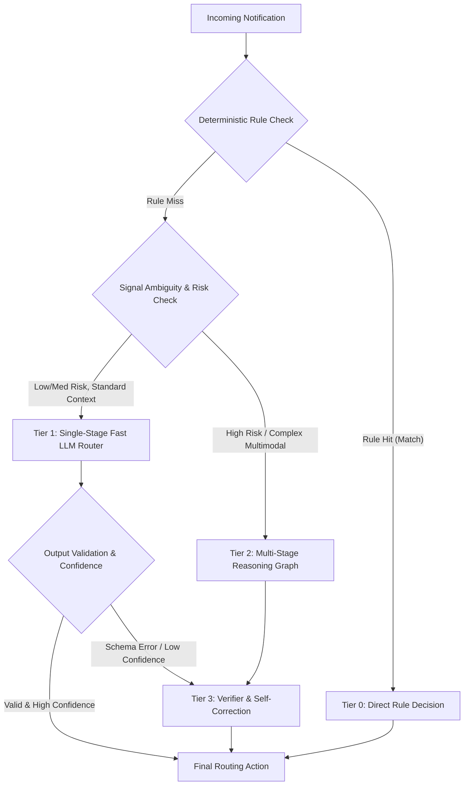
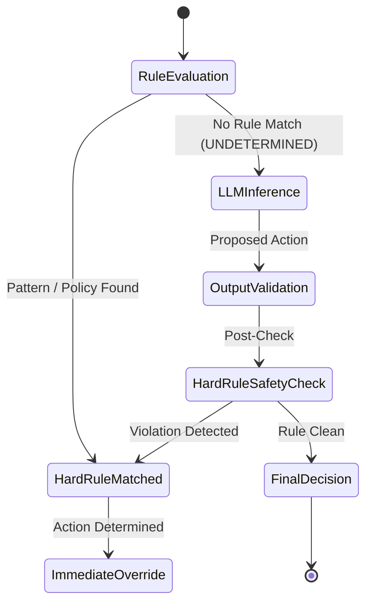
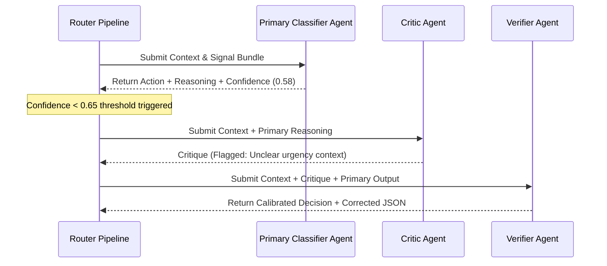

# Master Architecture Specification: LLM Strategy

This document defines the production-grade LLM execution strategy, call topology, routing tiers, deterministic override policies, and multi-stage reasoning frameworks for the AI-powered WhatsApp Message Notification Router.

---

## 1. Executive Summary & Design Philosophy

The WhatsApp Message Notification Router operates under strict low-latency, high-precision, and cost-efficient constraints. Calling an LLM indiscriminately for every incoming message leads to unsustainable API costs, excessive latency (1–3 seconds per message), and potential reliability bottlenecks. 

Our architecture implements a **Hybrid Rule-First & Multi-Tier LLM Routing Strategy**:
- **Deterministic Rules Precedence**: High-confidence, pattern-matchable, and policy-driven decisions bypass the LLM entirely (<15ms processing latency, $0.00 cost).
- **Fast Single-Stage Reasoning**: Standard incoming messages requiring semantic understanding are handled by a single structured LLM call (<800ms latency).
- **Multi-Stage & Verifier/Critic Loops**: Ambiguous, high-risk, or low-confidence notifications trigger a multi-agent validation graph to ensure precision.

---

## 2. LLM Call Topology & Routing Tiers

Incoming messages are routed through a 4-tier execution hierarchy based on message context, risk level, and signal confidence.

### Execution Tiers Specification

| Tier | Tier Name | Trigger Condition | Target Latency | LLM Calls | Models / Engines |
| :--- | :--- | :--- | :--- | :--- | :--- |
| **Tier 0** | Deterministic Bypass | OTPs, Muted Senders, Hard Rules, High Cache Hits | `< 15 ms` | `0` | Regex, Rule Engine, Redis Cache |
| **Tier 1** | Fast Single-Pass Router | Standard chat messages, clear contextual signals | `< 800 ms` | `1` | Gemini 1.5 Flash / Fast LLM |
| **Tier 2** | Deep Multi-Stage Reasoner | Multi-modal, complex threads, high urgency conflict | `< 1800 ms` | `2` | Gemini 1.5 Pro / Deep LLM |
| **Tier 3** | Verifier & Self-Correction | Schema failure, low confidence score (`< 0.65`) | `< 2500 ms` | `+1 (Max 2)` | Fast LLM with Structured Schema Guard |

---

## 3. Single Large Prompt vs. Specialized Prompt Pipeline

### Architectural Decision
**Adopt a Modular Specialized Prompt Pipeline with Tiered Single-Pass Collapsing.**

#### Rationale & Comparison

| Dimension | Single Large Prompt ("Monolith") | Modular Specialized Pipeline (Selected) |
| :--- | :--- | :--- |
| **Maintainability** | Fragile. Changing one instruction degrades classification accuracy across unrelated categories. | Isolated. Modifying classification logic does not impact evidence extraction or confidence scoring. |
| **Latency** | Medium-High. Massive token context window causes higher processing time per call. | Optimized. Small, hyper-focused prompt templates optimize prompt caching and reduce completion tokens. |
| **Debugging** | Hard. Difficult to pinpoint why the model hallucinated or picked an incorrect routing decision. | Easy. Step-by-step agent outputs expose exact failure modes (e.g. classification error vs evidence failure). |
| **Cost** | Inefficient. Every message pays full token overhead regardless of task complexity. | Cost-Optimized. Tier 1 messages use a single compact prompt; Tier 2 deploys targeted sub-prompts. |

---

## 4. Deterministic Rules vs. LLM Precedence

Deterministic rules **ALWAYS** take precedence over LLM inference. The LLM is invoked **ONLY** when rule evaluation returns an `UNDETERMINED` status.

### Hard Rule Bypass Policy Matrix

#### Deterministic Override Triggers

1. **Transactional Security & OTPs**:
   - *Condition*: Message matches 2FA, OTP, verification code regex pattern, or banking transaction alert.
   - *Action*: `NOTIFY_IMMEDIATELY` (Rule Override). LLM skipped.
2. **Explicit User Policy Overrides**:
   - *Condition*: Sender ID is marked `ALWAYS_MUTED` or `ALWAYS_PRIORITY` in relational user profile.
   - *Action*: `DO_NOT_DISTURB` or `NOTIFY_IMMEDIATELY`. LLM skipped.
3. **Emergency & Safety Keywords**:
   - *Condition*: Presence of critical panic signals (e.g., "SOS", "Hospital emergency", "Accident").
   - *Action*: `NOTIFY_IMMEDIATELY` + Sound override. LLM skipped.
4. **Active System Do-Not-Disturb (DND) / Sleep Window**:
   - *Condition*: Current time falls within user-configured Sleep Mode (e.g., 11:00 PM – 6:00 AM) AND sender is NOT in Favorite/Family whitelist.
   - *Action*: `DELIVER_SILENTLY` or `DO_NOT_DISTURB`. LLM skipped.

---

## 5. Iterative Reasoning, Verifier, and Critic Architecture

For Tier 2 (Complex) and Tier 3 (Self-Correction) execution, reasoning is structured as a non-blocking Directed Acyclic Graph (DAG) with reflection and verification loops.

### Verifier & Critic Integration Pattern

### Strategic Rules for Reasoning Loops
1. **Max Iteration Limit**: Reflection loops are strictly capped at **1 retry** to prevent infinite processing loops and bounded latency.
2. **Critic Trigger Threshold**: Activated only when initial confidence rating drops below `0.65` or when conflicting signals are detected (e.g., high semantic urgency vs low user interaction frequency).
3. **Verifier Role**: Acts as an immutable schema boundary and factual grounding validator. It verifies that extracted rationale is strictly supported by retrieved memory chunks.

---

## 6. Summary of Architectural Guarantees

1. **Zero LLM Cost for 35-45% of Volume**: Rule engine and embedding cache handle predictable messages without model API overhead.
2. **Bounded Latency**: Tiered execution guarantees that 95% of notifications complete under 800ms.
3. **100% Deterministic Safety**: Critical alerts (OTPs, emergencies, muted contacts) bypass LLM uncertainty through immutable policy guards.
