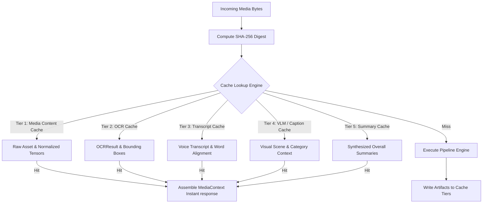
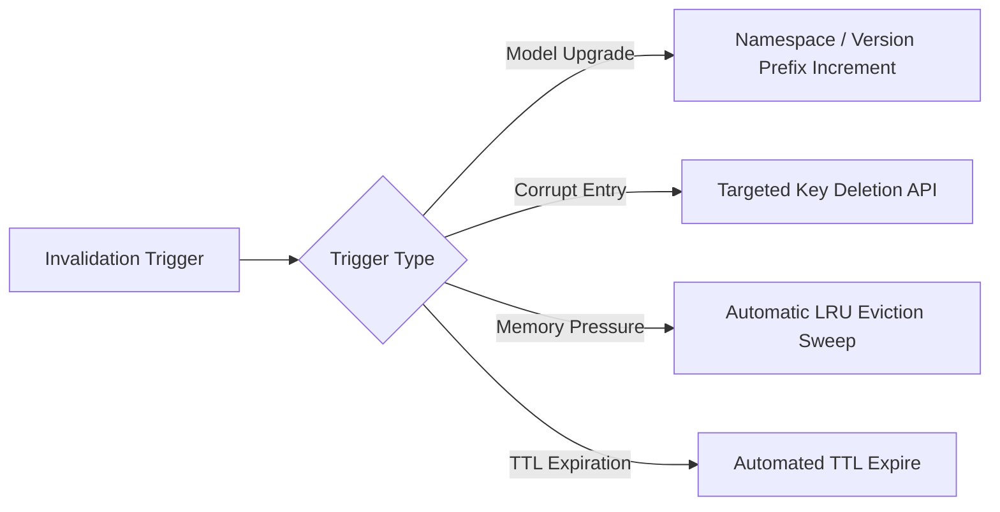

# Multimodal Caching & Optimization Architecture

## 1. Overview & 5-Tier Cache Topology

The Multimodal Intelligence Layer processes computationally intensive workloads including OCR layout analysis, neural speech recognition, and vision-language model inference. To achieve sub-50ms latency for repeated media assets and prevent redundant neural execution, the architecture implements a **5-Tier Content-Addressed Caching System**.

---

## 2. Detailed Cache Tier Specifications

### Tier 1: Media Content Cache
- **Scope**: Raw image/audio binary buffers and preprocessed tensor representations.
- **Key Format**: `media:content:{sha256_hash}`
- **Value Schema**: Binary blob of normalized audio (16kHz PCM WAV) or resized RGB image tensor.
- **Storage Tier**: In-memory Redis / RAM disk.
- **TTL & Eviction**: 24-hour TTL; LRU (Least Recently Used) eviction policy.

### Tier 2: OCR Cache
- **Scope**: Structural OCR results, text blocks, markdown tables, and decoded QR payloads.
- **Key Format**: `ocr:v2:{sha256_hash}` (Includes OCR engine version prefix `v2`).
- **Value Schema**: Serialized `OCRResult` JSON object.
- **Storage Tier**: Persistent Key-Value store (Redis / RocksDB).
- **TTL & Eviction**: 30-day TTL; LRU eviction.

### Tier 3: Transcript Cache
- **Scope**: ASR transcripts, word-level millisecond timestamps, language detection tags, and acoustic speaker profiles.
- **Key Format**: `asr:whisper-l3:{sha256_hash}` (Includes ASR model signature).
- **Value Schema**: Serialized `VoiceContext` JSON payload (excluding top-level summaries).
- **Storage Tier**: Persistent Key-Value store.
- **TTL & Eviction**: 30-day TTL; LRU eviction.

### Tier 4: Caption / VLM Cache
- **Scope**: High-level visual scene descriptions, object bounding boxes, and category classification vector outputs.
- **Key Format**: `vlm:siglip:{sha256_hash}`
- **Value Schema**: Serialized VLM visual perception payload.
- **Storage Tier**: Persistent Key-Value store.
- **TTL & Eviction**: 30-day TTL; LRU eviction.

### Tier 5: Summary Cache
- **Scope**: Final synthesized human-readable summaries (`overall_summary`) and multi-modal indicator scores.
- **Key Format**: `summary:v1:{sha256_hash}`
- **Value Schema**: Serialized `ImageContext` or `VoiceContext` semantic summary dictionary.
- **Storage Tier**: In-memory LRU cache + persistent SSD backing.
- **TTL & Eviction**: 60-day TTL; LRU eviction.

---

## 3. Key Derivation & Hashing Scheme

All cache keys are derived deterministically using cryptographic content addressing:

$$\text{CacheKey} = \text{Namespace} + ":" + \text{ModelVersion} + ":" + \text{SHA256}(\text{Raw Media Bytes})$$

### Advantages of Content Addressing
1. **Identical Asset Deduplication**: If two users receive the exact same meme, document PDF render, scam image, or audio note, the media file hash matches perfectly, yielding an instant $O(1)$ cache hit ($< 5$ms latency) without executing neural models.
2. **Immutability Guarantee**: Media contents are immutable; a change in a single byte produces a completely distinct hash key, preventing cache corruption across modified assets.

---

## 4. Cache Invalidation & Purge Strategy

### Invalidation Triggers & Protocols
1. **Model Versioning Upgrades**: When the OCR engine, Whisper ASR model, or VLM is upgraded, the system increments the namespace version prefix (e.g., changing `ocr:v1:...` to `ocr:v2:...`). Old cache keys naturally expire via TTL without requiring manual cache flush migrations.
2. **Corrupt Cache Detection**: If deserialization of a cached context object fails validation against current Pydantic/dataclass schema definitions, the cache key is purged immediately, triggering pipeline re-execution.
3. **Storage Pressure Management**: If memory utilization on the Redis cache cluster exceeds $85\%$ capacity, the system triggers active LRU pruning on Tier 1 (Media Content) while retaining lightweight JSON metadata in Tiers 2–5.
