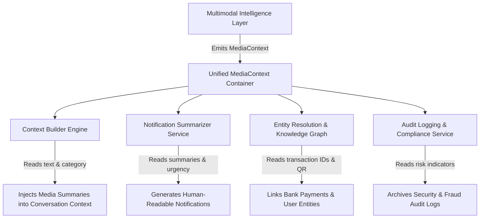

# Multimodal Media Data Contracts & Models

## 1. Overview & Data Modeling Standards

This document defines the strict data schemas for all objects produced by the Multimodal Intelligence Layer: `ImageContext`, `VoiceContext`, and the unifying `MediaContext`.

### Design Rules
1. **Immutability**: All returned context models are read-only, immutable structures once created.
2. **Schema Uniformity**: Every optional field uses explicit typed structures (`Optional[T]`) with safe default values (`None`, empty lists `[]`, or empty maps `{}`).
3. **Decoupled Downstream Consumption**: Downstream consumers (e.g., Context Builder, Notification Engine, Audit Logger) interact exclusively with these contracts. Raw image bytes or audio buffers are never accessed outside the multimodal layer.

---

## 2. `ImageContext` Specification

The `ImageContext` object holds all visual, textual, structural, and semantic data extracted from an incoming image.

### Field Definitions

| Field Name | Type | Constraints / Allowed Values | Description |
| :--- | :--- | :--- | :--- |
| `image_id` | `String` | Non-empty unique ID | Primary identifier for the image asset. |
| `sha256_hash` | `String` | 64-char hex string | Content-addressed cryptographic hash of raw image bytes. |
| `dimensions` | `Tuple[Int, Int]` | `(width, height) > 0` | Width and height of the original image in pixels. |
| `aspect_ratio` | `Float` | `> 0.0` | Aspect ratio ($\frac{\text{width}}{\text{height}}$). |
| `primary_category` | `String` | One of 14 categories (e.g., `"PAYMENT_SCREENSHOT"`, `"DOCUMENT"`, `"SCAM_IMAGE"`) | The dominant detected category for the image. |
| `secondary_categories`| `List[String]` | Subsets of 14 categories | Secondary overlapping categories (e.g., `["RECEIPT", "QR_CODE"]`). |
| `category_confidence` | `Float` | $0.0 \le c \le 1.0$ | Confidence score of the primary category assignment. |
| `extracted_text` | `String` | Markdown string | Full concatenated text extracted via OCR, formatted in reading order. |
| `ocr_confidence` | `Float` | $0.0 \le c \le 1.0$ | Weighted average confidence score of extracted text lines. |
| `text_blocks` | `List[TextBlock]` | List of `TextBlock` objects | Individual paragraph/text blocks with coordinates and font types. |
| `detected_tables` | `List[TableStructure]`| List of `TableStructure` objects | Extracted tabular structures rendered as markdown matrices. |
| `qr_payloads` | `List[QRPayload]` | List of `QRPayload` objects | Decoded QR code payloads and parsed metadata. |
| `visual_objects` | `List[String]` | List of object labels | List of detected visual items (e.g., `["person", "laptop", "bank_logo"]`). |
| `scene_description` | `String` | Free-text sentence | High-level summary of visual composition and setting. |
| `image_purpose` | `String` | Free-text sentence | Inferred intent of the image (e.g., "To prove payment completion"). |
| `risk_indicators` | `Dict[String, Any]` | Keys: `score`, `flags` | Risk assessment (e.g., `{"score": 0.85, "flags": ["EXPLICIT_CREDIT_CARD"]}`). |
| `business_indicators`| `Dict[String, Any]` | Keys: `score`, `brand_name` | Commercial assessment (e.g., `{"score": 0.90, "brand_name": "Nike"}`). |
| `urgency_indicators` | `Dict[String, Any]` | Keys: `score`, `keywords` | Visual urgency (e.g., `{"score": 0.75, "keywords": ["DUE TODAY"]}`). |
| `event_indicators` | `Dict[String, Any]` | Keys: `score`, `event_date` | Event details (e.g., `{"score": 0.95, "event_date": "2026-08-15"}`). |
| `spam_indicators` | `Dict[String, Any]` | Keys: `score`, `reason` | Promotional spam likelihood. |
| `scam_indicators` | `Dict[String, Any]` | Keys: `score`, `tactic` | Scam/phishing risk (e.g., `{"score": 0.98, "tactic": "PHISHING_URL"}`). |
| `overall_summary` | `String` | 1-3 sentences | Concise synthetic summary combining visual and textual features. |

---

## 3. `VoiceContext` Specification

The `VoiceContext` object holds all acoustic, speech-to-text, speaker profiling, and semantic data extracted from an incoming voice note.

### Field Definitions

| Field Name | Type | Constraints / Allowed Values | Description |
| :--- | :--- | :--- | :--- |
| `voice_note_id` | `String` | Non-empty unique ID | Primary identifier for the voice note asset. |
| `sha256_hash` | `String` | 64-char hex string | Content-addressed cryptographic hash of raw audio bytes. |
| `duration_seconds` | `Float` | $0.5 \le d \le 300.0$ | Total audio duration in seconds. |
| `sample_rate_hz` | `Int` | Default `16000` | Audio sampling rate in Hertz. |
| `audio_channels` | `Int` | Default `1` (Mono) | Number of audio channels. |
| `transcript` | `String` | Non-empty string | Full cleaned transcript of the speech content. |
| `transcript_confidence`| `Float` | $0.0 \le c \le 1.0$ | ASR model decoding confidence score. |
| `word_timestamps` | `List[WordTimestamp]`| List of `(word, start, end)` | Precise millisecond timestamp boundaries per transcribed word. |
| `detected_language` | `String` | ISO 639-1 code (e.g., `"en"`, `"hi"`) | Primary detected language code. |
| `language_confidence` | `Float` | $0.0 \le c \le 1.0$ | Confidence of language identification. |
| `speaker_profile` | `Dict[String, Any]` | Acoustic key-value pairs | Metrics: `mean_pitch_hz`, `wpm`, `silence_ratio`, `mean_energy_db`. |
| `acoustic_tone` | `String` | `"CALM"`, `"URGENT"`, `"SHOUTING"`, `"HESITANT"` | Primary acoustic vocal emotion/tone inferred from acoustic features. |
| `urgency_score` | `Float` | $0.0 \le u \le 1.0$ | Dual-modal acoustic + semantic urgency score. |
| `key_entities` | `List[Dict[String, String]]` | Entities list | Extracted named entities (people, dates, amounts, locations). |
| `key_topics` | `List[String]` | Topic labels | Extracted topic tags (e.g., `["Meeting Schedule", "Project Update"]`). |
| `overall_summary` | `String` | 1-2 sentences | Concise summary of spoken intent. |

---

## 4. `MediaContext` Container Specification

The `MediaContext` object is the unified root object that wraps media payloads and provides standard tracking metadata for downstream consumers.

### Field Definitions

| Field Name | Type | Constraints / Allowed Values | Description |
| :--- | :--- | :--- | :--- |
| `media_id` | `String` | Non-empty ID | System-wide unique identifier for the media message. |
| `media_type` | `String` | `"IMAGE"`, `"VOICE"`, `"MULTIMODAL_COMBO"` | Discriminator indicating which context payload is populated. |
| `sha256_hash` | `String` | 64-char hex string | Cryptographic hash of the raw media asset. |
| `image_context` | `Optional[ImageContext]` | Populated if `media_type` == `"IMAGE"` | Enriched image context object. |
| `voice_context` | `Optional[VoiceContext]` | Populated if `media_type` == `"VOICE"` | Enriched voice note context object. |
| `validation_status` | `String` | `"VALIDATED"`, `"PARTIAL"`, `"CORRUPTED"`, `"FAILED"` | Overall pipeline execution status. |
| `processing_latency_ms`| `Float` | `> 0.0` | End-to-end processing time in milliseconds. |
| `error_flags` | `List[String]` | List of error codes | Non-fatal execution warning/error tags (e.g., `["OCR_LOW_CONFIDENCE"]`). |
| `created_at` | `String` | ISO 8601 Timestamp | Processing completion timestamp. |

---

## 5. Downstream Integration & Consumption Patterns

Future architectural subsystems interact with `MediaContext` as follows:

1. **Context Builder Engine**: Reads `image_context.overall_summary`, `extracted_text`, or `voice_context.transcript` to assemble full conversational context for multi-turn user threads.
2. **Notification Summarizer Service**: Consumes `overall_summary` and category metadata to build human-readable notification previews without re-running media inference.
3. **Entity Resolution & Knowledge Graph**: Consumes structured fields like `payment_screenshots.transaction_id`, `qr_payloads`, `line_items`, and `key_entities` to link user account activities.
4. **Audit Logging & Compliance**: Inspects `risk_indicators` and `scam_indicators` to flag unsafe content for automated security logging.
