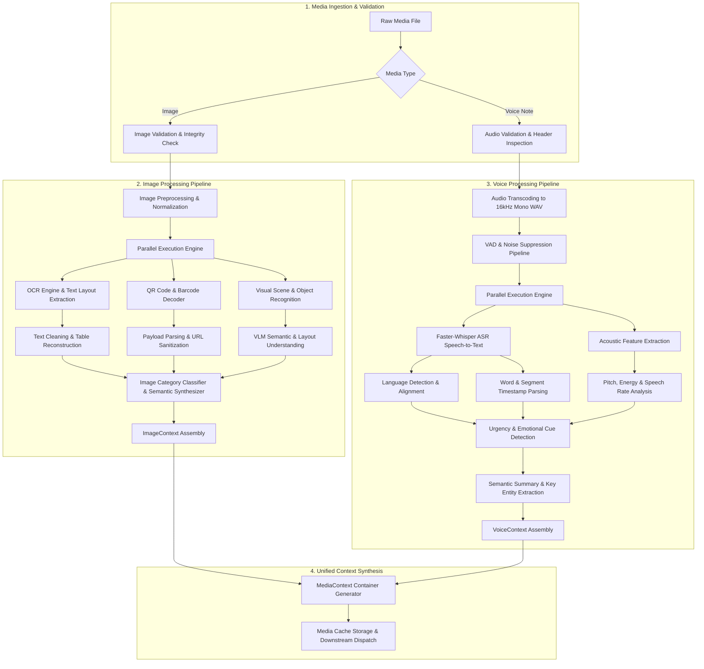

# Multimodal Intelligence Layer Architecture

## 1. Overview & Non-Routing Architectural Guarantee

The **Multimodal Intelligence Layer** is the specialized subsystem within the WhatsApp Message Notification Router responsible for ingesting raw media assets—specifically images and voice notes—and extracting rich, structured semantic metadata.

### Architectural Boundaries & Guarantees
1. **Zero Routing Responsibility**: This layer does **NOT** decide whether a message should be notified immediately, batched into a daily digest, or muted. It purely enriches raw visual and acoustic media into structured domain representations (`ImageContext`, `VoiceContext`, `MediaContext`).
2. **Zero Prompt Engineering / Classification Scope**: This layer does not run notification classification rules or construct LLM routing prompts. It performs feature extraction, optical character recognition (OCR), layout reconstruction, automated speech recognition (ASR), acoustic signal analysis, and vision-language semantic perception.
3. **Determinism & Idempotency**: Given a raw media file (identified by its SHA-256 hash), the layer returns a deterministic, schema-compliant `MediaContext` object.
4. **Decoupled Engine Abstraction**: Signal processing, OCR, ASR, and VLM operations run behind isolated contract interfaces, allowing underlying vision models, ASR models, or OCR engines to be upgraded or swapped without breaking downstream analytical services.

---

## 2. End-to-End Multimodal Pipeline Topology

---

## 3. High-Level Stage Execution Sequence

### Image Execution Sequence
1. **Validation**: Check file existence, magic bytes, dimensions, aspect ratio, and mime-type (`image/jpeg`, `image/png`, `image/webp`).
2. **Preprocessing**: Color space conversion to RGB, contrast enhancement (CLAHE for text regions), and aspect-ratio preserving downscaling.
3. **Parallel Feature Extraction**:
   - **OCR Extraction**: Multi-engine text detection, character extraction, bounding boxes, and confidence scoring.
   - **QR Decoding**: Scanning for embedded QR matrices and extracting decoded string payloads.
   - **Visual Perception (VLM)**: Deep visual decomposition for object, scene, document layout, and intent inference.
4. **Structural Reconstruction**: Parse bounding boxes into coherent text blocks and markdown tables.
5. **Category & Indicator Synthesis**: Map visual features into 14 explicit image categories and compute indicator scores (Risk, Business, Urgency, Event, Spam, Scam).
6. **Context Assembly**: Populate `ImageContext` schema.

### Voice Execution Sequence
1. **Validation**: Check header validity, file duration (0.5s - 300s), audio format (.opus, .ogg, .mp3, .wav), and non-zero audio frame presence.
2. **Signal Preprocessing**: Transcode to 16kHz 16-bit mono PCM WAV format via FFmpeg/av. Apply EBU R128 loudness normalization and spectral noise reduction.
3. **Voice Activity Detection (VAD)**: Remove silence gaps using Silero VAD and isolate active speech segments.
4. **Parallel Signal & Speech Analysis**:
   - **ASR Transcription**: Fast beam-search decoding with Faster-Whisper, yielding word-level timestamps.
   - **Language Identification (LID)**: Identify primary and secondary spoken languages.
   - **Acoustic Profiling**: Extract root-mean-square (RMS) energy, fundamental frequency ($F_0$ pitch tracking), and speaking rate (words per minute).
5. **Semantic & Acoustic Synthesis**:
   - Combine acoustic indicators (shouting, rapid pace) with textual content to infer urgency and acoustic tone.
   - Extract key phrases, entities, and generate a concise spoken summary.
6. **Context Assembly**: Populate `VoiceContext` schema.

---

## 4. Input & Output System Boundaries

| Boundary Component | Input Interface | Output Artifact |
| :--- | :--- | :--- |
| **Media Ingestion Boundary** | Raw binary stream / file path + metadata pointers (`image_id`, `voice_note_id`, `created_at`). | Validated, normalized media buffer + metadata audit payload. |
| **Image Intelligence Engine** | Normalized RGB tensor + binary mask. | Fully populated `ImageContext` instance. |
| **Voice Intelligence Engine** | 16kHz 16-bit Mono WAV audio buffer. | Fully populated `VoiceContext` instance. |
| **Unified Multimodal Layer** | Raw message payload with media references. | Standardized `MediaContext` wrapper object. |

---

## 5. Architectural Principles & Production Quality Rules

### 1. Common Hackathon Pitfalls vs. Production Multimodal Engineering

| Feature / Trait | Naive / Hackathon Approach | Production-Grade Multimodal Architecture |
| :--- | :--- | :--- |
| **Media Handling** | Passing raw image URLs directly to high-cost LLMs/VLMs. | Tiered processing: fast local OCR + heuristic pre-filter before calling deep VLM models. |
| **Audio Processing** | Naive API calls to ASR without noise suppression or VAD. | VAD silence stripping, audio normalization, local Faster-Whisper execution with timestamp alignment. |
| **Caching** | No cache or caching by temporary filename. | Strict content-addressed caching using `SHA-256` digest of raw media bytes. |
| **Error Handling** | Unhandled exceptions on unreadable images or low-audio signals. | Graceful degradation with fallback context structures and partial feature extraction guarantees. |
| **Concurrency** | Sequential blocking processing of OCR, VLM, and ASR. | Asynchronous parallel processing graphs with strict timeouts per execution stage. |
| **Separation of Concerns** | Mixing media processing with notification routing logic. | Strict boundary: Multimodal layer produces semantic context only. Routing is decoupled downstream. |

### 2. Scalability & Lazy Evaluation Strategy
- **Lazy VLM Invocation**: Deep vision-language processing is skipped for high-confidence structured documents (e.g., pure receipts or standard QR payment screenshots) where fast OCR and QR parsing extract 100% of required semantic data.
- **Asynchronous Execution**: Heavy neural model inference is offloaded to dynamic GPU batch queues.

---

## 6. Future Expansion Roadmap

1. **Multimodal Streaming Embeddings**: Generate unified cross-modal vector embeddings (e.g., Image-Text-Audio joint embedding space using ImageBind or CLAP) for cross-modal similarity search.
2. **Native End-to-End Speech Encoders**: Shift from cascade (VAD -> ASR -> NLP Summary) to direct audio-to-intent speech models for ultra-low latency processing of short voice notes.
3. **On-Device Edge Acceleration**: Quantize OCR (ONNX float16) and ASR (Whisper int8) models for edge deployment on containerized microservices.
