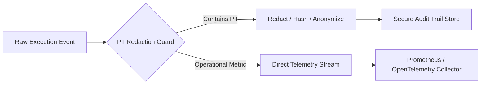

# Master Architecture Specification: Observability & Logging

This document specifies the logging architecture, distributed tracing infrastructure, telemetry metrics, audit trail schemas, PII redaction policies, and real-time monitoring frameworks for the AI-powered WhatsApp Message Notification Router.

---

## 1. Executive Summary & Design Principles

Observability in an AI-driven notification routing system must fulfill two distinct objectives:
1. **System & Operational Health**: Real-time tracking of latency, token costs, throughput, and error rates.
2. **AI Decision Auditability**: Full end-to-end explainability showing *why* a specific message received a given routing action without exposing sensitive user PII.

Our design enforces **Zero-PII Structured Telemetry** with OpenTelemetry tracing and correlation IDs propagated across every micro-agent execution step.

---

## 2. Distributed Tracing Architecture (OpenTelemetry)

Every incoming WhatsApp notification is assigned a unique `correlation_id` (UUIDv4) at the API gateway, which propagates through every pipeline phase.

```mermaid
gantt
    title Notification Request Distributed Span Lifecycle
    dateFormat  SS.SSS
    axisFormat %S.%L s

    section API Gateway
    Ingestion & Token Auth     :a1, 00.000, 00.015
    section Rule Engine
    Tier 0 Deterministic Check :a2, 00.015, 00.030
    section Signal Engine
    Context & Signal Assembly  :a3, 00.030, 00.150
    Vector RAG Search          :a4, 00.050, 00.120
    section Agent Orchestrator
    Safety Agent Audit         :a5, 00.150, 00.250
    Classifier LLM Call        :a6, 00.250, 00.850
    Verifier Agent Check       :a7, 00.850, 00.980
    Output Formatter & Audit   :a8, 00.980, 01.010
```

### OpenTelemetry Span Hierarchy
```
root_span: process_notification (correlation_id="c8f12a-...")
├── span: evaluate_rules (tier_0_hit=false)
├── span: compute_signals
│   ├── span: extract_media_features (ocr_cached=true)
│   └── span: vector_rag_retrieval (latency_ms=42)
└── span: agent_graph_execution (tier_level=1)
    ├── span: safety_agent (status=PASSED)
    ├── span: classifier_agent (model="gemini-1.5-flash", tokens=642)
    ├── span: verifier_agent (status=APPROVED, ece_calibrated=true)
    └── span: output_formatter (json_repaired=false)
```

---

## 3. Metrics & Real-Time Monitoring Dashboards

The system exports Prometheus-compatible metrics categorized into 4 operational dashboards.

```mermaid
graph TD
    A[Telemetry Collector] --> B[Latency Dashboard]
    A --> C[Token & Cost Dashboard]
    A --> D[AI Performance & Calibration Dashboard]
    A --> E[System Health & Error Dashboard]
    
    B --> B1[p50 / p90 / p99 Latency per Component]
    C --> C1[Prompt Tokens vs Cached Tokens vs Cost ($)]
    D --> D1[Tier 0 Hit Rate vs Tier 1 vs Tier 2]
    E --> E1[Rule Failures, Schema Repairs & API Error Rate]
```

### Core Metrics Specification Table

| Metric Name | Type | Metric Description | Target Threshold |
| :--- | :--- | :--- | :--- |
| `router_request_latency_ms` | Histogram | End-to-end processing time per message. | p95 `< 1,200 ms` |
| `tier_execution_total` | Counter | Count of executions per Tier (Tier 0, 1, 2, 3). | Tier 0 $\ge 35\%$ |
| `llm_token_usage_total` | Counter | Total prompt, completion, and cached tokens. | `$ < 0.0004` / msg |
| `prompt_cache_hit_ratio` | Gauge | Ratio of API prompt tokens served from provider cache. | $\ge 45\%$ |
| `json_auto_repair_total` | Counter | Count of LLM outputs requiring Stage 1-4 repair. | `< 2\%$ of LLM calls |
| `ece_calibration_score` | Gauge | Real-time Expected Calibration Error of confidence outputs.| $\le 0.05$ |
| `pipeline_error_total` | Counter | Total unhandled exceptions or hard fallbacks triggered.| `< 0.01\%$ |

---

## 4. Per-Message Audit Trail Architecture

For governance and explainability, every routing decision writes a structured JSON audit log entry to an immutable audit store (ClickHouse / Elasticsearch).

### Audit Trail Data Schema Specification

```json
{
  "audit_version": "1.0.0",
  "correlation_id": "c8f12a9b-4e2d-41a3-b8f9-8d1e2f3a4b5c",
  "timestamp_utc": "2026-08-01T22:25:00.123Z",
  "user_id_hash": "e3b0c44298fc1c149afbf4c8996fb92427ae41e4649b934ca495991b7852b855",
  "sender_id_hash": "f2ca1bb6c7e907d06dafe4687e579fce76b37e4e93b7605022da52e6ccc26fd2",
  "execution_path": {
    "tier_level": 1,
    "rule_bypassed": false,
    "agents_invoked": ["Safety", "Evidence", "Confidence", "Classifier", "OutputFormatter"],
    "is_fallback": false
  },
  "signal_summary": {
    "relationship_score": 0.82,
    "urgency_index": 0.76,
    "media_type": "IMAGE_WITH_TEXT",
    "ocr_detected": true
  },
  "decision": {
    "action": "NOTIFY_IMMEDIATELY",
    "calibrated_confidence": 0.89,
    "reason_code": "URGENT_CALENDAR_SCHEDULE_CHANGE",
    "evidence_count": 2
  },
  "telemetry": {
    "total_latency_ms": 782,
    "llm_model": "gemini-1.5-flash",
    "prompt_tokens": 512,
    "completion_tokens": 68,
    "estimated_cost_usd": 0.00018
  }
}
```

---

## 5. Security & Sensitive Data Handling Policy

To guarantee strict user privacy compliance (GDPR, HIPAA, SOC2), telemetry rules strictly enforce data segregation.



### Data Classification Matrix

| Data Category | Examples | Logging Policy | Sanitization / Encryption Standard |
| :--- | :--- | :--- | :--- |
| **User Message Content** | Text body, OCR text, audio transcript | **NEVER LOG** | Processed in-memory; discarded immediately after inference. |
| **Contact Identifiers** | Phone numbers, contact names, emails | **NEVER LOG PLAIN** | SHA-256 HMAC hashed with user-specific salt. |
| **Raw Media Files** | Images, voice notes | **NEVER STORE IN LOGS** | Cached in secure encrypted scratch storage with 1-hour TTL. |
| **Signal Features** | Relationship score, urgency score, thread count | **LOGGED** | Plain numerical values. |
| **AI Rationale & Decision**| `action`, `reason_code`, `confidence` | **LOGGED** | Scrubbed of specific named entities. |
| **System Telemetry** | Latency, token count, status codes | **LOGGED** | Standard operational metrics. |

---

## 6. Retention Policy & Storage Tiers

1. **Hot Tier (Real-Time Metrics & Traces)**: Prometheus & Jaeger / Grafana Tempo — **7-Day Retention**.
2. **Warm Tier (Audit Logs & Decision Traces)**: Searchable ClickHouse / Elasticsearch Cluster — **30-Day Retention**.
3. **Cold Tier (Anonymized Aggregate Research Logs)**: Encrypted S3 / Cloud Storage buckets — **1-Year Retention**.
