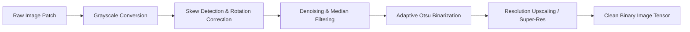
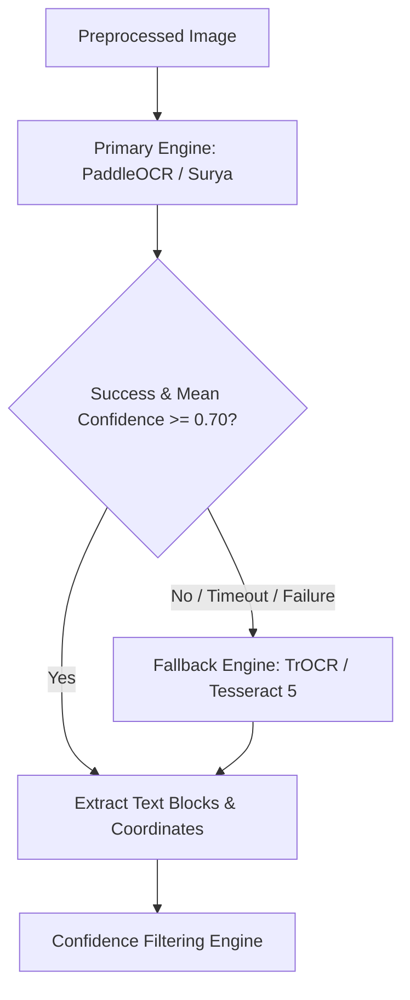
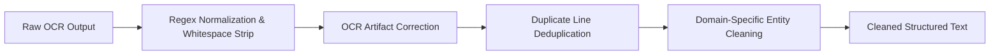

# OCR & Structural Text Extraction Pipeline

## 1. OCR Preprocessing Pipeline

To maximize character recognition accuracy across degraded, noisy, low-light, or camera-captured images, input images pass through a dedicated image processing pipeline prior to optical character recognition.

### Preprocessing Operations
1. **Grayscale Conversion**: Convert 3-channel RGB image tensor to single-channel 8-bit luminance matrix using standard ITU-R 601-2 Luma transform ($Y = 0.299R + 0.587G + 0.114B$).
2. **Deskewing & Alignment**:
   - Detect dominant line angles via **Hough Transform** or **Radon Transform** on detected edge contours.
   - Rotate image tensor by angle $\theta$ (if $|\theta| \in [0.5^\circ, 45^\circ]$) using bilinear interpolation to realign text lines horizontally.
3. **Denoising & Median Filtering**:
   - Apply a $3 \times 3$ median filter to eliminate salt-and-pepper noise and compression artifacts without blurring crisp character edges.
4. **Adaptive Thresholding & Binarization**:
   - Compute localized thresholding using **Otsu’s Binarization** combined with adaptive Gaussian windowing ($15 \times 15$ local neighborhood) to cleanly separate dark text from uneven background shadows.
5. **DPI & Scale Optimization**:
   - Check mean character height across detected bounding components. If average character height is below 18 pixels, perform bicubic upscaling ($2\times$) or apply lightweight CNN Super-Resolution (ESRGAN-Lite).

---

## 2. Multi-Engine Text Extraction Architecture

The OCR subsystem utilizes a primary-secondary fallback multi-engine layout to balance throughput, multi-script support, and spatial layout precision.

### Engine Selection Matrix
- **Primary Engine (PaddleOCR / Surya OCR)**: Ultra-fast ultra-lightweight multi-language neural detector (DBNet) and text recognizer (SVTR). Exceptional accuracy on multilingual Indian/Asian/Western scripts and dense tabular layouts.
- **Fallback Engine (Transformer-based TrOCR / Tesseract 5)**: Invoked when the primary engine returns a mean line confidence score below $0.70$ or encounters unreadable handwriting. TrOCR leverages Vision Transformers for sequence-to-sequence text generation from difficult image patches.

---

## 3. Confidence Filtering & Bounding Box Coordinates

### Spatial Coordinate System
- Bounding boxes are tracked as normalized 4-point polygon coordinates $(x_1, y_1, x_2, y_2, x_3, y_3, x_4, y_4)$ where $x, y \in [0.0, 1.0]$ relative to image dimensions.
- Normalized coordinates allow downstream scale-invariant spatial alignment.

### Confidence Thresholding Rules
- **Word-Level Threshold**: Words with recognition confidence $c < 0.40$ are flagged as UNCERTAIN (`?`) or discarded if they consist of unreadable isolated symbols.
- **Line-Level Threshold**: Lines with overall confidence $c < 0.50$ trigger secondary engine extraction on that specific cropped bounding region.
- **Bounding Box Clustering**: Adjacent word bounding boxes on the same horizontal plane (vertical overlap $> 70\%$, horizontal distance $< 1.5 \times \text{font size}$) are merged into unified `TextBlock` items.

---

## 4. Multilingual Script Handling

1. **Script Identification (LID)**: Fast lightweight script classifier identifies script families prior to text decoding (Latin, Devanagari, Arabic, Tamil, Cyrillic, Hanzi/Kanji).
2. **Directionality Handling**: Automatic Right-to-Left (RTL) reading order detection for scripts like Arabic/Hebrew, reversing bounding box reading sequence to maintain coherent semantic sentence assembly.
3. **Mixed-Script Lines**: Multi-head recognizer decodes hybrid code-switched text lines (e.g., Hinglish: English alphabet mixed with Hindi words or Devanagari script).

---

## 5. Text Cleaning & Post-Processing

Raw OCR outputs undergo a deterministic cleaning pipeline before being structured:

1. **Regex Normalization**: Strip invalid non-printable ASCII control characters; standardize quotes, dashes, and bullet points.
2. **Common OCR Artifact Correction**: Fix frequent character misrecognitions (e.g., substituting `0` for `O` in transaction numbers, `l` for `1` in currency strings, `S` for `$` in pricing blocks).
3. **Duplicate Line Removal**: Detect duplicate text blocks caused by overlapping bounding box detection windows (Jaccard similarity $> 0.85$ between adjacent lines).
4. **Whitespace & Linebreak Cleanup**: Remove excessive space padding while preserving paragraph linebreaks and tab indentations essential for visual layout reconstruction.

---

## 6. Table & Structure Detection Architecture

### 6.1 Table Detection & Matrix Reconstruction
1. **Line & Grid Cell Detection**: Detect horizontal and vertical grid lines using Morphological Operations (kernel size $1 \times 25$ for horizontal, $25 \times 1$ for vertical).
2. **Cell Clustering**: Group OCR text blocks into discrete $(row, column)$ grid coordinates based on bounding box intersection over cell areas.
3. **Markdown Table Serialization**: Convert parsed table structures into standard GitHub Flavored Markdown (GFM) format for compact semantic representation.

### 6.2 QR Code & Barcode Extraction Engine
1. **Decoder Stack**: Parallel scanning using `zbar` and OpenCV QR Detector.
2. **Payload Extraction**: Extract raw decoded string payload from detected 2D matrices.
3. **Payload Type Categorization**:
   - **UPI / Payment QR**: Parse `upi://pay?pa=...&pn=...&am=...` parameters.
   - **URL QR**: Validate HTTP/HTTPS web endpoints.
   - **Wi-Fi Config QR**: Parse `WIFI:S:...;T:...;P:...;;` credentials.
   - **Plain Text / Contact (vCard)**: Extract text fields.

---

## 7. OCR Output Data Storage Schemas

### `TextBlock`
Represents an individual text block or paragraph in the image.
- `block_id`: Integer
- `text`: String
- `confidence`: Float ($0.0 - 1.0$)
- `bounding_box`: List[Float] ($[x_{min}, y_{min}, x_{max}, y_{max}]$ normalized)
- `reading_order_index`: Integer
- `font_size_category`: String ("HEADER", "SUBHEADER", "BODY", "CAPTION", "FOOTNOTE")

### `TableStructure`
Represents a structured table extracted from the image.
- `table_id`: Integer
- `num_rows`: Integer
- `num_cols`: Integer
- `headers`: List[String]
- `rows`: List[List[String]]
- `markdown_representation`: String
- `bounding_box`: List[Float]

### `QRPayload`
Represents a decoded 2D QR code or barcode matrix.
- `qr_id`: Integer
- `raw_content`: String
- `payload_type`: String ("UPI_PAYMENT", "URL", "WIFI", "VCARD", "PLAIN_TEXT")
- `parsed_metadata`: Dict[String, String] (e.g., `{"payee_pa": "merchant@upi", "amount": "250.00"}`)
- `bounding_box`: List[Float]

### `OCRResult`
The complete container for all OCR extractions from an image asset.
- `full_extracted_text`: String (Concatenated reading-order text)
- `mean_confidence`: Float
- `text_blocks`: List[`TextBlock`]
- `detected_tables`: List[`TableStructure`]
- `qr_codes`: List[`QRPayload`]
- `detected_language_scripts`: List[String]
- `engine_used`: String ("PADDLEOCR", "TROCR", "TESSERACT_HYBRID")
