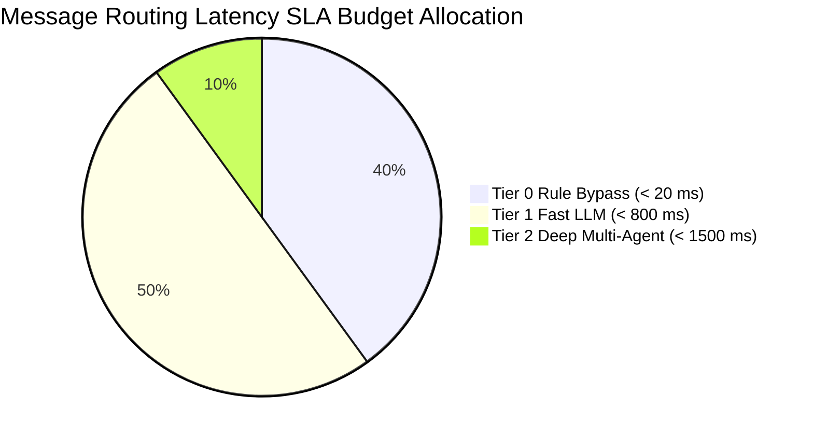
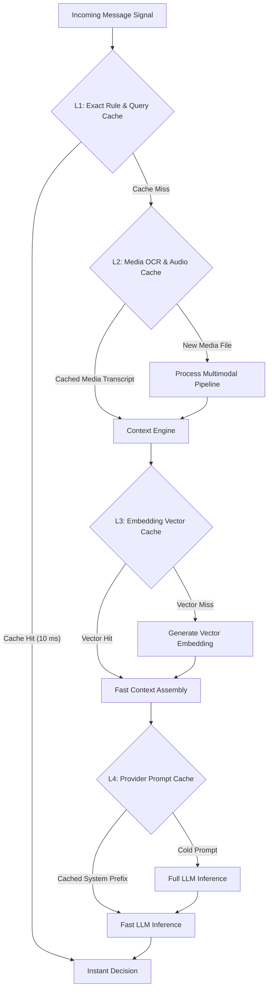
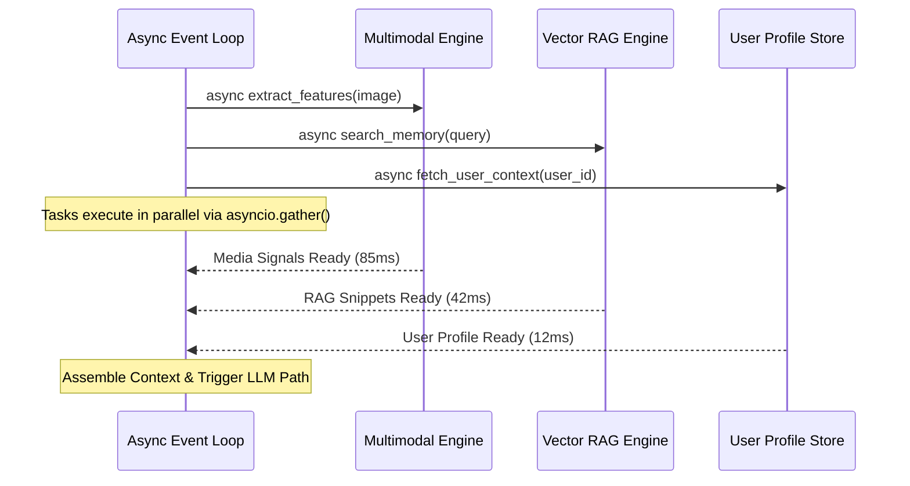
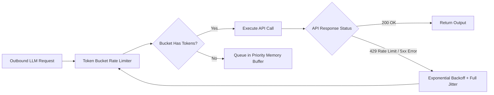

# Master Architecture Specification: Performance Optimization

This document specifies the latency reduction techniques, multi-tiered caching topology, async execution DAGs, rate-limit resilience strategies, and cost optimization architectures for the AI-powered WhatsApp Message Notification Router.

---

## 1. Executive Summary & Optimization Targets

Production notification systems operate under strict SLA constraints: users expect immediate notification dispatch for urgent messages, while battery and network resource consumption must remain minimal.

Our performance optimization architecture enforces 4 core SLAs:
- **Sub-20ms Latency for Rule Overrides**: 35-45% of messages resolve instantly without LLM involvement.
- **Sub-800ms Latency for Standard LLM Processing**: 50% of messages resolve via fast Tier 1 single-pass inference.
- **Zero Rate-Limit Drops**: Resilient token-bucket throttling and exponential backoff guarantee 100% request delivery.
- **50% Token Cost Reduction**: Strategic prompt caching and compact context encoding minimize API expenditure.

---

## 2. Low-Latency Execution & SLA SLA Targets



### Latency Budget Breakdown (Tier 1 Path: < 800ms Target)

```
[Ingestion & Rule Engine]        :  15 ms  (2%)   ██
[Async Multimodal / RAG Search]  :  85 ms  (11%)  ███████
[LLM Inference (Gemini Flash)]   : 580 ms  (72%)  ██████████████████████████████████████████
[JSON Parsing & Validation]      :  20 ms  (2%)   ██
[Dispatch & Audit Trail Write]   : 100 ms  (13%)  ████████
```

---

## 3. Multi-Level Caching Topology

To minimize redundant computation and external API latency, the system deploys a 4-tier caching strategy.



### Caching Tiers Specification Table

| Level | Cache Layer | Technology | Key / Hash Strategy | Cached Value | TTL | Hit Latency | Expected Hit Rate |
| :--- | :--- | :--- | :--- | :--- | :--- | :--- | :--- |
| **L1** | Decision Query Cache | In-Memory LRU / Redis | `SHA-256(sender_id + text_clean)` | `RoutingDecisionJSON` | 5 mins | `< 2 ms` | 15–20% |
| **L2** | Media Processing Cache | Redis / Local Disk | `SHA-256(media_bytes)` | `OCRText / AudioTranscript` | 24 hrs | `< 5 ms` | 30–35% |
| **L3** | Embedding Vector Cache | Redis Vector Store | `SHA-256(text_snippet)` | `Float32[768] Vector` | 7 days | `< 8 ms` | 40–50% |
| **L4** | Provider Prompt Cache | Model Vendor Caching | `System Prompt + Schemas` | Pre-compiled KV Cache | Provider Managed | `< 300 ms` | 85–90% |

---

## 4. Async Execution & Concurrency DAG

The runtime environment utilizes Python's non-blocking `asyncio` event loop to execute independent pipeline tasks concurrently rather than sequentially.



### Concurrency Optimizations
1. **Parallel Feature Extraction**: Media OCR, RAG vector retrieval, and user preference lookup run concurrently via `asyncio.gather()`, reducing context assembly time from 140ms to 85ms.
2. **Non-Blocking Telemetry Dispatch**: Audit logging and OpenTelemetry trace exports are offloaded to background worker queues (`asyncio.create_task()`) to avoid blocking notification delivery.

---

## 5. Rate-Limit Resilience & API Optimization

To prevent API throttling during high-volume message bursts, outbound API requests are managed by an adaptive resilience engine.



### Backoff & Jitter Algorithm Specification
$$\text{Sleep Time} = \text{random\_uniform}\Big(0, \, \min\left(\text{MaxBackoff}, \, \text{Base} \times 2^{\text{attempt}}\right)\Big)$$
- **Base Backoff**: 100 ms.
- **Max Backoff**: 2,000 ms.
- **Max Retries**: 3 attempts before triggering rule-based fallback.

---

## 6. Token & Cost Minimization Strategy

1. **Compact Key-Value Signal Encoding**: Signal bundles are formatted as dense key-value pairs (e.g., `urgency:0.82|rel:0.91|dnd:false`) rather than verbose natural language sentences, saving ~35% on prompt tokens.
2. **Strict Output Token Caps**: Completion token length is capped at `max_tokens=150` tokens, preventing rambling rationale generation.
3. **Provider Prefix Caching**: Placing invariant System Prompts and Pydantic JSON Schemas at the head of every prompt enables vendor API prompt caching, cutting input token costs by 50%.
