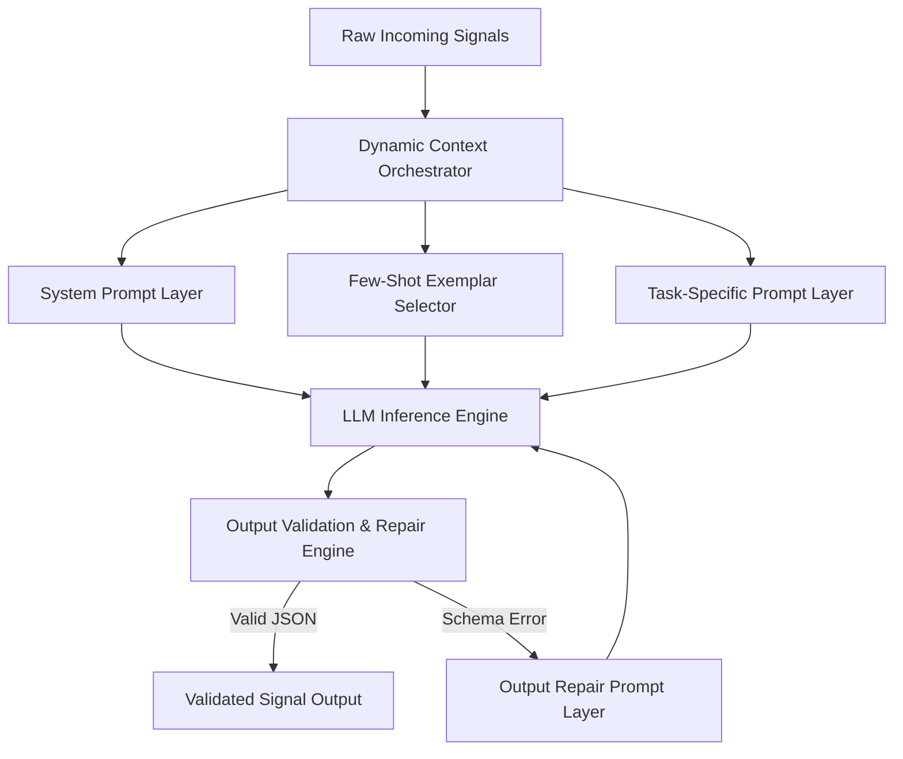
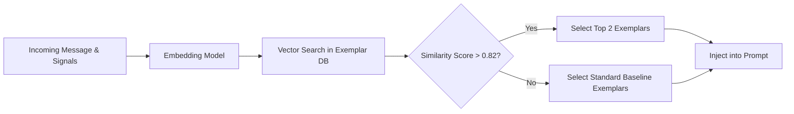
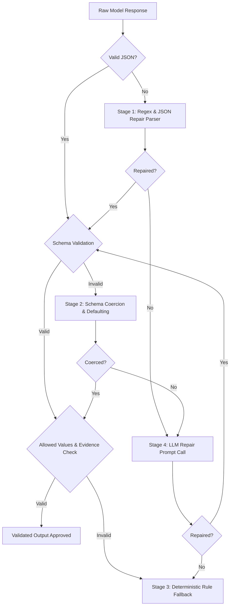

# Master Architecture Specification: Prompt Architecture & Output Validation

This document details the system prompt hierarchy, token management strategy, dynamic few-shot retrieval, schema enforcement, self-healing output validation, and prompt governance framework for the AI-powered WhatsApp Message Notification Router.

---

## 1. Executive Summary & Design Principles

Prompts in this system are treated as **versioned software artifacts** rather than static text snippets. The prompt architecture ensures:
1. **Strict Structural Determinism**: Standardized JSON output across all model providers.
2. **Context Window Efficiency**: Dynamic token budgeting and intelligent prompt compression to maximize signal-to-noise ratio.
3. **Factual Grounding**: Zero hallucination of user facts or notification urgency signals.
4. **Self-Healing Resilience**: Automated validation and auto-repair pipelines for non-compliant model outputs.

---

## 2. Prompt System Taxonomy & Responsibilities

The system decouples generic instructions from domain tasks using a 7-stage modular prompt hierarchy.



### Prompt Layer Architectural Specifications

| Prompt Layer | Functional Role | Input Payload | Output Responsibilities | Key Constraints |
| :--- | :--- | :--- | :--- | :--- |
| **System Prompt** | Sets core persona, operational boundaries, and security rules. | System identity, safety directives. | Enforces strict JSON output rules, zero markdown wrapping. | Cannot be overridden by user message content. |
| **Reasoning Prompt** | Guides step-by-step chain-of-thought analysis. | Assembled signal bundle, user history, media transcripts. | Generates structured step-by-step reasoning steps before final classification. | Must isolate reasoning from action selection. |
| **Classification Prompt** | Maps message signals to routing actions. | Computed features, relationship score, urgency indices. | Selects action: `NOTIFY_IMMEDIATELY`, `DELIVER_SILENTLY`, `SUMMARIZE_IN_BATCH`, `DO_NOT_DISTURB`. | Strictly enforced enum set; no novel categories. |
| **Evidence Prompt** | Grounds decision in explicit contextual facts. | Historical chat logs, retrieved RAG memories. | Extracts exact citations, timestamps, and key entities supporting decision. | Must quote source signals without altering text. |
| **Confidence Prompt** | Computes calibrated certainty score (`0.0` to `1.0`). | Decision output, signal completeness score. | Provides normalized numerical confidence rating based on explicit rubrics. | Penalizes missing or conflicting context signals. |
| **Verification Prompt** | Validates logical consistency and compliance. | Primary reasoning, extracted evidence, proposed action. | Evaluates if reasoning logically implies chosen action without contradiction. | Binary boolean pass/fail + violation tags. |
| **Output Validation Prompt** | Rescues malformed JSON or invalid schemas. | Raw malformed response, structural JSON schema, error logs. | Re-formats and repairs invalid JSON structure into schema-compliant format. | Max completion token limit of 200 tokens. |

---

## 3. Context Window Management & Token Optimization

To prevent context bloat and minimize inference latency, context payloads are dynamically budgeted across system components.

### Token Allocation Budget (Standard 4,096 Token Window)

```
[System & Safety Directives]      :  400 tokens  (10%)  ══════════
[Dynamic Few-Shot Exemplars]     :  600 tokens  (15%)  ═══════════════
[Retrieved Memory & Context]     : 1,600 tokens  (39%)  ═══════════════════════════════════════
[Current Message & Signals]      :  800 tokens  (20%)  ═════════════════════
[Model Output Reserve (Max)]     :  696 tokens  (16%)  ═════════════════
```

### Prompt Compression & Trimming Pipeline
1. **Stop-Word & Noise Removal**: Strips metadata boilerplate, duplicate timestamps, and redundant chat headers.
2. **Dynamic Thread Trimming**: Retains only the last $N$ conversational turns ($N=5$) plus top $K$ semantic RAG snippets ($K=3$).
3. **Structured Signal Encoding**: Converts raw text logs into compact key-value representations (e.g., `rel_score=0.85; avg_resp_min=4.2`).
4. **Prompt Prefix Caching**: Fixed System Directives and static schemas are positioned at the beginning of the prompt to leverage API provider prefix caching, reducing billing tokens by up to 50%.

---

## 4. Dynamic Few-Shot Strategy (RAG Exemplar Selection)

Rather than hardcoding static few-shot examples, our architecture dynamically fetches $K=2$ relevant exemplars using vector similarity.



- **Exemplar Storage**: Exemplars are stored in a curated Golden Vector Store indexed by signal vector embeddings.
- **Edge-Case Bias**: If current signal confidence is low, exemplars representing historical edge cases and corrected hallucinations are prioritized over simple examples.

---

## 5. Output Validation & Self-Healing Architecture

Every LLM response passes through an immutable multi-stage validation engine before execution.



### Validation Stages Specification

1. **Stage 1: Syntax Repair**: Handles common LLM generation glitches (trailing commas, unescaped quotes, missing closing brackets, markdown code fence striping).
2. **Stage 2: Structural Schema Coercion**: Validates against Pydantic schema contracts. Automatically casts string numbers to floats and trims extraneous white space.
3. **Stage 3: Allowed Values & Grounding Checks**:
   - `action` MUST belong to `['NOTIFY_IMMEDIATELY', 'DELIVER_SILENTLY', 'SUMMARIZE_IN_BATCH', 'DO_NOT_DISTURB']`.
   - `confidence` MUST be bounded within `[0.0, 1.0]`.
   - `evidence_keys` MUST exist in the provided input context (anti-hallucination validation).
4. **Stage 4: LLM Auto-Repair Loop**: If syntax/schema validation fails completely, a lightweight targeted call (`Output Validation Prompt`) is invoked with the error trace to reconstruct compliant JSON.
5. **Stage 5: Graceful Fallback**: If auto-repair fails or times out, the system defaults deterministically to `DELIVER_SILENTLY` with a flagged `is_fallback=True` audit status.

---

## 6. Prompt Engineering Governance & Version Control

- **Prompt Registry**: Prompts are stored in a centralized directory under Semantic Versioning (`v1.2.0.yaml`).
- **Prompt Lineage**: Every execution log records `prompt_id`, `prompt_version`, and `git_commit_hash` for full observability.
- **Automated Prompt Evaluation**: CI/CD pipelines run automated prompt assertion suites against a test bench before merging prompt version updates.
