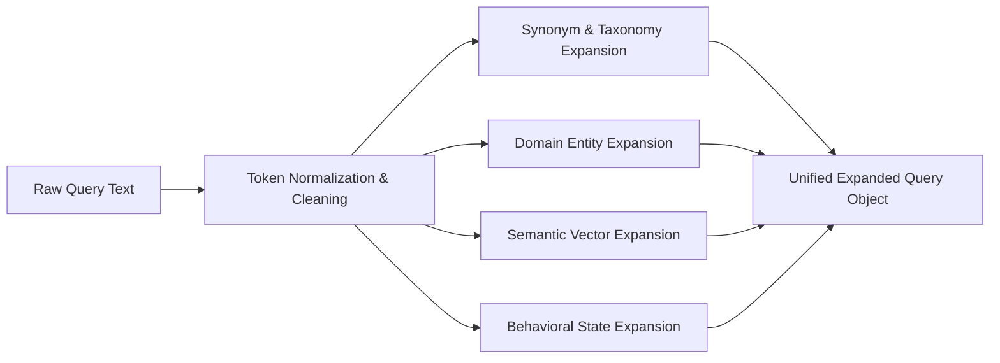

# Query Building & Query Expansion Specification

## Overview

The `QueryBuilder` component is responsible for transforming raw incoming message context, multimodal extractions, metadata attributes, and user behavioral profiles into structured, high-precision search queries. 

Query building bridges raw unstructured inputs and search indexes (BM25 sparse keyword indices and FAISS dense vector spaces).

---

## Multimodal Input Integration Matrix

Incoming WhatsApp messages may contain text, images, voice notes, or metadata. The `QueryBuilder` processes and incorporates all available modal signals:

| Input Signal | Integration Rule | Query Usage | Target Field in Index |
|---|---|---|---|
| **Raw Message Text** | Exact string & tokenized terms | Sparse keyword + Dense embedding | `message_text` |
| **Image Vision Captions** | Detailed description generated by Vision LLM | Dense embedding + Sparse keywords | `image_caption` |
| **Image OCR Text** | Extracted optical character text | Sparse keyword matching | `ocr_text` |
| **Voice Transcripts** | Speech-to-text transcript output | Sparse keyword + Dense embedding | `voice_transcript` |
| **Forward Count** | Numeric forward count (`forwarded_count`) | Relational filter / query boosting | `forwarded_count` |
| **Sender Metadata** | `sender_user_id`, `role`, `joined_at` | Structured filter / exact match | `sender_user_id` |
| **Business Metadata** | `business_id`, `category`, `domain` | Category matching & domain lookup | `business_id`, `domain` |
| **Group Metadata** | `group_id`, `group_type`, `member_count` | Group scoping & channel context | `group_id`, `group_type` |

### Detailed Multimodal Rationale

1. **Image Captions**: Vision captions provide high-level semantic intent (e.g., *"Screenshot of a bank transaction confirmation for Rs. 500"*). Captions are essential for dense vector retrieval, enabling semantic matching against historical transaction texts.
2. **OCR Text**: OCR text captures exact tokens (e.g., order IDs, verification codes, invoice numbers, domain names). OCR text is heavily weighted in sparse BM25 retrieval for exact entity matching.
3. **Voice Transcripts**: Voice notes contain natural language speech. Transcripts are converted to normalized lower-case text and fed into both sparse keyword queries and dense sentence transformers.
4. **Metadata & Structured Identifiers**: Structural metadata prevents cross-chat contamination. Scoping queries by `user_id`, `group_id`, or `business_id` ensures that retrieval operates strictly within valid privacy and conversational boundaries.

---

## Context & Behavior Influence on Query Formulation

Query construction is strongly influenced by contextual signals and user behavioral history:

### 1. Sender Information Integration
- **Personal Senders**: Query includes `sender_user_id` and relationship parameters (e.g., previous reply frequency, interaction recency).
- **Group Senders**: Query includes `group_id`, `group_type` (`family`, `society`, `school_group`, `coworker`), and sender's role (`admin` vs `member`).
- **Business Senders**: Query includes `business_id`, `official_domain`, `domain_used_by_sender`, and verification status (`verified`).

### 2. Business Information Integration
- Domain mismatch detection: If `domain_used_by_sender != official_domain`, the query builder appends explicit security risk tokens (`"domain_mismatch"`, `"suspicious_url"`, `"phishing_check"`) to pull historical scam patterns for that domain.

### 3. User Behavior-Influenced Retrieval
User behavioral history from `message_events.csv` and `user_business_history.csv` actively shapes search parameters:
- **High Dismissal Sender**: If the user has a high dismissal rate (>70%) for a business/sender, the query builder boosts historical dismissal records (`notification_dismissed == 1`) to surface evidence of past disinterest.
- **High Reply Sender**: If the user frequently replies to a contact, the query builder prioritizes historical reply messages (`message_replied == 1`) to establish personal relationship evidence.
- **Opt-Out History**: If `promotions_opted_out_at` is set, promotional keyword queries are expanded with opt-out enforcement tokens.

---

## Query Expansion Framework

Query expansion prevents vocabulary mismatch and retrieves semantically related historical evidence even when keyword overlap is low.



### Expansion Modalities

1. **Synonym & Taxonomy Expansion**:
   - Maps domain terms to canonical categories:
     - *"OTP" / "verification code" / "2FA" / "security pin"* \(\rightarrow\) `[category: authentication]`
     - *"discount" / "sale" / "off" / "cashback"* \(\rightarrow\) `[category: promotional]`
     - *"shipped" / "out for delivery" / "arriving today"* \(\rightarrow\) `[category: logistics]`

2. **Domain Entity Expansion**:
   - Extracts specific entities (amounts, order numbers, tracking numbers, dates, URLs) and adds structural wildcards for exact field matching.

3. **Semantic Vector Expansion**:
   - Uses the sentence transformer model to generate dense query vectors that capture semantic intent beyond surface keywords (e.g., *"when is my package coming?"* matches *"Your order #1234 is arriving by 5 PM"*).

4. **Behavioral Contextual Expansion**:
   - Appends contextual state terms (e.g., `user_dnd_active`, `high_dismissal_channel`, `recent_mute_event`) to pull historical messages with matching behavioral outcomes.

---

## Query Object Definition

The output of `QueryBuilder` is a structured query specification passed downstream:

```
StructuredQuery = {
    "user_id": String,                  # Target recipient user ID
    "sparse_terms": List[String],       # BM25 keyword tokens with field weights
    "dense_vector": List[Float],        # 384-d or 768-d normalized embedding vector
    "filters": {                        # Hard relational filters
        "conversation_type": String,
        "group_id": Optional[String],
        "business_id": Optional[String],
        "sender_user_id": Optional[String]
    },
    "boost_factors": {                  # Dynamic field boosting
        "exact_entity_match": Float,
        "sender_match": Float,
        "category_match": Float,
        "recency_bias": Float
    },
    "expansion_tokens": List[String]    # Added taxonomy and synonym tokens
}
```
