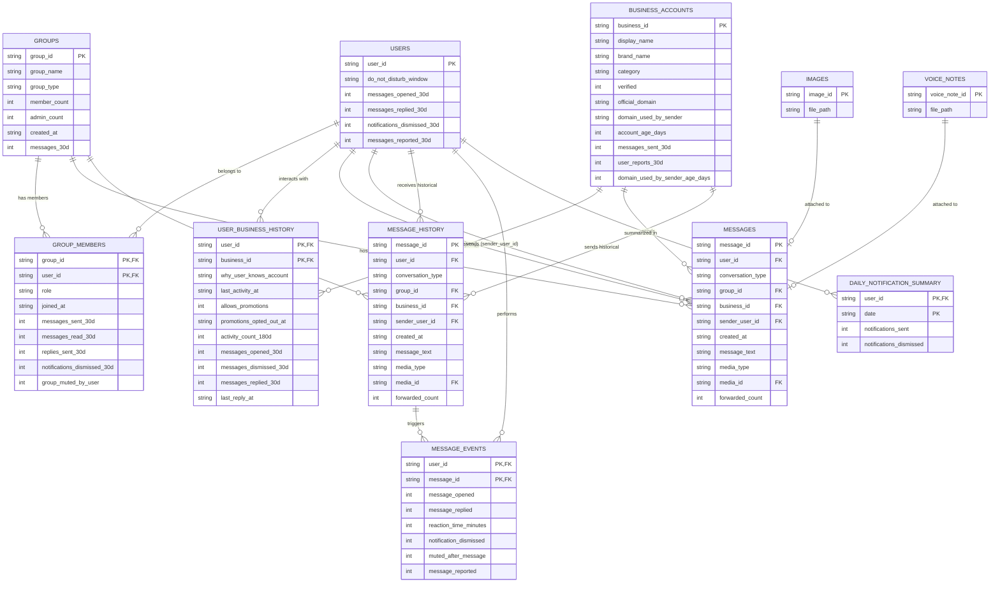

# Entity Relationship Diagram & Relational Blueprint

## Overview
This document maps all structural entity relationships, key mappings, and cardinalities between the 13 CSV files in the WhatsApp Message Notification Router dataset.

---

## 1. Mermaid Entity-Relationship Diagram

---

## 2. Foreign Key Topology & Cardinality Matrix

| Source Table | Foreign Key Column | Target Table | Target Key | Cardinality | Nullability Constraint | Contextual Integrity Rules |
|---|---|---|---|---|---|---|
| `messages.csv` | `user_id` | `users.csv` | `user_id` | N : 1 | NON-NULLABLE | Every incoming message MUST map to a valid receiving user. |
| `messages.csv` | `group_id` | `groups.csv` | `group_id` | N : 1 | NULLABLE | Mandatory ONLY IF `conversation_type == 'group'`. Must be NULL for `personal` or `business`. |
| `messages.csv` | `business_id` | `business_accounts.csv` | `business_id` | N : 1 | NULLABLE | Mandatory ONLY IF `conversation_type == 'business'`. Must be NULL for `personal` or `group`. |
| `messages.csv` | `sender_user_id` | `users.csv` | `user_id` | N : 1 | NULLABLE | Mandatory ONLY IF `conversation_type == 'group'` or `'personal'`. Must be NULL for `business`. |
| `messages.csv` | `media_id` | `images.csv` / `voice_notes.csv` | `image_id` / `voice_note_id` | N : 1 | NULLABLE | Mandatory ONLY IF `media_type` IN (`'image'`, `'voice'`). |
| `group_members.csv` | `group_id` | `groups.csv` | `group_id` | N : 1 | NON-NULLABLE | Group member entry must reference a valid group. |
| `group_members.csv` | `user_id` | `users.csv` | `user_id` | N : 1 | NON-NULLABLE | Group member entry must reference a valid user. |
| `user_business_history.csv` | `user_id` | `users.csv` | `user_id` | N : 1 | NON-NULLABLE | History record must reference a valid recipient user. |
| `user_business_history.csv` | `business_id` | `business_accounts.csv` | `business_id` | N : 1 | NON-NULLABLE | History record must reference a valid registered business. |
| `message_events.csv` | `message_id` | `message_history.csv` | `message_id` | N : 1 | NON-NULLABLE | Event log must reference a valid historical message ID. |
| `message_events.csv` | `user_id` | `users.csv` | `user_id` | N : 1 | NON-NULLABLE | Event log user MUST match the recipient `user_id` of the referenced historical message. |
| `daily_notification_summary.csv` | `user_id` | `users.csv` | `user_id` | N : 1 | NON-NULLABLE | Time-series row must reference a valid user. |

---

## 3. Join & Lookup Strategies

### A. Core Message Context Assembly (Inference Pipeline)
To enrich an incoming message from `messages.csv` for downstream evaluation:
1. **Recipient Context Join**: `messages.csv` INNER JOIN `users.csv` ON `messages.user_id == users.user_id`.
2. **Conversation Entity Resolution**:
   - IF `conversation_type == 'group'`:
     - LEFT JOIN `groups.csv` ON `messages.group_id == groups.group_id`.
     - LEFT JOIN `group_members.csv` ON `messages.group_id == group_members.group_id` AND `messages.user_id == group_members.user_id`.
     - LEFT JOIN `group_members.csv` AS `sender_meta` ON `messages.group_id == sender_meta.group_id` AND `messages.sender_user_id == sender_meta.user_id`.
   - IF `conversation_type == 'business'`:
     - LEFT JOIN `business_accounts.csv` ON `messages.business_id == business_accounts.business_id`.
     - LEFT JOIN `user_business_history.csv` ON `messages.user_id == user_business_history.user_id` AND `messages.business_id == user_business_history.business_id`.
3. **Media Pointer Resolution**:
   - IF `media_type == 'image'`: LEFT JOIN `images.csv` ON `messages.media_id == images.image_id`.
   - IF `media_type == 'voice'`: LEFT JOIN `voice_notes.csv` ON `messages.media_id == voice_notes.voice_note_id`.

### B. Historical Pattern & Evidence Join
1. **Sender Interaction History**: Query `message_history.csv` WHERE `user_id == target_user_id` AND (`sender_user_id == target_sender` OR `business_id == target_business` OR `group_id == target_group`).
2. **Reaction Event Resolution**: INNER JOIN `message_events.csv` ON `message_history.message_id == message_events.message_id`.
