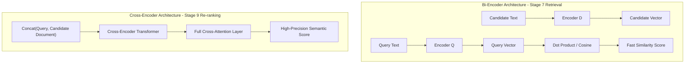
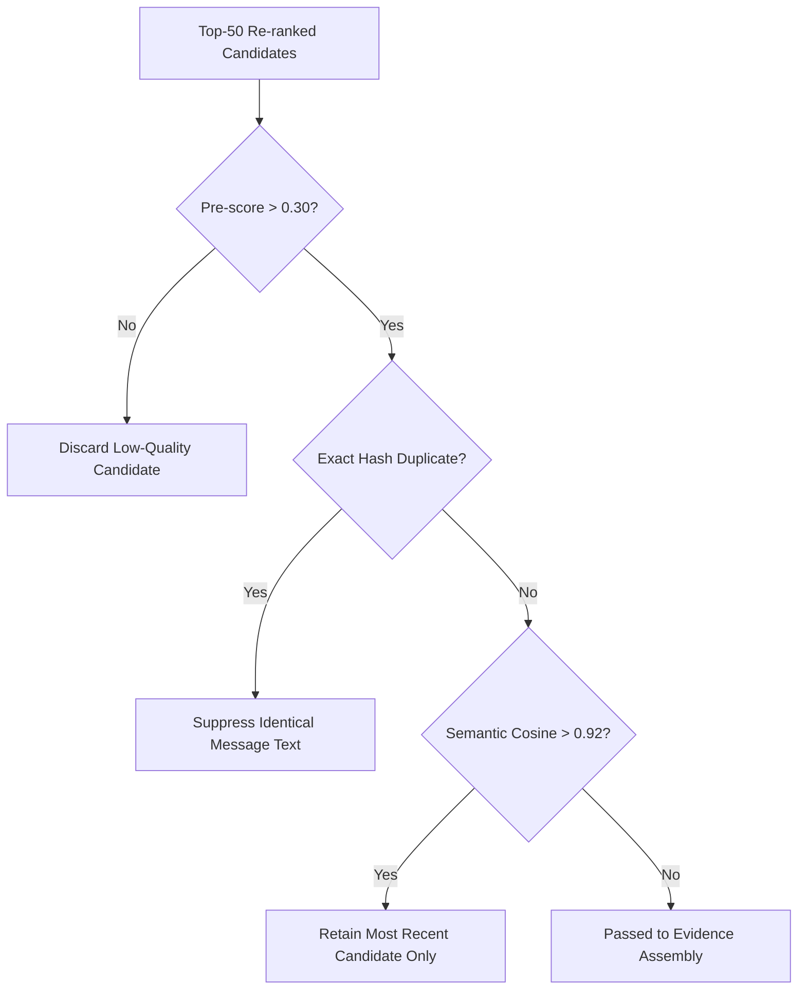

# Re-ranking & Candidate Scoring Specification

## Overview

The `Reranker` component takes the top-50 candidates produced by Hybrid Fusion (RRF) and re-evaluates them using a Cross-Encoder semantic model combined with a Multi-Factor heuristic scoring function. 

While hybrid search identifies broad candidates, re-ranking evaluates exact token interaction, behavioral alignment, temporal recency, relationship strength, sender trust, and message importance.

---

## Architecture: Cross-Encoder vs Bi-Encoder

### Architectural Trade-off

- **Bi-Encoder (Stage 7)**: Computes query and document embeddings independently. Fast (\(\mathcal{O}(1)\) vector lookup), ideal for candidate generation, but lacks token-to-token cross-attention.
- **Cross-Encoder (Stage 9)**: Processes query and candidate text jointly through transformer self-attention layers. Captures subtle contextual dependencies, negation, and entity relationships with high accuracy. Applied only to the top-50 candidates to respect strict latency budgets.

---

## Multi-Factor Scoring Formula

The final candidate rank score \(\text{FinalScore}(d)\) is computed as a weighted linear combination of 6 specialized feature scores:

$$\text{FinalScore}(d) = w_1 S_{\text{cross}}(d) + w_2 S_{\text{behaviour}}(d) + w_3 S_{\text{recency}}(d) + w_4 S_{\text{relationship}}(d) + w_5 S_{\text{trust}}(d) + w_6 S_{\text{importance}}(d)$$

### Component Feature Scores

#### 1. Semantic Cross-Encoder Score (\(S_{\text{cross}}\))
Normalized output score from the Cross-Encoder model (\(S_{\text{cross}} \in [0.0, 1.0]\)).

#### 2. Behavioral Match Score (\(S_{\text{behaviour}}\))
Measures historical user interaction with the candidate's sender/business using `message_events.csv` and `user_business_history.csv`:

$$S_{\text{behaviour}}(d) = 0.5 \cdot \text{ReplyRate} + 0.3 \cdot \text{OpenRate} - 0.8 \cdot \text{DismissalRate}$$

#### 3. Recency Exponential Decay (\(S_{\text{recency}}\))
Applies exponential decay based on time elapsed (\(\Delta t\) in days) between incoming message timestamp and candidate's `created_at`:

$$S_{\text{recency}}(d) = e^{-\lambda \cdot \Delta t}$$

- \(\lambda = 0.05\) (Half-life of ~14 days for general chat, ensuring recent context is weighted higher while preserving historical patterns).

#### 4. Relationship Strength Weighting (\(S_{\text{relationship}}\))
Evaluates tie strength between user and sender from `group_members.csv` or personal message history:

$$S_{\text{relationship}}(d) = \min\left(1.0, \; 0.4 \cdot \log_{10}(\text{ActivityCount}_{180d} + 1) + 0.2 \cdot \text{IsAdmin}\right)$$

#### 5. Domain & Sender Trust Weighting (\(S_{\text{trust}}\))
Incorporates business verification and domain authenticity from `business_accounts.csv`:

$$S_{\text{trust}}(d) = \begin{cases} 
1.0 & \text{if verified business AND official domain match} \\
0.5 & \text{if unverified business BUT account age > 90 days} \\
0.1 & \text{if domain mismatch (domain_used != official_domain)} \\
0.0 & \text{if high user reports (user_reports_30d > 10)}
\end{cases}$$

#### 6. Importance & Category Weighting (\(S_{\text{importance}}\))
Boosts high-value functional alerts (transactions, OTPs, deliveries) while suppressing routine promotional blasts:

$$S_{\text{importance}}(d) = \begin{cases}
1.2 & \text{if transactional / OTP / urgent alert} \\
1.0 & \text{if personal direct message} \\
0.8 & \text{if group chat message} \\
0.4 & \text{if promotional message}
\end{cases}$$

---

## Production Weight Assignments

| Feature Weight | Factor | Value | Description |
|---|---|---|---|
| \(w_1\) | Cross-Encoder Semantic Score | **0.35** | Primary semantic relevance weight. |
| \(w_2\) | Behavioral Match | **0.20** | User reply/dismissal history weight. |
| \(w_3\) | Recency Decay | **0.15** | Temporal closeness weight. |
| \(w_4\) | Relationship Strength | **0.15** | Interpersonal / group interaction weight. |
| \(w_5\) | Trust & Reputation | **0.10** | Domain integrity & report penalty weight. |
| \(w_6\) | Importance Weight | **0.05** | Category priority boost. |

---

## Noise Filtering & Deduplication Engine

Before constructing evidence items, candidates undergo strict quality filtering:

1. **Pre-Score Floor Filtering**: Any candidate with \(\text{FinalScore}(d) < 0.30\) is filtered out as noise.
2. **Exact Duplicate Suppression**: SHA-256 hash matching on normalized text suppresses identical historical broadcasts.
3. **Near-Duplicate Clustering**: Candidates with dense vector similarity \(\text{Sim} > 0.92\) are clustered; only the candidate with the highest behavioral interaction or most recent timestamp is retained.
4. **Candidate Pool Truncation**: Truncates filtered set to top-10 high-precision evidence candidates.
