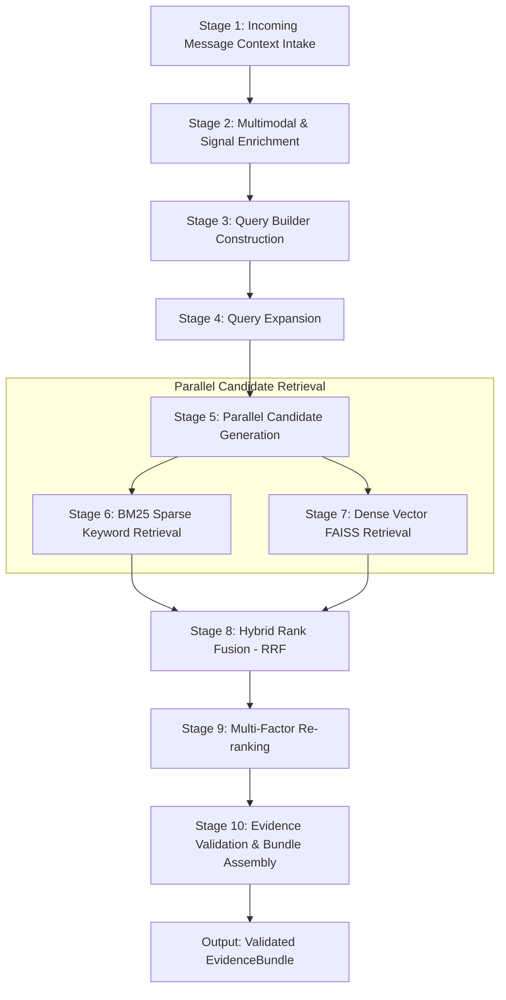
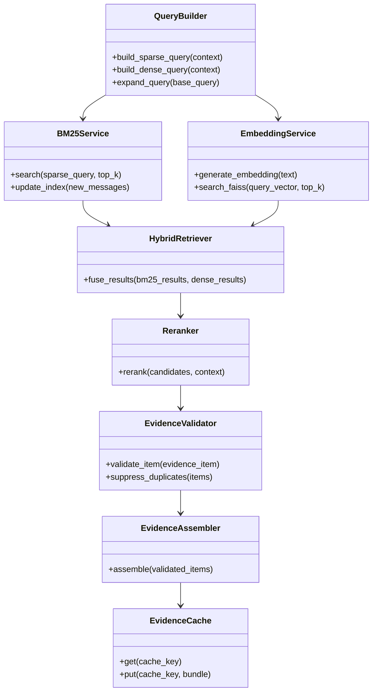

# Hybrid Retrieval & Evidence Engine Architecture

## Overview & Core Purpose

The **Hybrid Retrieval & Evidence Engine** is a specialized Information Retrieval (IR) subsystem designed for the production AI WhatsApp Message Notification Router. Its singular objective is to extract, evaluate, rank, and bundle historical contextual evidence from past interactions to support downstream decision-making. 

The retrieval engine is purely **evidentiary**. It does not perform message classification, action routing, or response generation. Instead, it transforms raw incoming message context into an enriched, validated, and ranked `EvidenceBundle` containing deterministic historical facts, structural relationships, past user behaviors, and content similarities.

---

## 18 Core Retrieval Objectives

The engine is engineered to satisfy 18 distinct retrieval objectives across structural, temporal, behavioral, and content dimensions:

| # | Retrieval Objective | Target Source Data | Value to Retrieval Context |
|---|---|---|---|
| 1 | **Similar Messages** | `message_history.csv` | Identifies exact or semantic duplicates of past messages across channels. |
| 2 | **Similar Media** | `message_history.csv`, OCR/Voice metadata | Matches vision captions, OCR text, or audio transcripts against historical media. |
| 3 | **Same Sender History** | `message_history.csv`, `message_events.csv` | Aggregates all historical messages sent by the specific `sender_user_id`. |
| 4 | **Same Group History** | `message_history.csv`, `group_members.csv` | Fetches historical thread dynamics and activity patterns within `group_id`. |
| 5 | **Business History** | `user_business_history.csv`, `business_accounts.csv` | Retrieves transaction volume, opt-in/out timestamps, and account age. |
| 6 | **User Interaction History** | `message_events.csv` | Obtains historical open rates, reply rates, and reaction times for the user. |
| 7 | **Dismiss History** | `message_events.csv`, `daily_notification_summary.csv` | Identifies messages or senders that the user previously swiped away without opening. |
| 8 | **Reply History** | `message_events.csv`, `user_business_history.csv` | Captures historical messages that elicited an explicit text reply from the user. |
| 9 | **Notification Behaviour** | `daily_notification_summary.csv` | Analyzes macro notification load and dismissal ratios on specific dates/times. |
| 10 | **Past Evidence** | `sample_messages.csv`, Historical logs | Correlates historical evidence bundles attached to similar prior messages. |
| 11 | **Conversation History** | `message_history.csv` | Retrieves recent chronological context within the same conversation thread. |
| 12 | **Forward Chain History** | `message_history.csv` | Tracks highly forwarded viral messages (`forwarded_count >= 5`). |
| 13 | **Repeated Promotions** | `message_history.csv`, `user_business_history.csv` | Detects high-frequency promotional blasts and marketing patterns. |
| 14 | **Repeated Scams** | `message_history.csv`, `message_events.csv` | Retrieves reported scam messages, suspicious link domains, and domain spoofing. |
| 15 | **Historical Urgency** | `message_history.csv`, `message_events.csv` | Locates past high-urgency operational alerts (OTP, delivery ETA, security alerts). |
| 16 | **Historical Payments** | `message_history.csv`, `user_business_history.csv` | Extracts past transaction receipts, payment requests, and banking alerts. |
| 17 | **Historical Events** | `message_history.csv` | Pulls past calendar events, meeting invitations, and deadline reminders. |
| 18 | **User Mute History** | `message_events.csv`, `group_members.csv` | Finds messages that directly triggered chat muting or block actions by the user. |

---

## Complete 10-Stage Pipeline Architecture

The retrieval pipeline processes incoming messages through 10 sequential stages:

### Stage Details

1. **Stage 1: Incoming Message Intake**: Receives raw message attributes (`message_id`, `user_id`, `conversation_type`, `created_at`, `message_text`, `media_id`, `forwarded_count`).
2. **Stage 2: Multimodal & Signal Enrichment**: Integrates upstream multimodal outputs (OCR text, vision captions, voice transcripts) and computed signal features (trust score, urgency level, relationship index).
3. **Stage 3: Query Builder**: Constructs structured search queries tailored for sparse, dense, and relational lookup services.
4. **Stage 4: Query Expansion**: Expands search tokens using domain-specific synonyms, entity extraction, and behavioral context flags.
5. **Stage 5: Parallel Candidate Generation**: Dispatches expanded queries asynchronously to sparse BM25 indices and dense vector search engines.
6. **Stage 6: BM25 Sparse Retrieval**: Executes term-frequency/inverse-document-frequency keyword matching across indexed historical corpora.
7. **Stage 7: Dense Vector Retrieval**: Computes sentence embeddings and searches FAISS vector index using Inner Product (Cosine) similarity.
8. **Stage 8: Hybrid Fusion**: Blends sparse and dense candidate sets using Reciprocal Rank Fusion (RRF) with constant \(k=60\).
9. **Stage 9: Multi-Factor Re-ranking**: Scores candidates using a cross-encoder model combined with recency decay, behavioral match weight, domain trust, and relationship strength.
10. **Stage 10: Evidence Validation & Assembly**: Filters low-quality, duplicate, or conflicting candidates, validates evidence items against strict quality criteria, and constructs the final immutable `EvidenceBundle`.

---

## Component Architecture & System Lifecycles

The engine comprises eight modular components:

### Component Lifecycles

1. **Initialization Phase**:
   - `BM25Service` loads the pre-built BM25 index into memory and initializes inverted tables.
   - `EmbeddingService` loads the Sentence-Transformer model into inference memory and reads the FAISS index file into RAM.
   - `EvidenceCache` connects to local and distributed cache tiers.

2. **Online Query Phase**:
   - Incoming request triggers parallel execution across `BM25Service` and `EmbeddingService`.
   - Results are streamed to `HybridRetriever` for instant rank aggregation.
   - `Reranker` applies lightweight cross-encoding and heuristic scoring within a tight latency budget (<15ms).

3. **Background Sync Phase**:
   - As new messages arrive in `message_history.csv`, incremental updates append to BM25 inverted indices and FAISS vector buffers.
   - Index consolidation runs during low-traffic windows.
