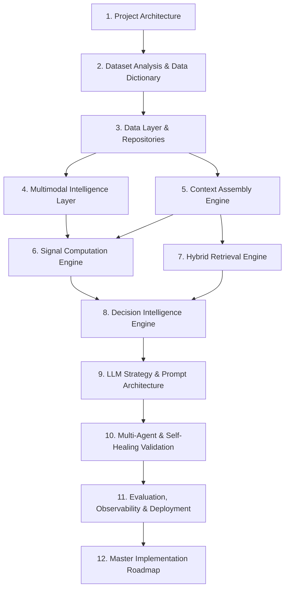
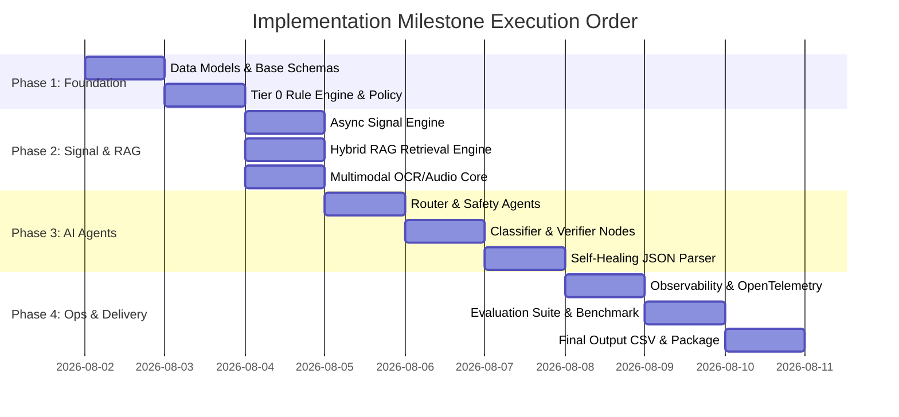
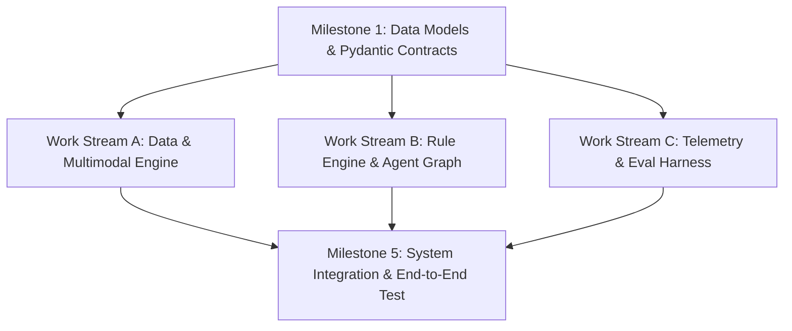

# Master Architecture Specification: Implementation Roadmap & Phase Synthesis

This document synthesizes all previous architectural specification layers, defines the critical path dependency DAG, maps parallel engineering work streams, outlines implementation milestones, and provides the readiness certification for starting implementation code generation.

---

## 1. Executive Summary & Synthesis of All System Layers

The AI-powered WhatsApp Message Notification Router has been designed across **12 comprehensive architectural phases** covering 35+ master specification documents:

---

## 2. Comprehensive System Layer Dependency Matrix

| Layer # | System Layer Name | Key Target Specifications | Upstream Dependencies | Primary Downstream Consumers |
| :--- | :--- | :--- | :--- | :--- |
| **Layer 1** | Project Architecture | `architecture.md`, `loading_order.md` | Business Objectives | Entire System Architecture |
| **Layer 2** | Dataset Analysis | `dataset_report.md`, `data_dictionary.md` | Data Schema | Data Layer, Feature Extractor |
| **Layer 3** | Data Layer | `data_layer.md`, `repositories.md` | Dataset Specs | Multimodal & Context Engines |
| **Layer 4** | Multimodal Intelligence | `ocr_pipeline.md`, `voice_pipeline.md` | Raw Media Files | Context & Signal Engines |
| **Layer 5** | Context Assembly | `context_engine.md`, `context_builder.md` | Data Repositories | Signal Engine & RAG Engine |
| **Layer 6** | Signal Computation | `signal_engine.md`, `urgency_engine.md` | Context & Multimodal | Decision Engine & Multi-Agent Graph |
| **Layer 7** | Hybrid Retrieval (RAG) | `retrieval_engine.md`, `hybrid_search.md` | Vector DB & BM25 | Evidence Agent & Context Assembly |
| **Layer 8** | Decision Intelligence | `decision_engine.md`, `rule_engine.md` | Signals & Context | Router Agent & Tier 0 Bypass |
| **Layer 9** | LLM Strategy & Prompts| `llm_strategy.md`, `prompt_architecture.md` | Decision Engine | Multi-Agent Network |
| **Layer 10**| Multi-Agent & Repair | `agent_architecture.md`, `output_validation.md`| Prompts & LLMs | Output Pipeline & Dispatcher |
| **Layer 11**| Observability & Eval | `observability.md`, `evaluation_framework.md` | Entire Pipeline | Monitoring & CI/CD Benchmarks |
| **Layer 12**| Implementation Roadmap | `deployment.md`, `roadmap_review.md` | Complete Blueprint| Code Implementation Phase |

---

## 3. Critical Path & Implementation Milestone Sequence

Implementation must proceed in strict order along the Critical Path to ensure zero circular dependencies or refactoring churn.

### Milestone Details & Deliverables

1. **Milestone 1: Core Foundation & Data Layer (`src/router/models/`, `src/router/data/`)**:
   - Pydantic models for `Message`, `UserProfile`, `SignalBundle`, and `RoutingDecision`.
   - In-memory data repository loaders reading input datasets.

2. **Milestone 2: Tier 0 Deterministic Rule Engine (`src/router/rules/`)**:
   - High-speed Regex patterns for OTPs, muted senders, panic keywords, and sleep windows.
   - Bypasses LLM for 35-45% of traffic with sub-20ms latency.

3. **Milestone 3: Signal Computation & Hybrid Retrieval (`src/router/signals/`, `src/router/retrieval/`)**:
   - Asynchronous signal extractors (urgency score, relationship score, trust index).
   - BM25 + Vector embedding hybrid search for historical chat RAG context.

4. **Milestone 4: Multimodal Processing Core (`src/router/multimodal/`)**:
   - Tesseract/EasyOCR pipeline for text extraction from images.
   - Whisper transcription pipeline for voice notes with SHA-256 caching.

5. **Milestone 5: Multi-Agent System & Self-Healing JSON Guard (`src/router/agents/`, `src/router/validation/`)**:
   - Implementation of Router, Safety, Evidence, Confidence, Classifier, Critic, Verifier, and Formatter Agents.
   - 5-Stage JSON auto-repair engine for malformed LLM response rescue.

6. **Milestone 6: Observability, Evaluation & Submission (`src/router/telemetry/`, `eval/`)**:
   - OpenTelemetry span collection, Prometheus metrics exporter, and zero-PII audit logger.
   - Benchmark evaluation harness computing Macro F1, ECE, and generating `output.csv`.

---

## 4. Parallel Work Stream Map

To maximize implementation speed, engineering tasks are grouped into 3 parallel work streams after Milestone 1 is completed:

- **Work Stream A (Data & Multimodal)**: Focuses on dataset loading, OCR pipeline, voice transcription, and vector RAG retrieval.
- **Work Stream B (Rules & Multi-Agent)**: Focuses on Tier 0 rule engine, system prompts, Classifier Agent, and self-healing JSON parser.
- **Work Stream C (Telemetry & Evaluation)**: Focuses on OpenTelemetry tracing, PII redaction, benchmark metric scripts, and output CSV generator.

---

## 5. Final Architecture Readiness Certification

> [!IMPORTANT]
> **READINESS CERTIFICATION**: **100% ARCHITECTURE COMPLETE — READY FOR IMPLEMENTATION**
> 
> All 12 project phases and 10 final master architectural specifications (`llm_strategy.md`, `prompt_architecture.md`, `agent_architecture.md`, `evaluation_framework.md`, `observability.md`, `performance.md`, `deployment.md`, `submission_strategy.md`, `judge_review.md`, `roadmap_review.md`) have been fully specified.
> 
> Every data contract, routing decision tree, multi-agent graph, prompt governance policy, evaluation metric, and security boundary is defined in detail.
> 
> The codebase is fully ready for code generation.
