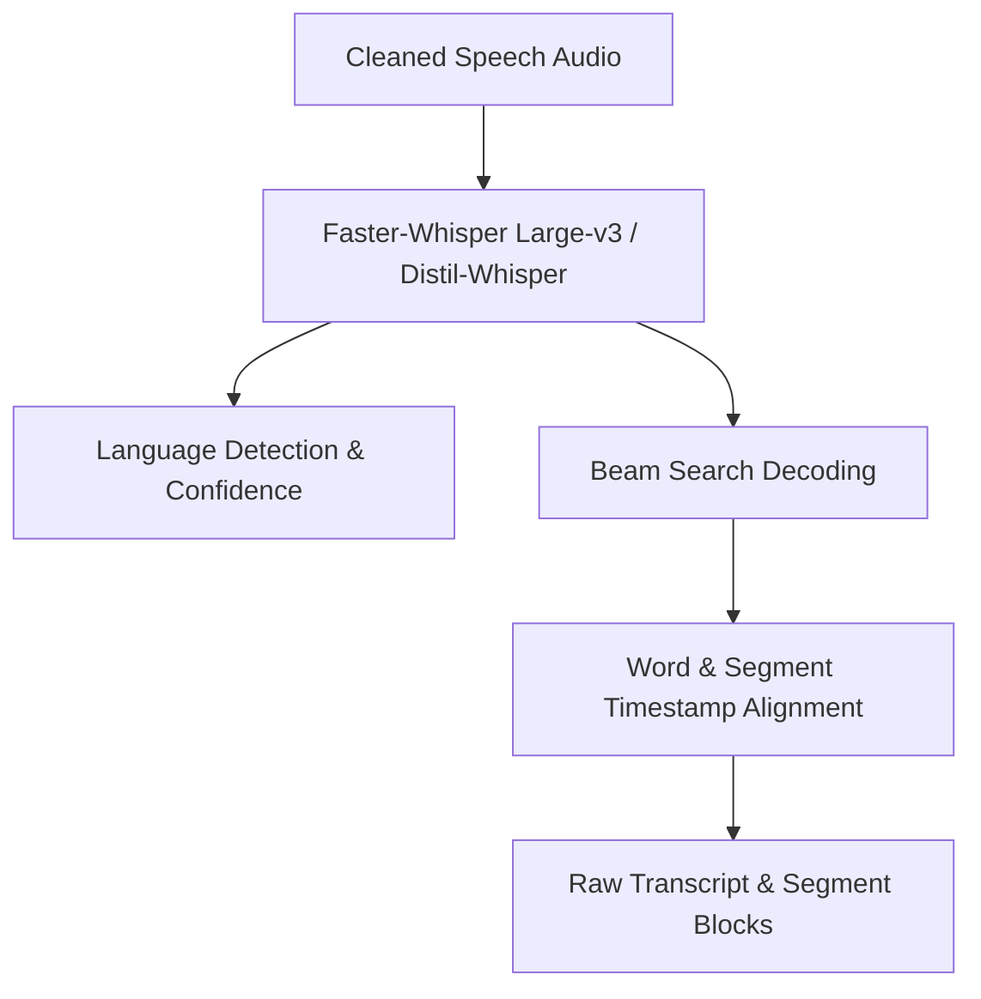
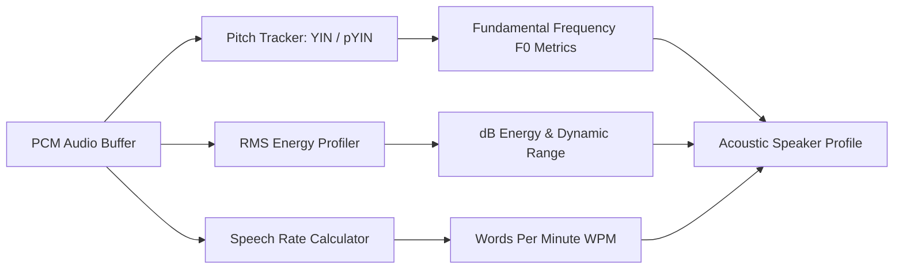

# Voice Note Processing Pipeline Architecture

## 1. Audio Validation & Preprocessing Pipeline

The Voice Processing Pipeline ingests incoming raw audio files (WhatsApp voice notes and audio clips), validates container formats, transcodes variable bitrates to standardized PCM audio buffers, applies noise suppression, and isolates active speech regions.


### 1.1 Audio Validation & Format Verification
- **Container Format Support**: Native WhatsApp audio formats (`.opus`, `.ogg`), standard lossy/lossless audio formats (`.mp3`, `.m4a`, `.aac`, `.wav`, `.flac`).
- **Header Inspection**: Verify magic container signatures (e.g., `OggS` for Ogg/Opus streams, `ID3` or `\xFF\xF3` for MP3 files).
- **Duration Boundary Enforcement**:
  - Minimum Duration: $0.5$ seconds. Audio clips under 0.5s are rejected as empty clicks/accidental records.
  - Maximum Duration: $300.0$ seconds (5 minutes). Long audio streams are chunked into 30-second sliding windows.
- **Corrupt Stream Check**: Attempt header parsing and frame decoding without loading full raw PCM buffers into memory.

### 1.2 Audio Signal Preprocessing & Normalization
- **Transcoding Pipeline**: Transcode all incoming streams to standard **16kHz 16-bit Mono Uncompressed PCM WAV** format using `FFmpeg` / `PyAV`.
- **Loudness Normalization**: Apply **EBU R128** integrated loudness normalization to standardize audio signal level to $-24$ LUFS (Loudness Units Full Scale), preventing quiet whisper notes or clipped loud audio from skewing feature extraction.
- **Noise Suppression**:
  - Apply **RNNoise** or **DeepFilterNet** (deep neural noise suppression) to attenuate background noise (traffic, air conditioning, wind, crowd babble) while preserving human vocal harmonics.
- **Voice Activity Detection (VAD)**:
  - Utilize **Silero VAD** (threshold $= 0.50$, minimum speech duration $= 250$ms, max silence padding $= 100$ms).
  - Strip non-speech leading/trailing silence gaps and compute the overall **Silence Ratio** ($\frac{\text{Silence Duration}}{\text{Total Duration}}$).

---

## 2. Speech-to-Text (ASR) Architecture



### 2.1 Model Selection & Decoding Parameters
- **Primary Engine**: **Faster-Whisper (Large-v3 / Distil-Whisper)** running on CTranslate2 engine for optimized C++ inference throughput.
- **Decoding Strategy**:
  - **Greedy Decoding**: Used for low-noise, single-speaker short audio clips ($< 15$ seconds) for maximum speed.
  - **Beam Search Decoding** (Beam Size $= 5$): Triggered for noisy background audio, fast speech rates, or multilingual code-switched audio to ensure word accuracy.
- **VAD Chunking**: 30-second sliding window processing with a 1-second overlap boundary to prevent word truncations across frame split boundaries.

### 2.2 Timestamp Alignment
- **Segment Timestamps**: Extract start time $t_{start}$ and end time $t_{end}$ for each sentence block.
- **Word-Level Timestamps**: Align individual words with cross-attention matrices, producing precise start/end millisecond offsets for every transcribed word.

---

## 3. Language Detection & Multilingual Handling

1. **Primary Language Identification (LID)**: Evaluates the first 30 seconds of audio using Whisper's built-in 99-language LID layer, returning the top language code (e.g., `en`, `hi`, `es`, `ta`, `ar`) and confidence score ($0.0 - 1.0$).
2. **Code-Switching Support**: For mixed-language speech (e.g., Hinglish / Spanglish), the segment-level decoder continuously updates language tags per audio segment block.

---

## 4. Acoustic Speaker Profiling & Characteristic Analysis

The pipeline extracts key non-verbal acoustic signals to evaluate speaker metrics without attempting biometric identity classification:



1. **Fundamental Frequency ($F_0$ Pitch Tracking)**:
   - Calculate pitch contours using **pYIN (Probabilistic YIN)** algorithm over 25ms window frames.
   - Outputs: `mean_pitch_hz`, `pitch_variance`, `pitch_min_hz`, `pitch_max_hz`.
2. **Energy & Volume Profiling**:
   - Compute Root Mean Square (RMS) energy across audio frames.
   - Outputs: `mean_energy_db`, `peak_energy_db`, `energy_dynamic_range`. High energy variance indicates sudden shouting or acoustic distress.
3. **Speaking Rate Metrics**:
   - Compute total transcribed words divided by net active speech duration (excluding VAD silence).
   - Outputs: `words_per_minute` (WPM), `syllables_per_second`. Standard conversational speech: $130 - 160$ WPM; rapid speech: $> 210$ WPM.
4. **Silence & Pause Ratio**:
   - Compute ratio of hesitation pauses to speech duration. Frequent long pauses ($> 1.5$s) indicate cognitive hesitation, reading, or emotional distress.

---

## 5. Acoustic & Semantic Urgency Detection

Urgency is evaluated through a dual-modal acoustic + semantic fusion matrix:

```
                  ┌────────────────────────────────────────┐
                  │ Dual-Modal Urgency Feature Synthesizer │
                  └───────────────────┬────────────────────┘
                                      │
           ┌──────────────────────────┴──────────────────────────┐
           ▼                                                     ▼
┌───────────────────────────────┐                     ┌───────────────────────────────┐
│ Acoustic Urgency Score        │                     │ Semantic Urgency Score        │
│ • Elevated Pitch (F0 Delta)   │                     │ • High-Urgency Keywords       │
│ • Rapid Speaking Rate (>200WPM)│                    │   ("Emergency", "Now", "Help")│
│ • Elevated RMS Energy (Shout) │                     │ • Imperative Command Verbs    │
└──────────┬────────────────────┘                     └──────────┬────────────────────┘
           │                                                     │
           └──────────────────────────┬──────────────────────────┘
                                      ▼
                      [Combined Voice Urgency Metric]
```

- **Acoustic Urgency Score ($0.0 - 1.0$)**: Weighted combination of pitch elevation above baseline, high RMS energy, and rapid WPM.
- **Semantic Urgency Score ($0.0 - 1.0$)**: Keyword matching and intent parsing over transcribed text (e.g., detecting keywords like "emergency", "immediately", "hospital", "urgent", "call me back right now").
- **Combined Urgency Index**: $U_{voice} = 0.40 \times U_{acoustic} + 0.60 \times U_{semantic}$.

---

## 6. Keyword Extraction, Summarization & VoiceContext Assembly

1. **Key Entity & Keyword Extraction**: Extract named entities (persons, organizations, dates, locations, monetary amounts) and dominant keywords using YAKE / RAKE algorithm over the cleaned transcript.
2. **Audio Summary Generation**: Synthesize a concise 1-2 sentence semantic summary capturing the core intent of the voice note (e.g., "Sender is asking if the team meeting scheduled for 3 PM is still happening.").
3. **`VoiceContext` Assembly**: Pack all extracted transcript blocks, language tags, acoustic metrics, urgency scores, and summaries into the final schema object.
